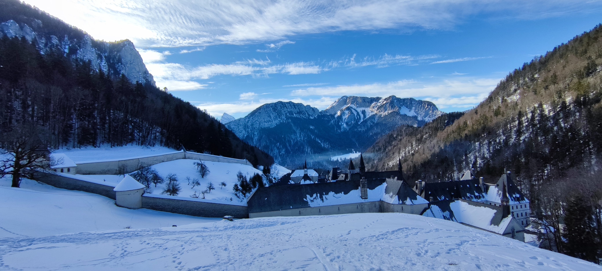

# Snowshoe hike : Le grand Som by the Monastery

Hard and long hike, only for very good hikers / Randonnée longue et difficile, uniquement pour les très bons randonneurs.

Read the full page / Lisez jusqu’au bout

##  EN/FR 
We speak English/French in all our events. Don't be worry if your English/French is not that good. Nos évènements sont en Anglais et Français. Ne soyez pas inquiets si vous n’êtes pas bilingue.

##  Le grand Som : a wonderful hike with chapels and monasteries 
Topo : https://www.altituderando.com/Grand-Som-2026m-par-le-Monastere-de-la-Grande-Chartreuse
* Distance: 14km
* Time: 8h of hike + 45min lunch + 1h15 drive
Drop : 1200m

Note for hikers who do not have their own snowshoes : There is no possibility to rent it on site. You must therefore rent it in Grenoble.

##  Car share 
Meet at « Palluel » (end of tram E)
Beginning of the hike at parking du monastère de la grande Chartreuse
Car share will cost 3€ per person

##  Rules 
- Don't be late
- Do not subscribe if you are not sure to join the event
- If you finally can't join us, please unsubscribe from the event or at least write a message here to announce your cancellation. That way, we won't wait for you
- If you are a driver and can't join, please send me a message through meetup ASAP, that way I can remove available seats
- Don't throw any dump in nature

##  What do you need 
- Hiking waterproof boots
- Hiking poles (if you want)
- Snowshoes and snow crampons
- Food for lunch + water + some snack
- Clothes for wind/cold
- Your mask as always (avoid contact and so on)
- Money for car share
- Snow cap, snow gloves
- A headligth or any flashlight (normally we should not need it but it can be useful)
##  Covid 
- Don't come if you feel sick, have fever, are contact case
- Wear your mask
- You are responsible to your own health, so respect barrier gestures, social distancing

If you have any questions, please ask !

## Stats

- Start time: 2022-01-23 09:00
- End time: 2022-01-23 19:00
- Duration: 10:00:00
- Time to event: 1 day, 8:35:56
- Attendees: 4
- KM: 14
- D+: 1200
- Top: 2026
- Type: Hike
- Comment: 

## Links

- [Trail short link](https://s.42l.fr/pg4ZECdb)
- [Trail full link]()
- [Album](https://binnette.github.io/GacImg2022/2022-01-23-Snowshoe-hike-Le-grand-Som-by-the-Monastery.html)
- [Meetup event](https://www.meetup.com/grenoble-adventure-club-english-french/events/283411992/)
