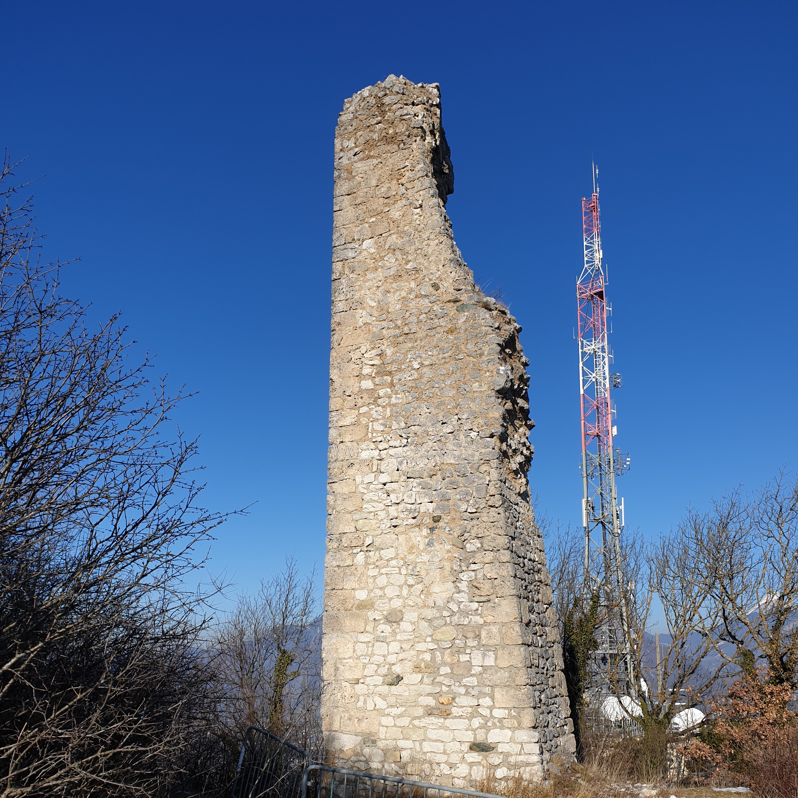

# 🥾 Hike: Around la Tour-Sans-Venin ⚔️🛡️🐍

💡 Read the full page by clicking on "Read more"/"Lire la suite"...💜
Joining the event = Accepting the rules (See rule section below)

##  ⭐⭐ Updates ⭐⭐ 
> 📅 Jan 22 - 11pm: more cars = more seats. Seats: Albin (5), Ayham (4), Berengere (4), Aymen (4), Anis (5). Drivers, we have a lot of cars and we won't need them all. So post a message in comment If you plan not to take your car. Otherwise you can leave your car at Parc Paul Mistral, the parking lot is free.

##  🗨️ EN/FR 🗨️ 
🦅/🐓 : we speak English/French in all our events. Don't worry if your English/French is not that good. Nos évènements sont en Anglais et Français. Ne soyez pas inquiets si votre niveau d'anglais n'est pas "suffisant".

##  🥾 Hike: Around la Tour-Sans-Venin ⚔️🛡️🐍 
This hike is easy for good hikers and medium for noobs 🙃

Meet at 1pm at parking "Esplanade du Souvenir Français" near Parc Paul Mistral:
- https://www.osm.org/way/69486256
- https://goo.gl/maps/BAbHQ153PcNgunPd6

We ride our cars for about 20m. Then park our car(s) at "Parc des Vouillants":
- https://www.osm.org/way/226923577
- https://goo.gl/maps/avpVPKgLAAtzo2qm7

We will hike to la Tour-Sans-Venin. Then we will try to see the Grotte des Sarrasins. Then we go Ferme des Visons, Ferme Froussard, Ferme Raymond and Désert de Jean-Jacques Rousseau. Finally go back to Grenoble 😎

* Topo & GPX track: https://s.42l.fr/ZOMxTA6u
* ▶💡 Download GPX track on your phone. Tuto here: https://github.com/Binnette/GAC
* Distance: 7.6km
* Time: ~2/3h of hike + 40m 🚗
* D+: 400m 🦡

##  🚗 share 
Car share will cost 2€ per person (fuel + "compensation" to get more drivers). 😷 You have to wear a mask in car.

##  💡 Rules 💡 
- 🚶‍♀️🚶‍♂️ The GAC group is about hiking 🥾 and why not making friends BUT NOT about flirting or speed dating ⛔
- Don't throw any dump 🚮 in nature even egg shell 🥚, fruit pelt 🍌, ... 🌳 ❤️ You
- Subscribe on the waiting list. Maybe more cars will be available 🚗
- Don't be (too) late 😇 We won't wait for you at morning, especially if you don't send any message.
- Since seats in car(s) are "rare", please do not subscribe if you are not sure to join the event
- If you finally can't join us, please unsubscribe from the event or at least write a message here to announce your cancellation. 💜 That way, we won't wait for you 💜
- If you are a driver and can't join, please send me a message through meetup ASAP, that way I can remove available seats 🚗
- 💟 You are responsible of your own health and security
- 😷 Covid rules: https://www.gouvernement.fr/en/coronavirus-covid-19

##  ❔ What do you need ❔ 
- 🥾 Hiking shoes (or any good/non slippery shoes)
- Hiking pole (if you want)
- 🧃 Water + 🍫 Some snack
- Clothes for wind, rain (if any)
- 🌞 Sun-cream / 😎 Sun glasses
- 😁 Your smile / 😊 Happiness
- 😷 Your mask as always (avoid contact and so on)
- 💵 Money for car share (exact change)

-----------------------
If you have any questions, please ask!

See you! Albin from GAC.

PS: for more activities (cinema, tennis table, concert, etc), you can join our WhatsApp group. Just ask me by message on meetup or IRL (in real life).

## Stats

- Start time: 2022-01-23 13:00
- End time: 2022-01-23 18:00
- Duration: 5:00:00
- Time to event: 14:46:20
- Attendees: 12
- KM: 7.6
- D+: 400
- Top: 650
- Type: Hike
- Comment: 

## Links

- [Trail short link](https://s.42l.fr/ZOMxTA6u)
- [Trail full link]()
- [Album](https://binnette.github.io/GacImg2022/2022-01-23-🥾-Hike-Around-la-Tour-Sans-Venin-⚔️🛡️🐍.html)
- [Meetup event](https://www.meetup.com/grenoble-adventure-club-english-french/events/283428809/)
