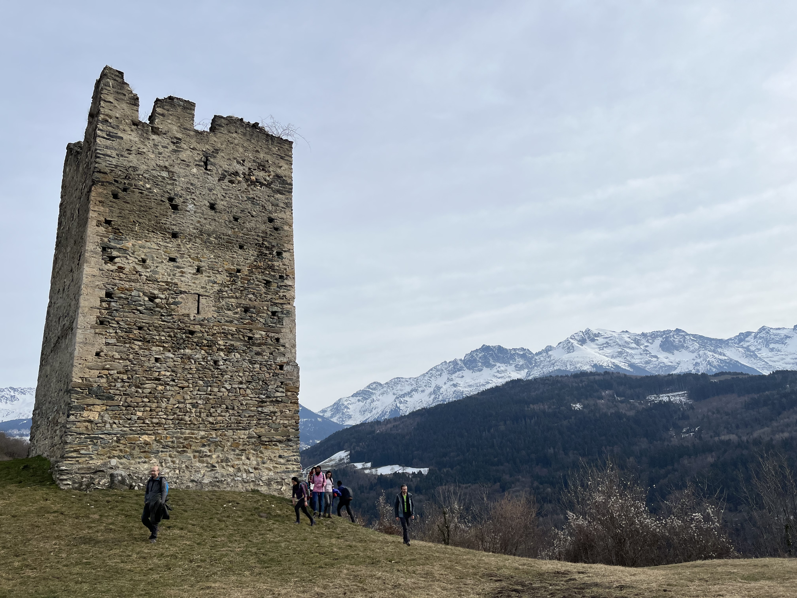

# 🥾 Hike: La Tour de Montfallet ⛰

💡 Read the full page by clicking on "Read more"/"Lire la suite"...💜
Joining the event = Accepting the rules (See rule section below)

##  ⭐⭐ Updates ⭐⭐ 
> 📅 Feb 5 - 8pm: more cars = more seats. Seats: Albin (5), Joao (5), JP (4), Eve-Anne (3), Berengere (3)

##  🗨️ EN/FR 🗨️ 
🦅/🐓 : we speak English/French in all our events. Don't worry if your English/French is not that good. Nos évènements sont en Anglais et Français. Ne soyez pas inquiets si votre niveau d'anglais n'est pas "suffisant".

##  🥾 Hike: La Tour de Montfallet ⛰ 
This hike is easy for good hikers and medium for noobs 🙃
We will probably walk on snow so take good shoes and why not hiking poles.

Meet at 1pm at parking "Esplanade du Souvenir Français" near Parc Paul Mistral:
- https://www.osm.org/way/69486256
- https://goo.gl/maps/BAbHQ153PcNgunPd6

We ride our cars for about 45m. Then park our car(s) near the townhall of Laval-en-Belledonne :
- https://www.osm.org/way/562315235
- https://goo.gl/maps/dcZBJGScBrYRzAte7

We will hike to "La Tour de Montfallet". Then do a loop around Laval. Finally go back to Grenoble by car 😎

* Topo & GPX track: https://s.42l.fr/HIGAW
* ▶💡 Download GPX track on your phone. Tuto here: https://github.com/Binnette/GAC
* Distance: 10km
* Time: ~3/4h of hike + 1h 🚗
* D+: 470m 🦡

##  🚗 share 
Car share will cost 4€ per person (fuel + "compensation" to get more drivers). 😷 You have to wear a mask in car.

##  💡 Rules 💡 
- 🚶‍♀️🚶‍♂️ The GAC group is about hiking 🥾 and why not making friends BUT NOT about flirting or speed dating ⛔
- Don't throw any dump 🚮 in nature even egg shell 🥚, fruit pelt 🍌, ... 🌳 ❤️ You
- Subscribe on the waiting list. Maybe more cars will be available 🚗
- Don't be (too) late 😇 We won't wait for you at morning, especially if you don't send any message.
- Since seats in car(s) are "rare", please do not subscribe if you are not sure to join the event
- If you finally can't join us, please unsubscribe from the event or at least write a message here to announce your cancellation. 💜 That way, we won't wait for you 💜
- If you are a driver and can't join, please send me a message through meetup ASAP, that way I can remove available seats 🚗
- 💟 You are responsible of your own health and security
- 😷 Covid rules: https://www.gouvernement.fr/en/coronavirus-covid-19

##  ❔ What do you need ❔ 
- 🥾 Hiking shoes (or any good/non slippery shoes)
- Hiking pole (if you want)
- 🧃 Water + 🍫 Some snack
- Clothes for wind, rain (if any)
- 🌞 Sun-cream / 😎 Sun glasses
- 😁 Your smile / 😊 Happiness
- 😷 Your mask as always (avoid contact and so on)
- 💵 Money for car share (exact change)

-----------------------
If you have any questions, please ask!

See you! Albin from GAC.

PS: for more activities (cinema, tennis table, concert, etc), you can join our WhatsApp group. Just ask me by message on meetup or IRL (in real life).

## Stats

- Start time: 2022-02-06 13:00
- End time: 2022-02-06 19:00
- Duration: 6:00:00
- Time to event: 1 day, 0:02:18
- Attendees: 18
- KM: 10
- D+: 470
- Top: 1025
- Type: Hike
- Comment: 

## Links

- [Trail short link](https://s.42l.fr/HIGAW)
- [Trail full link]()
- [Album](https://binnette.github.io/GacImg2022/2022-02-06-🥾-Hike-La-Tour-de-Montfallet-⛰.html)
- [Meetup event](https://www.meetup.com/grenoble-adventure-club-english-french/events/283740630/)
