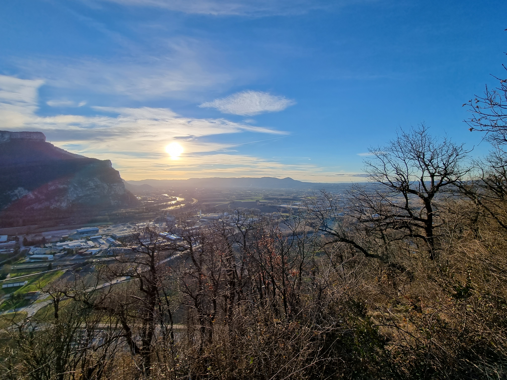

#  🥾🔵 Hike: Belvédère des maquisards 👁️

💡 Read the full page by clicking on "Read more"/"Lire la suite"...💜
Joining the event = Accepting the rules (See rule section below)

##  ⭐⭐ Updates ⭐⭐ 

* 📅 Feb 19 - 9pm: more cars = more seats. Seats: Albin (5), Rasy & Mailey (4), Manon (5), Paulo (5), JP (4), Samir (5), Maxime (4), François (4), Thomas (1 join us directly at hike start)

##  🗨️ EN/FR 🗨️ 
🦅/🐓 : we speak English/French in all our events. Don't worry if your English/French is not that good. Nos évènements sont en Anglais et Français. Ne soyez pas inquiets si votre niveau d'anglais n'est pas "suffisant".

##  🥾🔵 Hike: Belvédère des maquisards 👁️ 

* 🟢 Easy for good hikers
* 🔵/🔴 Medium/hard for noobs

Meet at 1pm at parking "Esplanade du Souvenir Français" near Parc Paul Mistral:

* https://www.osm.org/way/69486256
* https://goo.gl/maps/BAbHQ153PcNgunPd6

We ride our cars for about 25m. Then park our car(s) in La Buisse:

* https://www.osm.org/way/1032659326
* https://goo.gl/maps/nGS1dB9wyLhzvMYz8

We will hike around the quarry. Then hike in the forest to reach the "Belvédère". Hike down the mountain and walk a bit on the road to get back to cars. Finally go back to Grenoble by cars 😎

* Topo & GPX track: https://s.42l.fr/X8DFsc8v
* ▶💡 Download GPX track on your phone. Tuto here: https://github.com/Binnette/GAC
* Distance: 11.1km
* Time: ~3/4h of hike + 50m 🚗
* D+: 730m

##  🚗 share 
Car share will cost 3€ per person (fuel + "compensation" to get more drivers). 😷 You have to wear a mask in car.

##  💡 Rules 💡 

* 🚶‍♀️🚶‍♂️ The GAC group is about hiking 🥾 and why not making friends BUT NOT about flirting or speed dating ⛔
* Don't throw any dump 🚮 in nature even egg shell 🥚, fruit pelt 🍌, ... 🌳 ❤️ You
* Subscribe on the waiting list. Maybe more cars will be available 🚗
* Don't be (too) late 😇 We won't wait for you at morning, especially if you don't send any message.
* Since seats in car(s) are "rare", please do not subscribe if you are not sure to join the event
* If you finally can't join us, please unsubscribe from the event or at least write a message here to announce your cancellation. 💜 That way, we won't wait for you 💜
* If you are a driver and can't join, please send me a message through meetup ASAP, that way I can remove available seats 🚗
* 💟 You are responsible of your own health and security
* 😷 Covid rules: https://www.gouvernement.fr/en/coronavirus-covid-19

##  ❔ What do you need ❔ 

* 🥾 Hiking shoes (or any good/non slippery shoes)
* Hiking pole (if you want)
* 🧃 Water + 🍫 Some snack
* Clothes for wind, rain (if any)
* 🌞 Sun-cream / 😎 Sun glasses
* 😁 Your smile / 😊 Happiness
* 😷 Your mask as always (avoid contact and so on)
* 💵 Money for car share (exact change in cash)

***

If you have any questions, please ask!

See you! Albin from GAC.

PS: for more activities (cinema, tennis table, concert, etc), you can join our WhatsApp group. Just ask me by message on meetup or IRL (in real life).

## Stats

- Start time: 2022-02-20 13:00
- End time: 2022-02-20 19:00
- Duration: 6:00:00
- Time to event: 2 days, 13:48:14
- Attendees: 30
- KM: 11.1
- D+: 730
- Top: 660
- Type: Hike
- Comment: 

## Links

- [Trail short link](https://s.42l.fr/X8DFsc8v)
- [Trail full link]()
- [Album](https://binnette.github.io/GacImg2022/2022-02-20-🥾🔵-Hike-Belvedere-des-maquisards-👁️.html)
- [Meetup event](https://www.meetup.com/grenoble-adventure-club-english-french/events/284081461/)
