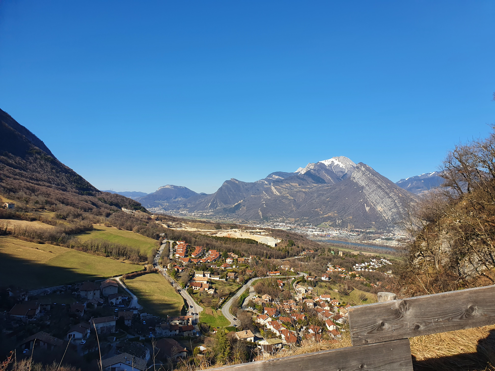

# 🎿 Ski: Ski at les 2 alpes not for noob ⛷

💡 Read the full page by clicking on "Read more"/"Lire la suite"...💜
Joining the event = Accepting the rules (See rule section below)

##  ⭐⭐ Updates ⭐⭐ 

Adam 4 seats

##  🗨️ EN/FR 🗨️ 
🦅/🐓 : we speak English/French in all our events. Don't worry if your English/French is not that good. Nos évènements sont en Anglais et Français. Ne soyez pas inquiets si votre niveau d'anglais n'est pas "suffisant".

##  🎿Ski ⛷ 

🟨 DO NOT BRING YOUR SKI (unless you have your own car) cause there is not enough place in my car. you can rent ski directly at the station.

Meet at 8am at parking "Esplanade du Souvenir Français" near Parc Paul Mistral:
- https://www.osm.org/way/69486256
- https://goo.gl/maps/BAbHQ153PcNgunPd6

We ride our cars for about 50m. Then park our car(s) directly at the ski station:

- 2 Rue du Ser Palor
https://maps.app.goo.gl/EDp22sUyj3P3gEwy5

##  🎿 Ski renting🎿 
We will go to the shop to rent ski directly at ski station. The shop is open at from 8:30am until 5pm

##  💲 Ski Pass 💲 
To enter the ski station, you need a ski pass, check the online ticket to avoid waiting

##  🚗 share 
Car share will cost 7€ per person (fuel + "compensation" to get more drivers). 😷 You have to wear a mask in car.

##  For drivers 🚗 
Drivers needs (mandatory):
- ⛄ Either 4 winter or 4 four seasons tires
- 🔗 Either 2 car snow chains (~25€ at Carrefour)
- 🧦 Either 2 car snow socks

https://www.service-public.fr/particuliers/actualites/A14389?lang=en

##  💡 Rules 💡 
- 🚶‍♀️🚶‍♂️ The GAC group is about hiking 🥾 and why not making friends BUT NOT about flirting or speed dating ⛔
- Don't throw any dump 🚮 in nature even egg shell 🥚, fruit pelt 🍌, ... 🌳 ❤️ You
- Subscribe on the waiting list. Maybe more cars will be available 🚗
- Don't be (too) late 😇 We won't wait for you at morning, especially if you don't send any message.
- Since seats in car(s) are "rare", please do not subscribe if you are not sure to join the event
- If you finally can't join us, please unsubscribe from the event or at least write a message here to announce your cancellation. 💜 That way, we won't wait for you 💜
- If you are a driver and can't join, please send me a message through meetup ASAP, that way I can remove available seats 🚗
- 🚗 Don't forget to bring the good amount of money for car share. And please don't forget to pay your driver.
- 💟 You are responsible of your own health and security
- 😷 Covid rules: https://www.gouvernement.fr/en/coronavirus-covid-19

##  ❔ What do you need ❔ 
- ⛔ NO SKI (I don't have place in my car. We will rent them at the shop)
- 🧢 A ski helmet (mandatory, you can rent one at the shop for 4€)
- 🧥 Snow/Warm clothes (bring yours)
- 🧤 Ski gloves (bring yours)
- 👖 Ski pants: must have 💗 (bring yours)
- 🧦 Ski socks: big warm socks
- 🥾 Any good/non slippery shoes to walk on snow/ice
- 🧃 Water + 🥪 Food for lunch + 🍫 Some snack
- 🌞 Sun-cream / 😎 Sun glasses
- 🎒 A backpack to carry food, water, sun-cream, ...
- 😁 smile / 😊 Happiness
- 😷 Your mask as always (avoid contact and so on)
- 💵 Money for car share

-----------------------
If you have any questions, please ask!

See you! Adam from GAC.

PS: for more activities (cinema, tennis table, concert, etc), you can join our WhatsApp group. Just ask me by message on meetup or IRL (in real life).

## Stats

- Start time: 2022-02-26 07:45
- End time: 2022-02-26 16:45
- Duration: 9:00:00
- Time to event: 1 day, 13:30:24
- Attendees: 4
- KM: 
- D+: 
- Top: 
- Type: Ski
- Comment: 

## Links

- [Trail short link]()
- [Trail full link]()
- [Album](https://binnette.github.io/GacImg2022/)
- [Meetup event](https://www.meetup.com/grenoble-adventure-club-english-french/events/284225448/)
