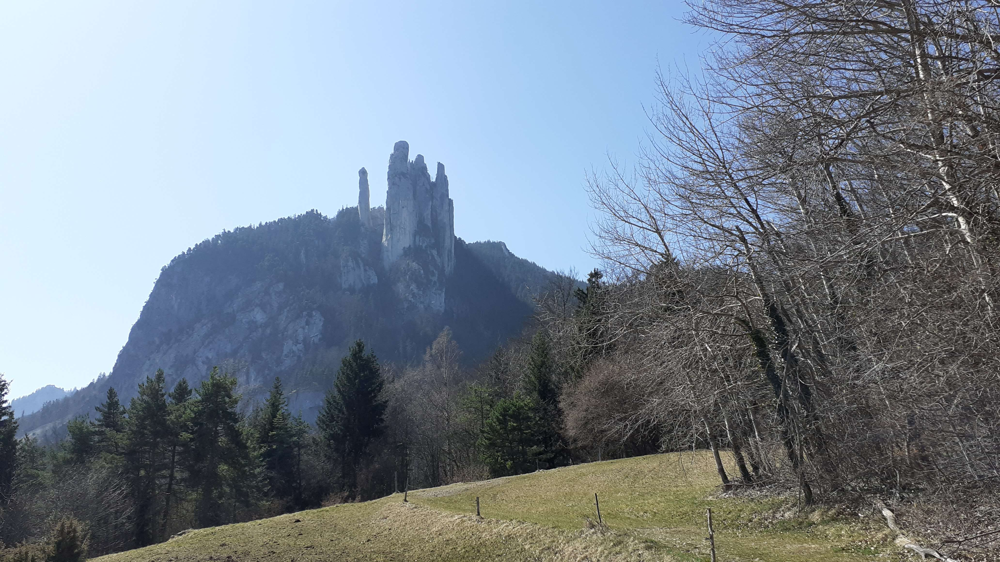

# 🥾🔵🔴 Hike: Les Trois Pucelles 🖖

💡 Read the full page by clicking on "Read more"/"Lire la suite"...💜
Joining the event = Accepting the rules (See rule section below)

##  🗨️ EN/FR 🗨️ 
🦅/🐓 : we speak English/French in all our events. Don't worry if your English/French is not that good. Nos évènements sont en Anglais et Français. Ne soyez pas inquiets si votre niveau d'anglais n'est pas "suffisant".

##  🥾🔵🔴 Hike: Les Trois Pucelles 🖖

* 🔵 Medium for good hikers
* 🔴 Hard for noobs

Meet at 09:00am at Seyssins Le Prisme (terminus of tram C) :

* https://www.openstreetmap.org/node/445206267
* https://goo.gl/maps/MxNv7SNDKPMDVi5J6

We will go under the 3 Pucelles, then to a Belvédère near Saint Nizier where we will eat.

Topo & GPX track by GraphHopper : https://s.42l.fr/7NoYI4Wa
Topo & GPX track by BRouter : https://s.42l.fr/6O3U6dDG
* ▶💡 Download GPX track on your phone. Tuto here: https://binnette.github.io/GAC/TutoOsmAnd/
* Distance: 16.5km
* Time: \~6/7h of hike
* D+: 977m according BRouter, 1109m according GraphHopper

##  💡 Rules 💡 

* 🚶‍♀️🚶‍♂️ The GAC group is about hiking 🥾 and why not making friends BUT NOT about flirting or speed dating ⛔
* 😍 Hiking is about walking and enjoying nature.
* Don't throw any dump 🚮 in nature even fruit pelt: 🍌(2 years for decomposition), 🍊 (6 months); egg shell 🥚 (3 years)
* Subscribe on the waiting list. Maybe more cars will be available 🚗
* Don't be (too) late 😇 We won't wait for you at morning, especially if you don't send any message.
* If you finally can't join us, please unsubscribe from the event or at least write a message here to announce your cancellation. 💜 That way, we won't wait for you 💜
* 😷 Covid rules: https://www.gouvernement.fr/en/coronavirus-covid-19

##  ❔ What do you need ❔ 

* 🥾 Hiking shoes (or any good/non slippery shoes)
* Hiking pole (if you want)
* 🧃 Water + 🍫 Lunch snack
* Clothes for wind, rain (if any)
* 🌞 Sun-cream / 😎 Sun glasses
* 😁 Your smile / 😊 Happiness
* 😷 Your mask as always (avoid contact and so on)

***

If you have any questions, please ask!

See you! Nicolas from GAC.

PS: for more activities (cinema, tennis table, concert, etc), you can join our Telegram channel. Just ask me by message on meetup or IRL (in real life).

## Stats

- Start time: 2022-03-26 09:00
- End time: 2022-03-26 16:00
- Duration: 7:00:00
- Time to event: 2 days, 11:35:38
- Attendees: 4
- KM: 16.8
- D+: 1109
- Top: 1162
- Type: Hike
- Comment: 

## Links

- [Trail short link](https://s.42l.fr/7NoYI4Wa)
- [Trail full link]()
- [Album](https://binnette.github.io/GacImg2022/2022-03-26-🥾🔵🔴-Hike-Les-Trois-Pucelles-🖖.html)
- [Meetup event](https://www.meetup.com/grenoble-adventure-club-english-french/events/284808200/)
