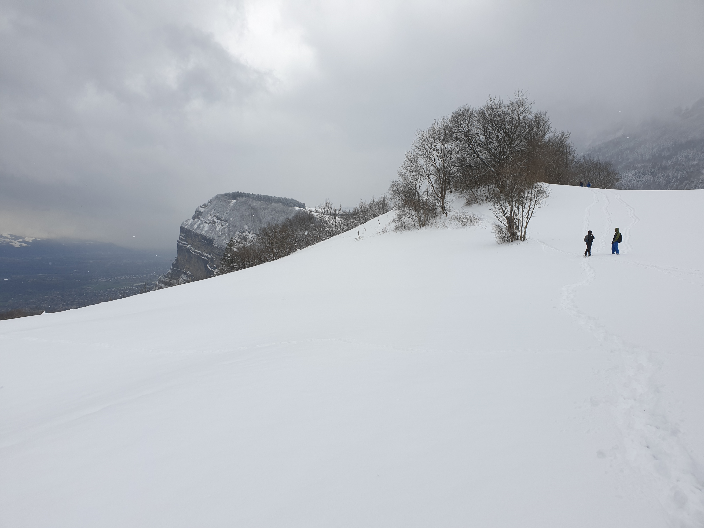

# ❄️🔵 Snowshoe: Around le Plateau des petites roches ☃️

💡 Read the full page by clicking on "Read more"/"Lire la suite"...💜
Joining the event = Accepting the rules (See rule section below)

##  ⭐⭐ Updates ⭐⭐ 

* 📅 April 1 - 8pm: more cars = more seats. Seats: Albin (5), Joao (5)

##  🗨️ EN/FR 🗨️ 
🦅/🐓 : we speak English/French in all our events. Don't worry if your English/French is not that good. Nos évènements sont en Anglais et Français. Ne soyez pas inquiets si votre niveau d'anglais n'est pas "suffisant".

##  ❄️🔵 Snowshoe: Around le Plateau des petites roches ☃️ 
Bring your showshoe or rent them in Grenoble. There are no shop open in St-Hilaire.

* 🔴 hard for noobs 🙃
* 🔵 medium for good hikers

Meet at 1pm at parking "Esplanade du Souvenir Français" near Parc Paul Mistral:

* OSM: [https://www.osm.org/way/69486256](https://www.osm.org/way/69486256)
* Maps: [https://goo.gl/maps/BAbHQ153PcNgunPd6](https://goo.gl/maps/BAbHQ153PcNgunPd6)

We ride our cars for about 40m. Then park our car(s) near "Office du Tourisme St-Hilaire du Touvet":

* [https://www.osm.org/way/23026039](https://www.osm.org/way/23026039)
* [https://goo.gl/maps/VVNd49F7x9FoCnUr8](https://goo.gl/maps/VVNd49F7x9FoCnUr8)

* Topo & GPX track: [https://s.42l.fr/7cIKg2Hu](https://s.42l.fr/7cIKg2Hu)
▶💡 Show GPX track on your phone. Tuto: [https://binnette.github.io/GAC](https://binnette.github.io/GAC/)
* Distance: 9.5km
* Time: \~3/4h of hike + 1h 🚗
* D+: 540m

##  🚗 share 
Car share will cost 3€ per person (fuel + "compensation" to get more drivers). 😷 You have to wear a mask in car. Fuel is very expensive at this time...

##  💡 Rules 💡 

* 🚶‍♀️🚶‍♂️ The GAC group is about hiking 🥾 and why not making friends BUT NOT about flirting or speed dating ⛔
* 😍 Hiking is about walking and enjoying nature
* Don't throw any dump 🚮 in nature even fruit pelt: 🍌(2 years for decomposition), 🍊 (6 months); egg shell 🥚 (3 years)
* Subscribe on the waiting list. Maybe more cars will be available 🚗
* Don't be (too) late 😇 We won't wait for you at morning, especially if you don't send any message.
* Since seats in car(s) are "rare", please do not subscribe if you are not sure to join the event
* If you finally can't join us, please unsubscribe from the event or at least write a message here to announce your cancellation. 💜 That way, we won't wait for you 💜
* If you are a driver and can't join, please send me a message through meetup ASAP, that way I can remove available seats 🚗
* 💟 You are responsible of your own health and security
* 😷 Covid rules: [https://www.gouvernement.fr/en/coronavirus-covid-19](https://www.gouvernement.fr/en/coronavirus-covid-19)

##  ❔ What do you need ❔ 

* ❄️ Snowshoes (no shop in St-Hilaire)
* Hiking pole (if you want)
* 🧃 Water + 🍫 Some snack
* 🌬 Clothes for wind, rain (if any)
* 🌞 Sun-cream / 😎 Sun glasses
* 😁 Your smile / 😊 Happiness
* 😷 Your mask as always (avoid contact and so on)
* 💵 Money for car share (exact change in cash)

***

If you have any questions, please ask!

See you! Albin from GAC.

PS: for more activities (cinema, concert, etc), join our Telegram Channel. Just ask me by message on meetup or IRL (in real life).

## Stats

- Start time: 2022-04-02 13:00
- End time: 2022-04-02 20:00
- Duration: 7:00:00
- Time to event: 17:08:53
- Attendees: 7
- KM: 9.5
- D+: 540
- Top: 1173
- Type: Hike
- Comment: 

## Links

- [Trail short link](https://s.42l.fr/7cIKg2Hu)
- [Trail full link]()
- [Album](https://binnette.github.io/GacImg2022/2022-04-02-❄️🔵-Snowshoe-Around-le-Pleteau-des-petites-roches-☃️.html)
- [Meetup event](https://www.meetup.com/grenoble-adventure-club-english-french/events/285003106/)
