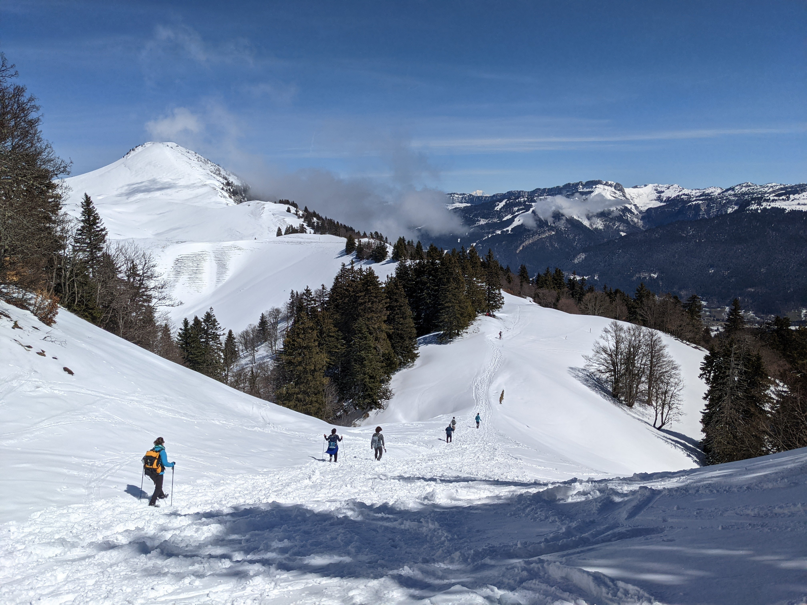

# ❄️ Hike: Circuit la Pinéa - Chalet du Charmant Som WINTER EDITION ❄️

Details
💡 Read the full page by clicking on "Read more"/"Lire la suite"...💜
Joining the event = Accepting the rules (See rule section below)

##  🗨️ EN/FR 🗨️ 
🦅/🐓 : we speak English/French in all our events. Don't worry if your English/French is not that good. Nos évènements sont en Anglais et Français. Ne soyez pas inquiets si votre niveau d'anglais n'est pas "suffisant".

##  ⭐⭐ Updates ⭐⭐ 
None

## 🥾 Take **Bus** to Col de Port and then hike to la Pinéa and then to Chalet du Charmant Som - WINTER EDITION 

🔴 medium-hard for beginners
🔵 easy-medium for good hikers
⚫ impossible if you can't wake up early on a Sunday :)

No Albin-level experience here! So tread carefully! :)

What to expect:

* Planned by bus but cars welcome
* We will go to the slender summit of the Pinéa (a beautiful 360 view on clear days) and then head to the chalets of Charmant Som (with a Fromagerie with amazing Tomme and fresh Yogurt at the base, and a wonderful view at the top).

This is written by Vaibhav, there will be no such thing as the chalet is closed in winter.

* No risk passages, except for the final steep climb to La Pinéa, most of the path is proper route. The track to Pinéa is covered by trees so expected to be icy-snow, and muddy as usual. Weather prediction is partially sunny on Sunday for now.

* Distance: 13km
* Time: \~5h of hike + 40min breaks + 1.5h bus back and forth
Elevation+ : \~600m

* Topo & GPX track:
https://drive.google.com/file/d/19LZKNKwe6FkONqgaGz1Mb-Dcs5_YzH42/view?usp=sharing

Alternatively (Google Maps):
https://www.google.com/maps/d/u/0/edit?mid=16nAltUQ6UT4h2xuFpb5G_af2roAK_uxL&usp=sharing

RDV:
\- Meet before 07:45h sharp at Notre\-Dame \- Musee
https://goo.gl/maps/BetPXLuG78NNCfWN9

Bus details:

* Bus departs at 08:10 am so no room for delays :( The next bus would be in 2 hours so plan accordingly
* Also there can be a line so be early to surely get a seat
* Bus fare is 1.60 Euros (buy 2 tickets at the station).
* The bus takes about 35 min one-way. The last bus from Col de Porte is at 18:30, we will take the one at 17:10.

Ride details (if any):
Ride for about 35 mins. Then park our car(s) at the restaurant 3 sommet near Col de Porte

https://maps.app.goo.gl/CcU6c1Wju7EU1Ski9

##  ❔ **What do you need** ❔ 
\- 💵 Money for bus ticket \(buy 2 at Notre Dame Musee\) and to buy delicious Cheese and Yogurt :p
\- 🧃 Water \+ 🍫 Some snack \+ Food \+ 🤤extra Food for sharing \(highly recommended\)
\- Face masks for the Bus
\- Your smile and happiness 😁

Equipment:
\- Hiking shoes \(must\)
\- Long gaiters \(keep for comfort if fresh snow sections\)
\- Crampons \(recommended/keep for comfort on icy sections\)
\- Hiking pole \(recommended\)
\- Winter gloves \(highly recommended\)
\- Neck warmer/Beanie/anything to cover ears \(recommended\)
\- Clothes for snow\, wind \(layer\-up\)
\- 🌞 Sun\-cream / 😎 Sun glasses

See how waiting list works:
https://binnette.github.io/GAC/AboutMeetup/WaitingList.html

GPX Tutorial:
* ▶💡 Download GPX track on your phone. Tuto: https://binnette.github.io/GAC

##  🚗 share 
No car share. We take the bus.

If you finally can't join us, please unsubscribe from the event or at least write a message here to announce your cancellation. 💜 That way, we won't wait for you 💜

💟 You are responsible of your own health and security
😷 Covid rules: https://www.gouvernement.fr/en/coronavirus-covid-19

##  💡 Rules 💡 

* 🚶‍♀️🚶‍♂️ The GAC group is about hiking 🥾 and sharing food and why not making friends BUT NOT about flirting or speed dating ⛔
* 😍 Hiking is about walking and enjoying nature
* Don't throw any dump 🚮 in nature even fruit pelt: 🍌(2 years for decomposition), 🍊 (6 months); egg shell 🥚 (3 years)
* Don't be (too) late 😇 We won't wait for you at morning, especially if you don't send any message.

If you have any questions, please ask!
See you! GAC.

PS: for more activities (cinema, tennis table, concert, etc), you can join our Telegram Channel. Just ask Albin by message on meetup or IRL (in real life).

## Stats

- Start time: 2022-04-10 07:45
- End time: 2022-04-10 17:40
- Duration: 9:55:00
- Time to event: 2 days, 16:20:37
- Attendees: 9
- KM: 13
- D+: 600
- Top: 1867
- Type: Hike
- Comment: 

## Links

- [Trail short link](https://s.42l.fr/ZAm0ZCtj)
- [Trail full link]()
- [Album](https://binnette.github.io/GacImg2022/2022-04-10-❄️-Hike-Circuit-la-Pinea-Chalet-du-Charmant-Som-WINTER-EDITION-❄️.html)
- [Meetup event](https://www.meetup.com/grenoble-adventure-club-english-french/events/285124928/)
