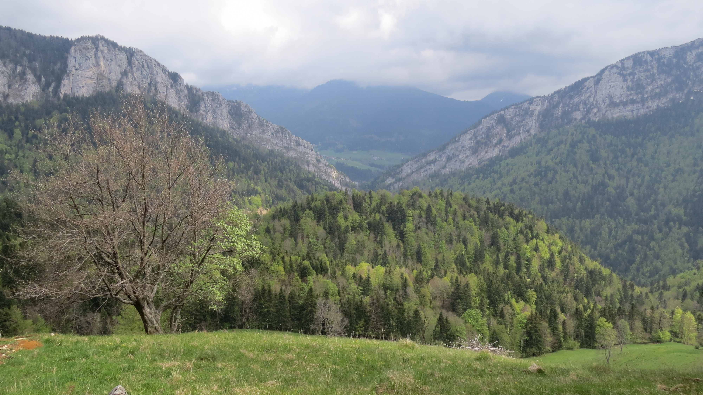

# Cloudy hike in Chartreuse

Read the full page

##  Level 

* 🔵 medium for good hikers
* 🔴 hard for noobs

##  EN/FR 
We speak English/French in all our events. Don't be worry if your English/French is not that good. Nos évènements sont en Anglais et Français. Ne soyez pas inquiets si vous n’êtes pas bilingue.

##  Le belvédère d’Arpison : hike with chapels and monasteries 
* Distance: 12km
* Time: 4h30 of hike + 1h lunch + 1h15 drive
Drop : 700m

##  Car share 
Meet at « Palluel » (end of tram E)
Beginning of the hike at parking du monastère de la grande Chartreuse 38380 Saint-Pierre-de-Chartreuse
Car share will cost 3€ per person

##  Rules 
\- Don't be late
\- Do not subscribe if you are not sure to join the event
\- If you finally can't join us\, please unsubscribe from the event or at least write a message here to announce your cancellation\. That way\, we won't wait for you
\- If you are a driver and can't join\, please send me a message through meetup ASAP\, that way I can remove available seats
\- Don't throw any dump in nature

##  What do you need 
\- Hiking shoes
\- Hiking poles \(if you need\)
\- Water \+ food for lunch \+ some snack
\- Clothes for wind/cold/rain
\- Money for car share
\- Sunglasses
\- Sunscreen

##  Covid 
\- Don't come if you feel sick\, have fever\, are contact case
\- Wear your mask in cars
\- You are responsible to your own health\, so respect barrier gestures\, social distancing

If you have any questions, please ask !

## Stats

- Start time: 2022-05-07 09:30
- End time: 2022-05-07 16:30
- Duration: 7:00:00
- Time to event: 11:45:57
- Attendees: 6
- KM: 12.1
- D+: 726
- Top: 1489
- Type: Hike
- Comment: 

## Links

- [Trail short link](https://s.42l.fr/MjNwH-I2)
- [Trail full link]()
- [Album](https://binnette.github.io/GacImg2022/2022-05-07-Cloudy-hike-in-Chartreuse.html)
- [Meetup event](https://www.meetup.com/grenoble-adventure-club-english-french/events/285748339/)
