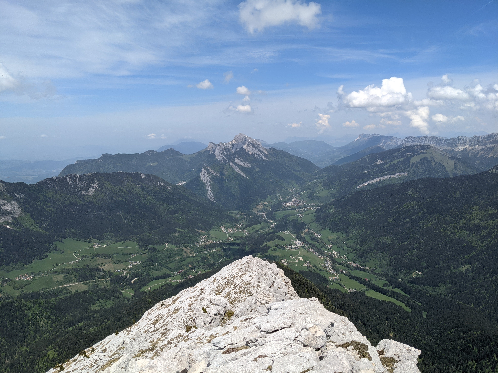

# 🔴🥾Hike: Chamchaude or Les crêtes Nord du Mont Saint-Eynard from sappey 

Details
Joining the event = Accepting the rules (See rule section below)

Difficulté :
🔴 hard (good pace to respect bus timings)
⚫ impossible if you can't wake up early on a Sunday :)

* Distance: 12.75km or 17 km (2 Options, see below)
* Time: \~6h of hike + 30min breaks + 1.5h bus back and forth
Elevation+ : 935m
Max elevation: 1582m

No Albin-level experience here! So tread carefully! :)

Note:
Can't guarantee a seat in bus. This route is busy. Be on time and line-up!

Plan:
Bus from Musee Notre Dame (ligne 62) to Sappey-en-Chart. Place -> Hike to Emeindra de Dessus -> Pas de la Branche -> Pret du Plat ->
From here:
Option 1 -> Return towards Sappey en Chart. and catch bus back
Option 2 -> Hike towards Mt Saint Eynard via Sentier des Cretes and bus from Col de Vance or hike back to Grenoble

* Topo & GPX track:
Option 1: https://drive.google.com/file/d/1-h-m7MBek55GypzmlpbJG4GxzJUQNqdD/view?usp=sharing
Option 2: https://drive.google.com/file/d/1iDd6_DMPXTI6bDLyKZ6UGsrCeePA_2LP/view?usp=sharing

RDV:
\- Meet before 07:45h sharp at Notre\-Dame \- Musee
https://goo.gl/maps/BetPXLuG78NNCfWN9

Bus details: https://www.tag.fr/ftp/fiche_horaires/fiche_horaires_2014/HORAIRES_62.pdf

* Bus departs at 08:10 am so no room for delays :( The next bus would be in 2 hours so plan accordingly
* Also there can be a line so be early to surely get a seat
* Bus fare is 1.60 Euros (buy 2 tickets at the station). Possible to use Oura
* The bus takes about 35 min one-way. The last bus from Col de Vance is around 18:30, we will take the one around 17:10.

What do you need?
\- Money for bus ticket \(buy 2 at Notre Dame Musee\) or Oura Card
\- Water \+ Some snack \+ Food
\- Face masks for the Bus
\- Your smile and happiness 😁

Equipment:
\- Hiking shoes \(must\)
\- Clothes for rain\, wind \(layer\-up\)
\- Hiking pole \(recommended\)
\- 🌞 Sun\-cream / 😎 Sun glasses

See how waiting list works:
https://binnette.github.io/GAC/AboutMeetup/WaitingList.html

GPX Tutorial:
Download GPX track on your phone. Tuto: https://binnette.github.io/GAC

If you finally can't join us, please unsubscribe from the event or at least write a message here to announce your cancellation. 💜 That way, we won't wait for you 💜

💟 You are responsible of your own health and security

##  💡 Rules 💡 

* 🚶‍♀️🚶‍♂️ The GAC group is about hiking 🥾 and sharing food and why not making friends BUT NOT about flirting or speed dating ⛔
* 😍 Hiking is about walking and enjoying nature
* Don't throw any dump 🚮 in nature even fruit pelt: 🍌(2 years for decomposition), 🍊 (6 months); egg shell 🥚 (3 years)
* Don't be (too) late 😇 We won't wait for you at morning, especially if you don't send any message.

If you have any questions, please ask!
See you! GAC.

PS: for more activities (cinema, tennis table, concert, etc), you can join our Telegram Channel. Just ask Albin by message on meetup or IRL (in real life).

## Stats

- Start time: 2022-05-15 07:45
- End time: 2022-05-15 17:40
- Duration: 9:55:00
- Time to event: 13:53:27
- Attendees: 3
- KM: 13
- D+: 1280
- Top: 2082
- Type: Hike
- Comment: 

## Links

- [Trail short link](https://s.42l.fr/px7tASYB)
- [Trail full link]()
- [Album](https://binnette.github.io/GacImg2022/2022-05-15-🔴🥾Hike-Chamchaude-or-Les-cretes-Nord-du-Mont-Saint-Eynard-from-sappey.html)
- [Meetup event](https://www.meetup.com/grenoble-adventure-club-english-french/events/285908756/)
