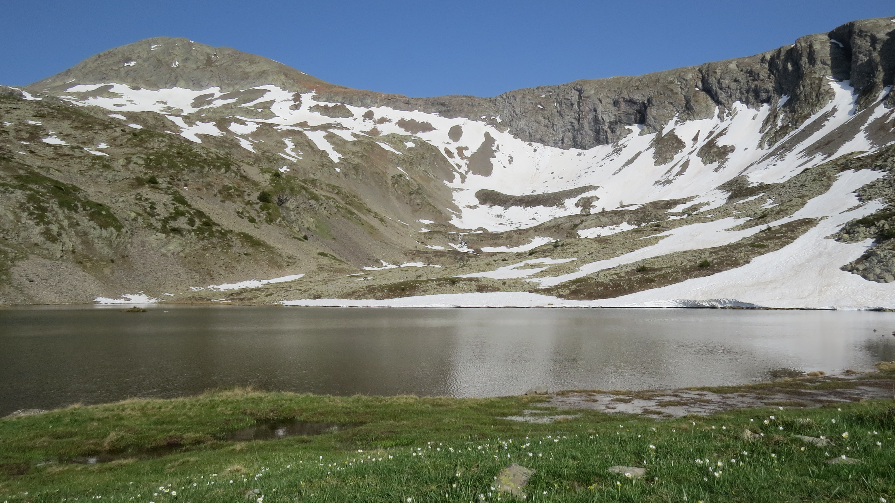

# 🥾🔴 Hike: 2 hot 🥵 ; 2 lakes 🥶 (Brouffier-La Morte)

💡 Read the full page by clicking on "Read more"/"Lire la suite"...💜
Joining the event = Accepting the rules (See rule section below)

##  ⭐⭐ Updates ⭐⭐ 

* 📅 Mai 20 - 5pm: more cars = more seats. Seats: Albin (5), Aymen (5), Thomas (5)

##  🗨️ EN/FR 🗨️ 
🦅/🐓 : we speak English/French in all our events. Don't worry if your English/French is not that good. Nos évènements sont en Anglais et Français. Ne soyez pas inquiets si votre niveau d'anglais n'est pas "suffisant".

##  🥾🔴 Hike: 2 hot 🥵 ; 2 lakes 🥶 

* 🔵 medium for good hikers
* 🔴 hard for noobs 🙃

Meet at 9am at parking "Esplanade du Souvenir Français" near Parc Paul Mistral:

* OSM: [https://www.osm.org/way/69486256](https://www.osm.org/way/69486256)
* Maps: [https://goo.gl/maps/BAbHQ153PcNgunPd6](https://goo.gl/maps/BAbHQ153PcNgunPd6)

We ride our cars for about 30m. Then park our car(s) at La Morte:

* [https://www.osm.org/way/1062008345](https://www.osm.org/way/1062008345)
* [https://goo.gl/maps/mT4S3fb7XDT9sszv7](https://goo.gl/maps/mT4S3fb7XDT9sszv7)

We will "climb" (\~1080m), go down a little bit and reach the first lake (have some swimming and chill). Then we go down by other way and chill at the second lake (it is near the parking where we will park our cars. When we are done, we go back to Grenoble Vice City.

* Topo & GPX track: [https://s.42l.fr/dVnSUrgh](https://s.42l.fr/dVnSUrgh) (click Export > GPX)
* ▶💡 Download GPX on your phone (Tuto: [https://binnette.github.io/GAC](https://binnette.github.io/GAC/))
* Distance: 14km
* Time: \~5/6h of hike + 1h launch break + 2h 🚗
* D+: 1080m

##  🚗 share 
Car share will cost 6€ per person (fuel + "compensation" to get more drivers). 😷 You have to wear a mask in car. Fuel is very expensive at this time...

##  💡 Rules 💡 

* 🚶‍♀️🚶‍♂️ The GAC group is about hiking 🥾 and why not making friends BUT NOT about flirting or speed dating ⛔
* 😍 Hiking is about walking and enjoying nature
* Don't throw any dump 🚮 in nature even fruit pelt: 🍌(2 years for decomposition), 🍊 (6 months); egg shell 🥚 (3 years)
* Subscribe on the waiting list. Maybe more cars will be available 🚗
* Don't be (too) late 😇 We won't wait for you at morning, especially if you don't send any message.
* Since seats in car(s) are "rare", please do not subscribe if you are not sure to join the event
* If you finally can't join us, please unsubscribe from the event or at least write a message here to announce your cancellation. 💜 That way, we won't wait for you 💜
* If you are a driver and can't join, please send me a message through meetup ASAP, that way I can remove available seats 🚗
* 💟 You are responsible of your own health and security
* 😷 Covid rules: [https://www.gouvernement.fr/en/coronavirus-covid-19](https://www.gouvernement.fr/en/coronavirus-covid-19)

##  ❔ What do you need ❔ 

* 🥾 Hiking shoes (or any good/non slippery shoes)
* Hiking pole (if you want)
* 🩳🩱 swimsuit + towel
* 🧃 Water + 🍫 Some snack + 🥗 food for lunch
* Clothes for wind, rain (if any)
* 🌞 Sun-cream / 😎 Sun glasses
* 😁 Your smile / 😊 Happiness
* 😷 Your mask as always (avoid contact and so on)
* 💵 Money for car share (exact change in cash)

***

If you have any questions, please ask!

See you! Albin from GAC.

PS: for more activities (cinema, tennis table, concert, etc), you can join our Telegram Channel. Just ask me by message on meetup or IRL (in real life).

## Stats

- Start time: 2022-05-21 09:00
- End time: 2022-05-21 20:00
- Duration: 11:00:00
- Time to event: 23:17:21
- Attendees: 12
- KM: 13.6
- D+: 1080
- Top: 2454
- Type: Hike
- Comment: 

## Links

- [Trail short link](https://s.42l.fr/dVnSUrgh)
- [Trail full link]()
- [Album](https://binnette.github.io/GacImg2022/2022-05-21-🥾🔴-Hike-2-hot-🥵-;-2-lakes-🥶-Brouffier-La-Morte.html)
- [Meetup event](https://www.meetup.com/grenoble-adventure-club-english-french/events/286029710/)
