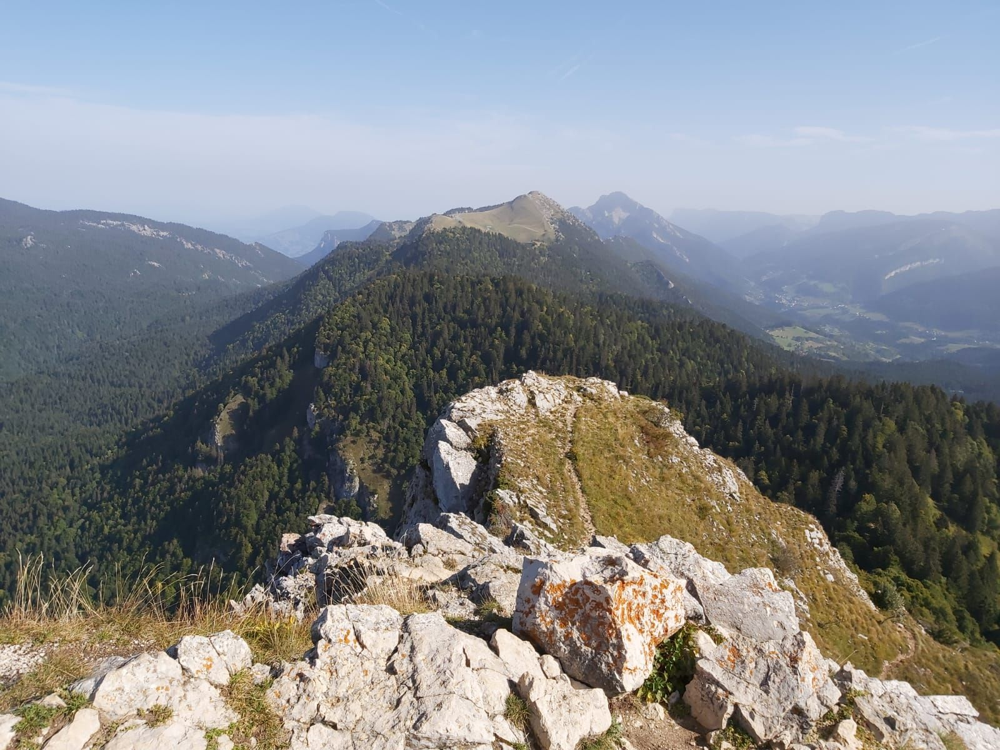

# 🥾🔴 Afterwork hike : Sunset at la Pinéa

Level :

* 🔵 medium for good hikers
* 🔴 hard for noobs

Read the full page

##  EN/FR 
We speak English/French in all our events. Don't be worry if your English/French is not that good. Nos évènements sont en Anglais et Français. Ne soyez pas inquiets si vous n’êtes pas bilingue.

##  La Pinéa : way up with sun, way down with headlight 
Topo : https://www.altituderando.com/La-Pinea-1771m-par-le-col-de-Porte-3692
* Distance: 6km
* Time: 2h30 of hike + 45min dinner + 45min drive
Drop : 450m

##  Car share 
Meet at parking porte de France
Beginning of the hike at col de porte
Car share will cost 3€ per person

##  Rules 
\- Don't be late
\- Do not subscribe if you are not sure to join the event
\- If you finally can't join us\, please unsubscribe from the event or at least write a message here to announce your cancellation\. That way\, we won't wait for you
\- If you are a driver and can't join\, please send me a message through meetup ASAP\, that way I can remove available seats
\- Don't throw any dump in nature

##  What do you need 
\- Hiking shoes
\- Hiking poles \(if you need\)
\- A headligth or any flashlight
\- Water \+ food for dinner \+ Some snack
\- Clothes for wind/cold/rain
\- Money for car share
\- Sunglasses
\- Sunscreen
##  Covid 
\- Don't come if you feel sick\, have fever\, are contact case
\- Wear your mask
\- You are responsible to your own health\, so respect barrier gestures\, social distancing

If you have any questions, please ask !

## Stats

- Start time: 2022-06-02 18:30
- End time: 2022-06-02 22:30
- Duration: 4:00:00
- Time to event: 1 day, 18:06:34
- Attendees: 7
- KM: 6
- D+: 460
- Top: 1771
- Type: Hike
- Comment: 

## Links

- [Trail short link](https://s.42l.fr/AsG5C8gc)
- [Trail full link]()
- [Album](https://binnette.github.io/GacImg2022/)
- [Meetup event](https://www.meetup.com/grenoble-adventure-club-english-french/events/286270149/)
