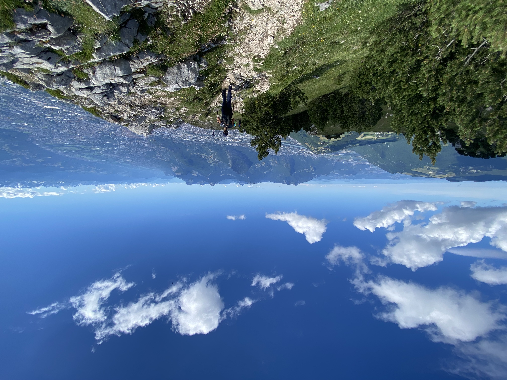

# 🟠🟢 🥾 Medium-Easy Hike: Le Moucherotte (Saint-Nizier to Lans-en-Vercors) 

💡 Read the full page by clicking on "Read more"/"Lire la suite"...💜
Joining the event = Accepting the rules (See rule section below)

##  Summary 
A third (3rd) in a series of Hikes around Grenoble without Cars: Le Moucherotte -- One of the most commonly undertaken and iconic hikes in Grenoble.

We will endure hell and arrive on the "roof" for wonderful lunch picnic with a wonderful bi-directional panoramic view, both Grenoble (east) and the inner-Vercors (West)

The high point on The Vercors Mountain (west) seen from Grenoble.

If you live in Grenoble and look west at any point, you've seen waypoint from a distance.

##  🟠🟢 🥾 Difficulty / Skill 🟠🟢 🥾

This event will classify this as a "Medium-easy" hike, as the event is NOT TECHNICALLY CHALLENGING (it is a well-maintained and safe trail), but because of the duration of the event (distance of the route, in addition to elevation gain), and recent weather conditions (very hot), I want to be impress upon attendees the physical duress we will endure !

##  General Plan 

We will all take the Trans Isère bus [T65] from Grenoble Gare to the trailhead (Village Saint Nizier office de Tourism) .

Come early to buy tickets (or use SMS)

##  🗨️ EN/FR 🗨️ 
🦅/🐓 : We speak English/French in all our events. Don't be worry if your English/French is not that good. Nos évènements sont en Anglais et Français. Ne soyez pas inquiets si votre niveau d'anglais n'est pas "suffisant".

##  🥾 Hike "Le Moucherotte" 🥾 

* Topo & GPX track: https://www.alltrails.com/explore/map/map-may-26-2022-1-38-pm-0163cce
* Distance: \~10km
* Time: 3h of hike up, 2.5h to hike down
Elevation Change D+: 742m

##  Schedule / Detailed Plan 

* [ 07:05 ] Meet at the Gare Grenoble: Tickets (Billets), coffee, snacks, sobriety test, stretching, etc.
* [ 07:20 ] Board / Ride bus [T65] to stop [Saint-Nizier-du-Moucherotte ] to stop "LE VILLAGE SAINT NIZIER DU MOUCHEROTTE"]
* [ 08:15 ] Hike to the plateau at Le Moucherotte (lots of space to spread out)! Overall Should take about 3.5 hours total:
* [ 12:00 ] Arrive at Summit! Picnic, Enjoy the View / Nap / Stretch / Rest / Eat / Play Mölkky / Frisby (bad idea) / Fly a Kite, etc.
* [ 13:45 ] Commence return Hike to Lans-en-Vercors:
( Or if the group decides, we can visit "The Three Virgins" ("les Trois Vierges" instead and return via the original path)
* [ 16:00-17:00 ] Board return bus in Lans-en-Vercors Tourist Office (Two options: T64 or T65)
* [ 16:00-18:00 ] Back at Grenoble

The event is over we step off the bus!

##  Suggested Supplies to Bring 

* 2.5-to-3 Liters of Water absolute minimum (\*) plus a small emergency bottle (200-300ml)
* Money for the bus (EUR 6 both ways), or you can pay with SMS on your mobile phone
* Good Hiking 🥾shoes and socks
* (MANDATORY) Hiking Poles (des Battons)
* Rain jacket and/or Layers of clothes as Temperatures will change at different altitudes and Sunlight and physical activity level.
* Food for Lunch and Petite snacks for 2-2.5 meals. (À partager?!). We will have a picnic up top! But we stop often to hydrate and keep blood sugar up
* Sunscreen / Bug spray
* Sun Hat (Chapeau de Soleil)
* Sunglasses (Polarized)
* Any medicines or allergy treatments you may have pre-existing (EPI PEN)
* 😁 Your smile / 😊 Happiness

Recommended:

* Whistle ( Sifflet )
* Gloves ( Gants )
* USB PowerBank battery for mobile phone (ensure charged!)
* Small torch / flashlight
*

“Better to have and not need, than need a not Have.”

(\*) The heat has been brutal. Stay hydrated so that your legs don't cramp. If you don't own one yet, I commend that this is the event for which you purchase a water reservoir for your Backpack/Sack-a-dos)

***

##  💡 Rules of The Day 💡 

* 🚶‍♀️🚶‍♂️ The GAC group is about hiking 🥾 , fitness, nature, active lifestyle --- and sure, also socializing and making friends and language/cultural exchange. **BUT NOT about flirting or speed dating!** We want everyone to feel comfortable during our events. ⛔
* 😍 Hiking is about enjoying and respecting mother nature!
* Don't throw/dump any garbage 🚮 in nature, not even fruit pelt: 🍌(2 years for decomposition), 🍊 (6 months); egg shell 🥚 (3 years)
* Don't be (too) late 😇 We have a large 30 minute queue window. If you arrive after we depart, call my mobile and we'll find a way for you to connect with us down the road.
* If you finally can't join us, please unsubscribe from the event or at least write a message here to announce your cancellation. 💜 That way, we won't wait for you 💜
* 💟 You are responsible of your own health and security
* If you have any medical conditions that we should be aware of in an emergency, please feel free to contact me privately!
* 😷 COVID-19 rules at the moment: [https://www.gouvernement.fr/en/coronavirus-covid-19](https://www.gouvernement.fr/en/coronavirus-covid-19)

If you have any questions, please ask! Feel free to send me a Private Message or on WhatsApp (+1-412-378-3823)

## Stats

- Start time: 2022-06-25 07:05
- End time: 2022-06-25 18:05
- Duration: 11:00:00
- Time to event: 6 days, 21:47:41
- Attendees: 15
- KM: 10.7
- D+: 732
- Top: 1901
- Type: Hike
- Comment: 

## Links

- [Trail short link](https://s.42l.fr/wxboqZRO)
- [Trail full link]()
- [Album](https://binnette.github.io/GacImg2022/2022-06-25-🟠🟢-🥾-Medium-Easy-Hike-Le-Moucherotte-Saint-Nizier-to-Lans-en-Vercors.html)
- [Meetup event](https://www.meetup.com/grenoble-adventure-club-english-french/events/286649018/)
