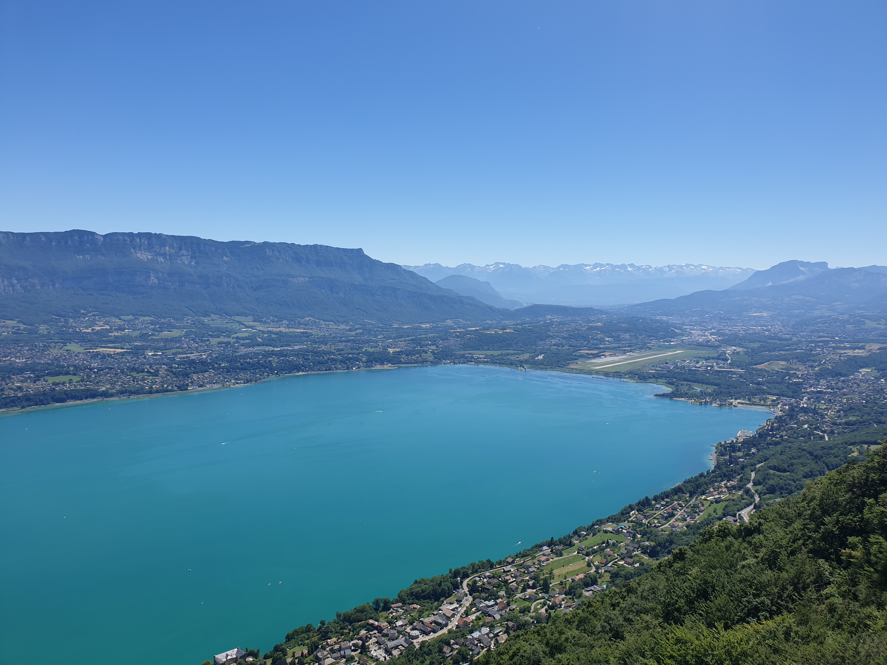

# 🌊 Chill at 'Lac du Bourget' (+🧗🟢 Bonus Via ferrata Rocher de Cornillon)

💡 Read the full page by clicking on "Read more"/"Lire la suite"...💜
Joining the event = Accepting the rules (See rule section below)

##  ⭐⭐ Updates ⭐⭐ 

* 📅 July 02 - 6pm: Maxwell, Tanaya, Yash & Senapati : you will go to the lake at 1pm with Anis. So I removed you from the event cause event starts at 9am.
* 📅 July 02 - 6pm: 🟨🟨 **WARNING the event appointment is at 9am** 🟨🟨
* 📅 July 02 - 8pm: more cars = more seats. Seats: Adam (5), Albin (5), Ilknur (4)

##  🗨️ EN/FR 🗨️ 
🦅/🐓 : we speak English/French in all our events. Don't worry if your English/French is not that good. Nos évènements sont en Anglais et Français. Ne soyez pas inquiets si votre niveau d'anglais n'est pas "suffisant".

##  🌊 Chill at 'Lac du Bourget' (+🧗🟢 Bonus Via ferrata Rocher de Cornillon) 

* 🟢 easy for climbers

Meet at 9am at parking "Esplanade du Souvenir Français" near Parc Paul Mistral:

* ⏰ [https://www.osm.org/way/69486256](https://www.osm.org/way/69486256)
* ⏰ [https://goo.gl/maps/BAbHQ153PcNgunPd6](https://goo.gl/maps/BAbHQ153PcNgunPd6)

We ride our cars for 50m. Then park our car(s) at "Le Bourget du Lac":

* 🅿 [https://goo.gl/maps/eeTCDBRLwnr9qwex7](https://goo.gl/maps/eeTCDBRLwnr9qwex7)
* 🅿 [https://www.osm.org/way/241793447](https://www.osm.org/way/241793447)

Make sure you have via equipment before joining to the via. You can rent Friday night at Adrenaline Sport. Or rent Saturday morning near Lac du Bourget. To rent via Lac du Bourget: Send a mail to minigolfbourget@gmail.com or call: (+33) 06 56 69 82 45 (number of kit limited)

About the via:

* [https://www.viaferrata-fr.net/via-ferrata-145-Rocher-de-Cornillon-Bourdeau-Savoie.html](https://www.viaferrata-fr.net/via-ferrata-145-Rocher-de-Cornillon-Bourdeau-Savoie.html)

About the lac:
💰 6€ entrance for the lac

##  🚗 share 
Car share will cost 8€ per person (fuel + toll + "compensation" to get more drivers). Fuel is very expensive at this time...

##  💡 Rules 💡 

* 🚶‍♀️🚶‍♂️ The GAC group is about hiking 🥾 and why not making friends BUT NOT about flirting or speed dating ⛔
* 😍 Hiking is about walking and enjoying nature
* Don't throw any dump 🚮 in nature even fruit pelt: 🍌(2 years for decomposition), 🍊 (6 months); egg shell 🥚 (3 years)
* Subscribe on the waiting list. Maybe more cars will be available 🚗
* Don't be (too) late 😇 We won't wait for you at morning, especially if you don't send any message.
* Since seats in car(s) are "rare", please do not subscribe if you are not sure to join the event
* If you finally can't join us, please unsubscribe from the event or at least write a message here to announce your cancellation. 💜 That way, we won't wait for you 💜
* If you are a driver and can't join, please send me a message through meetup ASAP, that way I can remove available seats 🚗
* 💟 You are responsible of your own health and security
* 😷 Covid rules: [https://www.gouvernement.fr/en/coronavirus-covid-19](https://www.gouvernement.fr/en/coronavirus-covid-19)

##  ❔ What do you need ❔ 

* 🥾 Hiking shoes (or any good/non slippery shoes)
* Hiking pole (if you want)
* 🩳🩱 swimsuit + towel
* **🧗 YOUR RENTED VIA FERRATA KIT** (if you plan to do it)
* Some like to have finger-less gloves (buy some if you want)
* ⚽🏐🎲🃏 Games, card games, books, etc (take as much as you want, you won't carry them during the hike cause we will take cars to reach the lake)
* 🧃 Water (mini 1 or 2L) + 🍫 Some snack + 🥗 food for lunch + food for afternoon or even evening if you want to chill more
* Clothes for wind, rain (if any)
* 🌞 Sun-cream / 😎 Sun glasses
* 😁 Your smile / 😊 Happiness
* 😷 Your mask as always (avoid contact and so on)
* 💵 Money for car share (exact change in cash)

\-\-\-
If you have any questions, please ask!
See you! Adam from GAC.
PS: for more activities (cinema, tennis table, concert, etc), you can join our Telegram Channel. Just ask me by message on meetup or IRL (in real life).

## Stats

- Start time: 2022-07-02 09:00
- End time: 2022-07-02 20:00
- Duration: 11:00:00
- Time to event: 15:34:09
- Attendees: 6
- KM: 2
- D+: 251
- Top: 845
- Type: Via
- Comment: 

## Links

- [Trail short link](https://s.42l.fr/Q10nJ1ae)
- [Trail full link]()
- [Album](https://binnette.github.io/GacImg2022/2022-07-02-🌊-Chill-at-Lac-du-Bourget-🧗🟢-Bonus-Via-ferrata-Rocher-de-Cornillon.html)
- [Meetup event](https://www.meetup.com/grenoble-adventure-club-english-french/events/286920305/)
