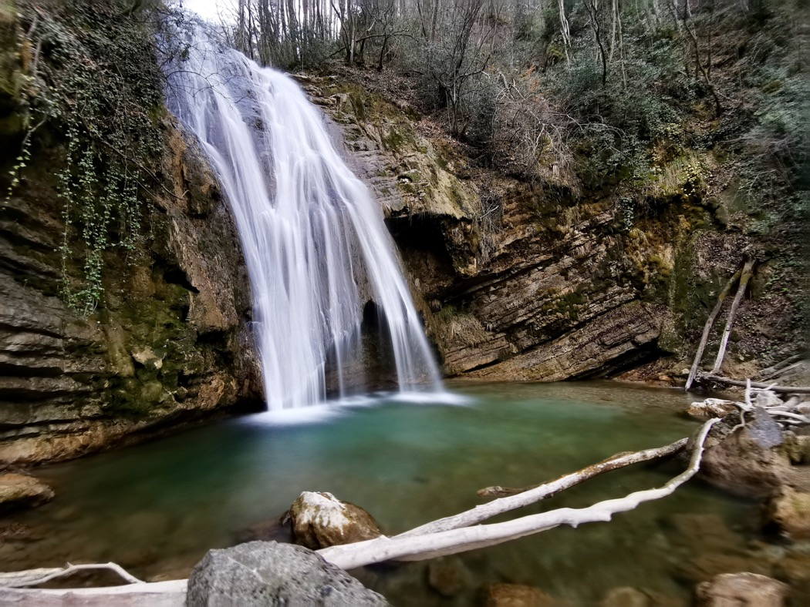

# 🟢 🥾🩱 Cool Off, Swim & Picnic w/ Easy Hike + Cascade d'Allières 🩱 🥾🟢

💡 Read the full page by clicking on "Read more"/"Lire la suite"...💜
Joining the event = Accepting the rules (See rule section below)

##  Summary 

A fifth (5th) in a series of weekend hikes around Grenoble without Cars:

Beat the heat and cool off in a pool / cascade of fresh water from the alps: Le Cascades d'Allières - near Village Claix

##  🟢 🥾 Difficulty / Skill 🟢 🥾

This event will classify will involve an easy hike along village / residential roads, then a small hike on paths/trails.

##  General Plan 

Everyone will make their own way via Tram C to the south-west end of the line at stop "Le Prisme"

NOTE/WARNING: Grenoble Transit Authority (TAG) is making some repairs/works on Line A and Line B, so if you must make a connection via tram, be prepared for delays.

Rally Point: https://goo.gl/maps/5S9nzNpwQHSgd5xx5

From there, we'll take the bus TAG #21 Bus to village Claix center (10-12 minutes ride)

Tag Bus Schedule: https://www.tag.fr/ftp/fiche_horaires/fiche_horaires_2014/HORAIRES_21.pdf

We'll have a 1.9 hike from Claix Village Center to the trail head.

Then 650m on the trail (mixed terrain, elevation gain 150-200m) to the cascades.

There is a series of (3x) different cascades in the area; we will visit them all, and then pick one for a picnic and swimming!

##  🗨️ EN/FR 🗨️ 
🦅/🐓 : We speak English/French in all our events. Don't be worry if your English/French is not that good. Nos évènements sont en Anglais et Français. Ne soyez pas inquiets si votre niveau d'anglais n'est pas "suffisant".

##  🥾 GPS TOPO 🥾 

* Topo & GPX track: https://www.alltrails.com/explore/map/map-july-22-2022-78bc62d
* Distance: \~2.6 km (both Directions)
* Time: \~2h of walking, depending
Elevation Change D+: 250m

##  Schedule / Detailed Plan 

* [ 03:00-03:29 ] Rally/Meet at the Tram C stop "Le Sessyin"
* [ 03:30 ] Board TAG Bus 21 to Village Claix/Point Rouge
* [ 03:45 ] Commence Hike towards the area of cascades
* [ 04:30] Arrive at Cascade Point #1
* [ Picnic, Swimming, General Cooling Off]
* [ Optional: Visit / hike around "Le Pissard" ]
* [ 05:45 ] Hike Back to Village Claix
* [ 06:34 ] Broad #21 Bus at Marrie de Claix towards Le Prisme

The event is over we step off the bus at Tram station "Le Prisme"; From there we can all take the Tram-C back to Grenoble together.

##  Suggested Supplies to Bring 

* 2.5-to-3 Liters of Water minimum (\*) plus a small emergency bottle (200-300ml)
* Money [💰](https://emojipedia.org/money-bag/#:~:text=Emoji%20Meaning,to%20Emoji%201.0%20in%202015.) for the bus (EUR 6 both ways), OURA Card, or you can pay with SMS on your mobile phone
* Good Hiking 🥾shoes and socks
* Food for Picnic/Lunch at the Cascade and petite snacks for "À partager".
* A swimming suit [🩱](https://emojipedia.org/one-piece-swimsuit/) if you want to swim
* A towel ( if you plan to Swim )
* Sunscreen / Bug spray
* Sun Hat (Chapeau de Soleil)
* Sunglasses (Polarized)
* Any medicines or allergy treatments you may have pre-existing (Par Example, EPI Pen if you have allergies)
* 😁 Your smile / 😊 Happiness

Recommended:

* Whistle ( Sifflet )
* Gloves ( Gants )
* USB PowerBank battery for mobile phone (ensure charged!)
* Small torch / flashlight

“Better to have and not need, than need a not Have.”

(\*) The heat has been brutal. Stay hydrated so that your legs don't cramp. If you don't own one yet, I commend that this is the event for which you purchase a water bladder/reservoir for your Backpack/Sac-a-Dos)

***

##  💡 Rules of The Day 💡 

* 🚶‍♀️🚶‍♂️ The GAC group is about hiking 🥾 , fitness, nature, active lifestyle --- and sure, also socializing and making friends and language/cultural exchange. **BUT NOT about flirting or speed dating!** We want everyone to feel comfortable during our events. ⛔
* 😍 Hiking is about enjoying and respecting mother nature!
* Don't throw/dump any garbage 🚮 in nature, not even fruit pelt: 🍌(2 years for decomposition), 🍊 (6 months); egg shell 🥚 (3 years)
* Don't be (too) late 😇 We have a large 30 minute queue window. If you arrive after we depart, call my mobile and we'll find a way for you to connect with us down the road.
* If you finally can't join us, please unsubscribe from the event or at least write a message here to announce your cancellation. 💜 That way, we won't wait for you 💜
* 💟 You are responsible of your own health and security
* If you have any medical conditions that we should be aware of in an emergency, please feel free to contact me privately!
* 😷 COVID-19 rules at the moment: [https://www.gouvernement.fr/en/coronavirus-covid-19](https://www.gouvernement.fr/en/coronavirus-covid-19)

If you have any questions, please ask! Feel free to send me a Private Message or on WhatsApp (+1-412-378-3823)

## Stats

- Start time: 2022-07-23 15:00
- End time: 2022-07-23 19:00
- Duration: 4:00:00
- Time to event: 15:40:30
- Attendees: 4
- KM: 7.1
- D+: 454
- Top: 740
- Type: Hike
- Comment: 

## Links

- [Trail short link](https://s.42l.fr/iUi0nba1)
- [Trail full link]()
- [Album](https://binnette.github.io/GacImg2022/2022-07-23-🟢-🥾-Cool-Off-and-PIcnic-w-Easy-Hike-Cascade-dAllieres-🟢-🥾.html)
- [Meetup event](https://www.meetup.com/grenoble-adventure-club-english-french/events/287355427/)
