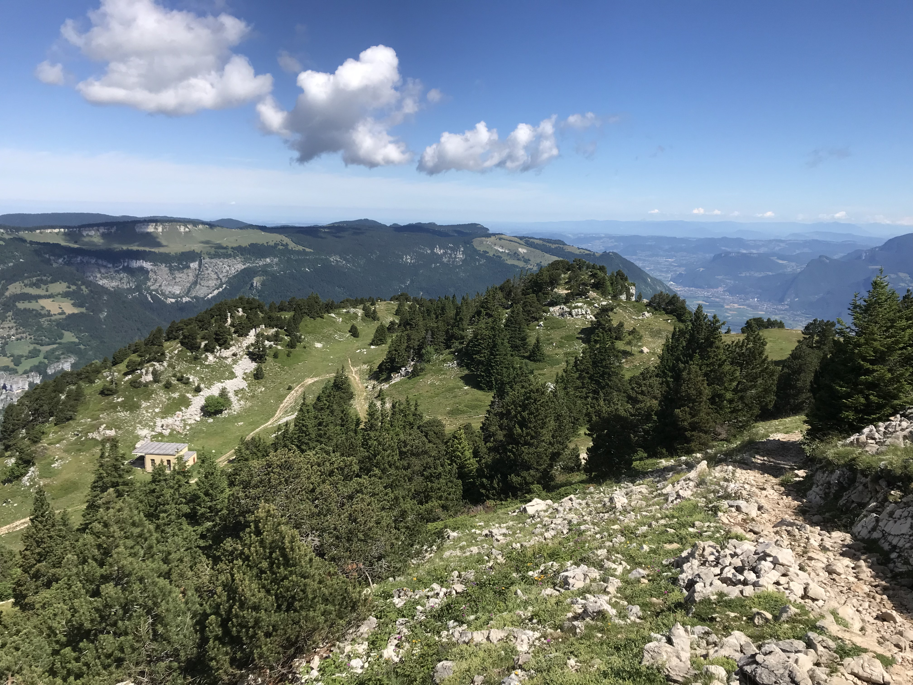

# Afterwork hike : Sunset at Moucherotte

Read the full page

##  EN/FR 
We speak English/French in all our events. Don't be worry if your English/French is not that good. Nos évènements sont en Anglais et Français. Ne soyez pas inquiets si vous n’êtes pas bilingue.

##  Moucherotte : way up with sun, way down with headlight 
Topo : https://www.visorando.com/randonnee-le-moucherotte-en-partant-de-saint-nizie/
* Distance: 9km
* Time: 3h of hike + 45min dinner + 45min drive
Drop : 750m

##  Car share 
Meet at Mairie de Seyssinet-Pariset (Tram C)
Beginning of the hike at parking du tremplin olympique (chemin de la roche)
Car share will cost 2€ per person

##  Rules 

* Don't be late
* Do not subscribe if you are not sure to join the event
* If you finally can't join us, please unsubscribe from the event or at least write a message here to announce your cancellation. That way, we won't wait for you
* If you are a driver and can't join, please send me a message through meetup ASAP, that way I can remove available seats
* Don't throw any dump in nature

##  What do you need 

* Hiking shoes (or any good sport shoes)
* Hiking pole (if you want)
* A headligth or any flashlight
* Water + food for dinner + Some snack
* Clothes for wind/cold
* Money for car share

##  Covid 

* Don't come if you feel sick, have fever, are contact case
* If we are more than 10 hikers, we will split in groups of maxi 10 people to respect current French Covid laws
* You are responsible to your own health, so respect barrier gestures, social distancing

If you have any questions, please ask !

## Stats

- Start time: 2022-10-04 17:30
- End time: 2022-10-04 22:00
- Duration: 4:30:00
- Time to event: 23:31:28
- Attendees: 3
- KM: 9
- D+: 750
- Top: 1901
- Type: Hike
- Comment: 

## Links

- [Trail short link](https://s.42l.fr/le-moucherotte)
- [Trail full link]()
- [Album](https://binnette.github.io/GacImg2022/)
- [Meetup event](https://www.meetup.com/grenoble-adventure-club-english-french/events/288881249/)
