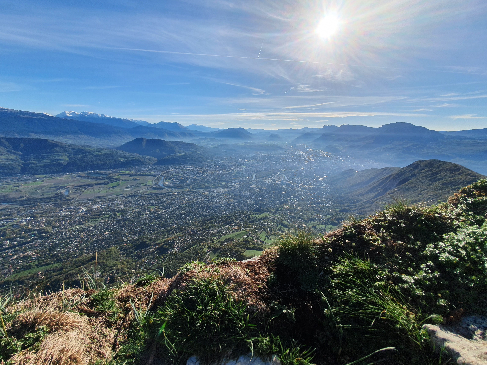

# 🟢 🥾 Easy Hike - Fort Saint-Eynard (Rescheduled) 🟢 🥾

💡 Read the full page by clicking on "Read more"/"Lire la suite"...💜
Joining the event = Accepting the rules (See rule section below)

##  Summary 

\-\- RESCHEDULED \-\-

An nice easy hike enjoy the weekend and get some mild fitness.

The sixth? seventh? eighth? Nineth? in a series of "Easy Hikes Around Town Without Cars" GAC Events that I will be hosting this summer/autumn (Trains, Trams, Bus, Telepherique only!)

🚋 Starting from bus stop outside of Grenoble National Art Museum
👁️‍🗨️ Note that the "fort" may be closed to public, so we will hike 'around' it.

There is a beautiful place from which to enjoy the Sunset.

##  🗨️ EN/FR 🗨️ 
🦅/🐓 : We speak English/French in all our events. Don't be worry if your English/French is not that good. Nos évènements sont en Anglais et Français. Ne soyez pas inquiets si votre niveau d'anglais n'est pas "suffisant".

##  🥾 Hike "Fort Saint-Eynard" 🥾 

* Topo & GPX track: https://www.alltrails.com/explore/map/tue-05-jan-2021-22-32-690f44c (Recycled from January 2021)
* Distance: \~5.5km (round trip)
* Time: 3h of hike
Elevation Change D+: 550m

##  Detailed Plan / Schedule 

NOTE: (Schedule Plan under final tuning)

* 10:25-10:45: Meet and board [10:45] TAG Bus 62 at stop Notre-Dame - Musée (Just in front at street)
* 11:00: Arrive Col de Vence\*\* Bus Stop and Commence Hike
* 12:45: Arrive at Top/Fort - Begin Group Picnic / Visit Museum / Shops
* 14:00: Begin return hike to Col de Vance Stop
* 15:15-15:30 (+/-): Catch TAG Bus 62 back to Grenoble Musée
* 15:45: Arrive back in Grenoble

Busses back to Grenoble on Jour Ferre/Sunday depart Col de Vence towards Grenoble at: 15:29 && 16:59 so we must arrive in time for 15:29 otherwise it is a 6km hike back to Grenoble or wait 1.5hrs

https://www.tag.fr/ftp/fiche_horaires/fiche_horaires_2014/HORAIRES_62.pdf

Rally Point (bus stop) on Google Maps: https://goo.gl/maps/xZiF8srLmTxCgRwi6

##  ❔ What do you need to Bring ❔ 

* Decent Hiking shoes 🥾 (or any 'non flat/slippery' shoes)
* Clothes for hiking between 24degC and 31degC
* Water 🧃 (1-2L) + Some snacks 🍫 / Tea/Coffee in Thermos
* Sun Hat / Chapeau + 🌞 Creme Solaire (Sunscreen Lotion)/ 😎 Sun glasses (lunettes de Solaire)
* Bug Spray / Gloves / Any other safety gear you need (your **EpiPen** for example)
* 😁 Your smile / 😊 Happiness
* Money/Argent for TAG Tram (OURA Card)

***

##  💡 Rules of The Day 💡 

* 🚶‍♀️🚶‍♂️ The GAC group is about hiking 🥾 , fitness, nature, active lifestyle --- and sure, also socializing and making friends and language/cultural exchange. **BUT NOT about flirting or speed dating!** We want everyone to feel comfortable during our events. ⛔
* 😍 Hiking is about enjoying and respecting mother nature!
* Don't throw/dump any garbage 🚮 in nature, not even fruit pelt: 🍌(2 years for decomposition), 🍊 (6 months); egg shell 🥚 (3 years)
* Don't be (too) late 😇 We have a large 30 minute queue window. If you arrive after we depart, call my mobile and we'll find a way for you to connect with us down the road.
* If you finally can't join us, please unsubscribe from the event or at least write a message here to announce your cancellation. 💜 That way, we won't wait for you 💜
* 💟 You are responsible of your own health and security
* If you have any medical conditions that we should be aware of in an emergency, please feel free to contact me privately!
* 😷 COVID-19 rules at the moment: [https://www.gouvernement.fr/en/coronavirus-covid-19](https://www.gouvernement.fr/en/coronavirus-covid-19)

If you have any questions, please ask! Feel free to send me a Private Message or on WhatsApp (+1-412-378-3823)

## Stats

- Start time: 2022-11-11 10:25
- End time: 2022-11-11 15:30
- Duration: 5:05:00
- Time to event: 33 days, 16:04:58
- Attendees: 33
- KM: 6.4
- D+: 740
- Top: 1337
- Type: Hike
- Comment: 

## Links

- [Trail short link](https://s.42l.fr/Kj-G7EaL)
- [Trail full link]()
- [Album](https://binnette.github.io/GacImg2022/2022-11-11-🟢-🥾-Easy-Hike-Fort-Saint-Eynard-Rescheduled-🟢-🥾.html)
- [Meetup event](https://www.meetup.com/grenoble-adventure-club-english-french/events/288991735/)
