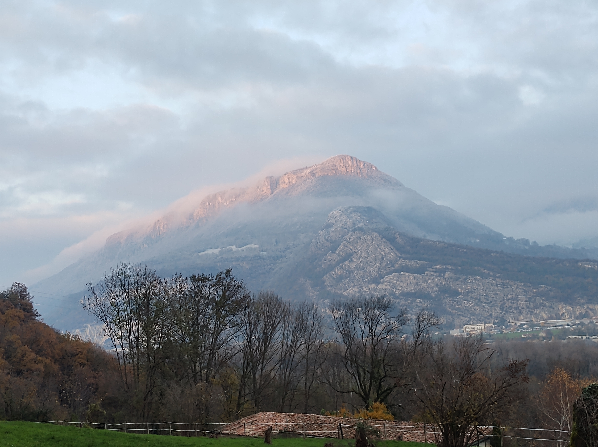

# 🥾🔵🕜 Hike: Bec de l'Echaillon - Northern point of Vercors 🧭

💡 Read full page by clicking on "Read more"/"Lire la suite"...💜
Joining the event = Accepting the rules (See rule section below)

##  ⭐⭐ Updates ⭐⭐ 

* 📅 more cars = more seats. Seats: Albin (5), Paul (5)

##  🗨️ EN/FR 🗨️ 
🦅/🐓 : we speak English/French in all our events. Don't worry if your English/French is not that good. Nos évènements sont en Anglais et Français. Ne soyez pas inquiets si votre niveau d'anglais n'est pas "suffisant".

##  🥾🔵🕜 Hike: Bec de l'Echaillon - Northern point of Vercors 🧭 

* 🔵 Very steep for noobs. 500m elevation in only 3km!

Meet at parking "Esplanade du Souvenir Français" near Parc Paul Mistral:

* ⏰ [https://www.osm.org/way/69486256](https://www.osm.org/way/69486256)
* ⏰ [https://goo.gl/maps/BAbHQ153PcNgunPd6](https://goo.gl/maps/BAbHQ153PcNgunPd6)

We ride our cars for \~20m. Then park near "Veurey-Voroize":

* 🅿️ [https://www.osm.org/way/1117688938](https://www.osm.org/way/1117688938)
* 🅿️ [https://goo.gl/maps/vMQfk6UW8fKge7jV7](https://goo.gl/maps/vMQfk6UW8fKge7jV7)

We will do a steep hike until a church and a nice viewpoint. Then go back to cars by some other path.

* Topo & GPX track: [https://s.42l.fr/dQwSkFgR](https://s.42l.fr/dQwSkFgR) (click Export > GPX)
* ▶💡 Download GPX on your phone (Tuto: [https://binnette.github.io/GAC](https://binnette.github.io/GAC/))
* Distance: 6km
* Time: \~2/3h of hike
* D+: 500m

##  🚗 share 
Car share is 2€ per person (fuel + "compensation" to get more drivers).

##  💡 Rules 💡 

* 🚶‍♀️🚶‍♂️ The GAC group is about hiking 🥾 and why not making friends BUT NOT about flirting or speed dating ⛔
* 😍 Hiking is about walking and enjoying nature
* Don't throw any dump 🚮 in nature even fruit pelt: 🍌(2 years for decomposition), 🍊 (6 months); egg shell 🥚 (3 years)
* Subscribe on the waiting list. Maybe more cars will be available 🚗
* Don't be (too) late 😇 We won't wait for you at morning, especially if you don't send any message.
* Since seats in car(s) are "rare", please do not subscribe if you are not sure to join the event
* If you finally can't join us, please unsubscribe from the event or at least write a message here to announce your cancellation. 💜 That way, we won't wait for you 💜
* If you are a driver and can't join, please send me a message through meetup ASAP, that way I can remove available seats 🚗
* 💟 You are responsible of your own health and security
* 😷 Covid rules: [https://www.gouvernement.fr/info-coronavirus](https://www.gouvernement.fr/info-coronavirus)

##  ❔ What do you need ❔ 

* 🥾 Hiking shoes
* 🥢 Hiking pole
* 🧃 Water (mini 1L) + 🍫 Some snack
* 🌞 Sun-cream / 😎 Sun glasses
* 😁 Your smile / 😊 Happiness
* 😷 Your mask as always (avoid contact and so on)
* 💵 Money for car share (exact change in cash)

***

If you have any questions, please ask!

See you! Albin from GAC.

PS: for more activities (cinema, tennis table, concert, etc), you can join our Telegram Channel. Just ask me by message on meetup or IRL (in real life).

## Stats

- Start time: 2022-12-11 13:30
- End time: 2022-12-11 18:30
- Duration: 5:00:00
- Time to event: 1 day, 13:59:49
- Attendees: 9
- KM: 5.9
- D+: 500
- Top: 622
- Type: Hike
- Comment: 

## Links

- [Trail short link](https://s.42l.fr/dQwSkFgR)
- [Trail full link]()
- [Album](https://binnette.github.io/GacImg2022/2022-12-11-🥾🔵🕜-Hike-Bec-de-lEchaillon-Northern-point-of-Vercors-🧭.html)
- [Meetup event](https://www.meetup.com/grenoble-adventure-club-english-french/events/290246652/)
