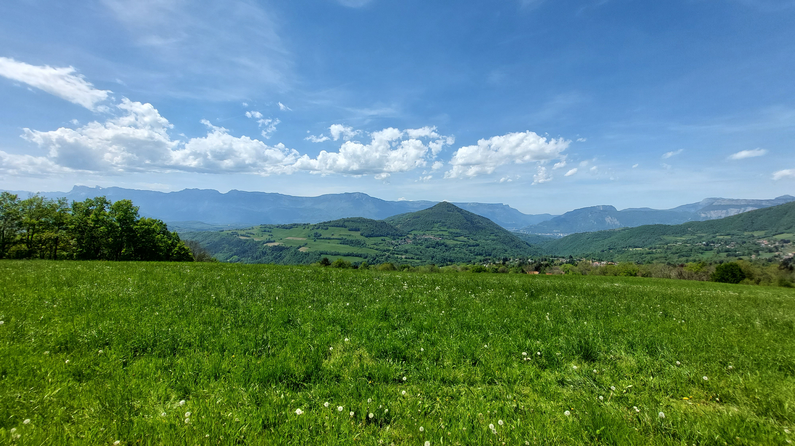

# 🥾🔵 Hike: Le Marais des Seiglières 🐸🦆

💡 Click “Read more”/“Lire la suite” for full page ✅ Joining = Accepting rules (see below)

##  ⭐ Updates ⭐ 

* 📅 More cars = more seats. Seats: Albin (5), Thomas (5), Roman (5), François (3), Arthur (4), Marta+3 (4) join directly at hike start.
* We have a total of 26 seats

##  🗨️ EN/FR 🗨️ 
🦅/🐓 Our events are in English/French. Don’t worry if you are not fluent. Nos évènements sont en Anglais/Français. Ne vous inquiétez pas si vous n’êtes pas bilingue.

## 📍 Meeting Point 📍
Meet at parking "Esplanade du Souvenir Français" near Parc Paul Mistral at **event start time SHARP**:

* ⏰ [https://www.osm.org/way/69486256](https://www.osm.org/way/69486256)
* ⏰ [https://goo.gl/maps/iNPSZcFVyTcM9VX2A](https://goo.gl/maps/iNPSZcFVyTcM9VX2A)

##  🚗 Transportation 🚗 
We ride our cars for \~25m. Then park at "**Le Pinet d'Uriage**":

* 🅿️ [https://www.osm.org/way/474805146](https://www.osm.org/way/474805146)
* 🅿️ [https://goo.gl/maps/Ussxrmf8cMMEPuvw5](https://goo.gl/maps/Ussxrmf8cMMEPuvw5)

##  🚗 Car share 🚗 
Car share is 2€ per person (fuel + "compensation" to get more drivers).

##  🥾🔵 Hike: Le Marais des Seiglières 🐸🦆 

* 🔵/🔴 Medium/hard for beginners
* 🟢 Easy for good hikers

We will do a loop hike. First, we will breathe in the fresh air of the forest before heading to the swamp. Then, we will loop back to our car by hiking through the residential area of Saint-Martin-d’Uriage. Along the way, we will try to catch a glimpse of a very old chestnut tree. Finally, we will drive back to Grenoble.

* 🗺️ Topo & GPX track: [https://s.42l.fr/Pj7fJfyR](https://s.42l.fr/Pj7fJfyR) (click Export > GPX)
* 📲 Download GPX on your phone (Tuto: [https://binnette.github.io/GAC](https://binnette.github.io/GAC/))
* 📏 Distance: 14.7km
* ⏱️ Time: \~4/5h of hike
* 📈 D+: 531m 😅

##  📜 Rules 📜 

* 🚶‍♀️🚶‍♂️ GAC is about hiking 🥾 and making friends 🤗, NOT flirting ⛔
* 🚮 Don't litter in nature, even fruit peel. Decomposition: 🍊 6 months, 🍌 2 years, 🥚 3 years
* 🚗 Join waiting list for car availability
* ⏰ Don’t be late, we won’t wait
* 💺 Seats in car(s) are limited, only subscribe if sure to join
* ❌ Unsubscribe or 💬 message if can’t join
* 🚗 Drivers: message me ASAP if you can’t join
* 💟 You are responsible for your own health and security

##  🎒 What to bring 🎒 

* 🥾 Hiking shoes
* 🥢 Hiking poles (optional)
* 🧃 Water (1-2L) + 🍫 Snacks + 🥗 Lunch
* ❄️🌧️ Cold and rain ready clothes
* 🌞 Sunscreen, 😎 Sunglasses
* 😁 Smile, 😊 Happiness
* 💵 Car share money (exact change in cash)

***

Got questions? Just ask!
Albin from GAC

PS: Join our Telegram for more activities (🧗‍♀️, 🏓, 🎳, 🎲, 🎥, 🎵, 🍽️). Message me on Meetup for the link.

## Stats

- Start time: 2023-05-06 08:30
- End time: 2023-05-06 17:30
- Duration: 9:00:00
- Time to event: 16 days, 15:51:20
- Attendees: 17
- KM: 14.7
- D+: 531
- Top: 1110
- Type: Hike
- Comment: 

## Links

- [Trail short link](https://s.42l.fr/Pj7fJfyR)
- [Trail full link]()
- [Album](https://binnette.github.io/GacImg2023/2023-05-06-🥾🔵-Hike-Le-Marais-des-Seiglieres-🐸🦆.html)
- [Meetup event](https://www.meetup.com/grenoble-adventure-club-english-french/events/292996689/)
