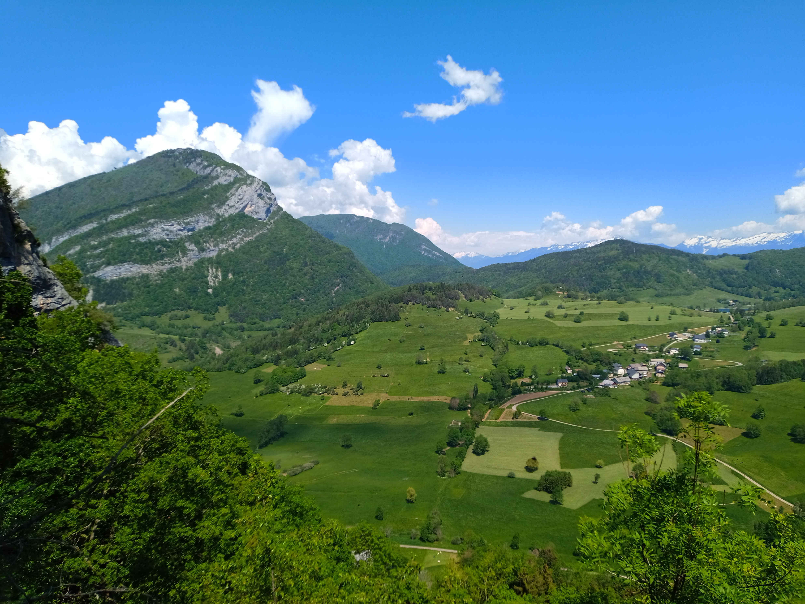

# 🥾🔴 Hike: Montgelas ⛰️ and ladder of Tormery 🪜

💡 Click “Read more”/“Lire la suite” for full page ✅ Joining = Accepting rules (see below)

##  ⭐ Updates ⭐ 

* 📅 More cars = more seats. Seats: Albin (5), Thomas (5)

##  🗨️ EN/FR 🗨️ 
🦅/🐓 Our events are in English/French. Don’t worry if you are not fluent. Nos évènements sont en Anglais/Français. Ne vous inquiétez pas si vous n’êtes pas bilingue.

## 📍 Meeting Point 📍
Meet at parking "Esplanade du Souvenir Français" near Parc Paul Mistral at **event start time SHARP**:

* ⏰ [https://www.osm.org/way/69486256](https://www.osm.org/way/69486256)
* ⏰ [https://goo.gl/maps/iNPSZcFVyTcM9VX2A](https://goo.gl/maps/iNPSZcFVyTcM9VX2A)

##  🚗 Transportation 🚗 
We ride our cars for \~40m. Then park at "**Chignin**":

* 🅿️ [https://www.osm.org/way/632547653](https://www.osm.org/way/632547653)
* 🅿️ [https://goo.gl/maps/qKSwy1Dvo4BuHP2w5](https://goo.gl/maps/qKSwy1Dvo4BuHP2w5)

##  🚗 Car share 🚗 
Car share is 6€ per person (fuel + toll + "compensation" to get more drivers).

##  🥾🔴 Hike: Montgelas ⛰️ and ladder of Tormery 🪜 

* ⚫️ Not for beginners
* 🔵/🔴 Medium/hard for good hikers

* 🗺️ Topo & GPX track: [https://s.42l.fr/fHC0KxET](https://s.42l.fr/fHC0KxET) (click Export > GPX)
* 📲 Download GPX on your phone (Tuto: [https://binnette.github.io/GAC](https://binnette.github.io/GAC/))
* 📏 Distance: 15.9km
* ⏱️ Time: \~6/7h of hike
* 📈 D+: 1286m 😅

##  📜 Rules 📜 

* 🚶‍♀️🚶‍♂️ GAC is about hiking 🥾 and making friends 🤗, NOT flirting ⛔
* 🚮 Don't litter in nature, even fruit peel. Decomposition: 🍊 6 months, 🍌 2 years, 🥚 3 years
* 🚗 Join waiting list for car availability
* ⏰ Don’t be late, we won’t wait
* 💺 Seats in car(s) are limited, only subscribe if sure to join
* ❌ Unsubscribe or 💬 message if can’t join
* 🚗 Drivers: message me ASAP if you can’t join
* 💟 You are responsible for your own health and security

##  🎒 What to bring 🎒 

* 🥾 Hiking shoes
* 🥢 Hiking poles (optional)
* 🧃 Water (1-2L) + 🍫 Snacks + 🥗 Lunch
* ❄️🌧️ Cold and rain ready clothes
* 🌞 Sunscreen, 😎 Sunglasses
* 😁 Smile, 😊 Happiness
* 💵 Car share money (exact change in cash)

***

Got questions? Just ask!
Albin from GAC

PS: Join our Telegram for more activities (🧗‍♀️, 🏓, 🎳, 🎲, 🎥, 🎵, 🍽️). Message me on Meetup for the link.

## Stats

- Start time: 2023-05-27 08:30
- End time: 2023-05-27 19:30
- Duration: 11:00:00
- Time to event: 1 day, 7:41:23
- Attendees: 7
- KM: 15.9
- D+: 1286
- Top: 1301
- Type: Hike
- Comment: 

## Links

- [Trail short link](https://s.42l.fr/fHC0KxET)
- [Trail full link]()
- [Album](https://binnette.github.io/GacImg2023/2023-05-27-🥾🔴-Hike-Montgelas-⛰️-and-ladder-of-Tormery-🪜.html)
- [Meetup event](https://www.meetup.com/grenoble-adventure-club-english-french/events/293770730/)
