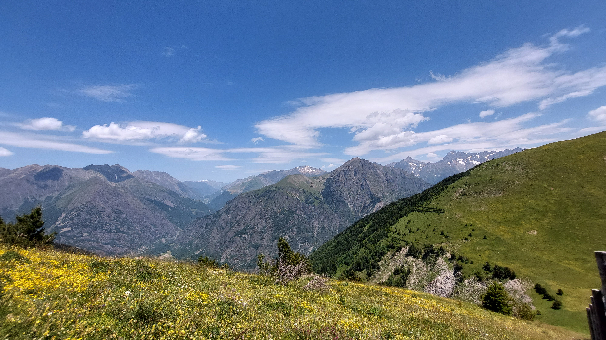

# 🥾🔵 Hike: Sentier des pères 🙏👨‍🦲 + Valbonnais lake 🌅🏊‍♀️🦆

💡 Click “Read more”/“Lire la suite” for full page ✅ Joining = Accepting rules (see below)

##  ⭐ Updates ⭐ 

* 📅 More cars = more seats. Seats: Albin (5), Manu (2), Thomas (5)

##  🗨️ EN/FR 🗨️ 
🦅/🐓 Our events are in English/French. Don’t worry if you are not fluent. Nos évènements sont en Anglais/Français. Ne vous inquiétez pas si vous n’êtes pas bilingue.

## 📍 Meeting Point 📍
Meet at parking "Esplanade du Souvenir Français" near Parc Paul Mistral at **event start time 🔺SHARP🔺**:

* ⏰ [https://osm.org/go/0CASJNbuF?m=](https://osm.org/go/0CASJNbuF?m=)
* ⏰ [https://goo.gl/maps/iNPSZcFVyTcM9VX2A](https://goo.gl/maps/iNPSZcFVyTcM9VX2A)

##  🚗 Transportation 🚗 
We ride our cars for \~1h20m and park after Valbonnais (near Col de Parquetout).

* 🅿️ [https://osm.org/go/xXVbLllQq?m=](https://osm.org/go/xXVbLllQq?m=)
* 🅿️ [https://goo.gl/maps/AYCbLgzktuF3YH5n8](https://goo.gl/maps/AYCbLgzktuF3YH5n8)

##  🚗 Car share 🚗 
Car share is 7€ per person (fuel + "compensation" to get more drivers).

##  🥾🔵 Hike: Sentier des pères 🙏👨‍🦲 + Valbonnais lake 🌅🏊‍♀️🦆 

* 🔵 Medium for beginners
* 🟢 Easy for good hikers

🥵🌡️34°C in Grenoble…😱 That means we need some 🏔️ and of course some 🌊! Be ready for a 🌞 hike (don’t forget your sun cream 🧴) on a nice and almost flat hill. We will do a loop 🔄 on the monk 🙏 path. Then after our hike, we take our 🚗 and go chill 😎 the whole afternoon at the lake 🌊! For real, I don’t want to get back in Grenoble to suffer the 🔥, so my 🚗 (and I) will stay as long as possible at the 🌊, we can even buy 🍻 and 🍕 at the 🌊! Then we finally can go back to Grenoble, the hottest city ever…😅 Sounds good? Join me for this awesome adventure! 😁😍

Afternoon lake:

* 🏊‍♀️ [https://osm.org/go/xXVbSSjPU-?m=](https://osm.org/go/xXVbSSjPU-?m=)
* 🏊‍♀️ [https://goo.gl/maps/AeseTmqcKsEYQo217](https://goo.gl/maps/AeseTmqcKsEYQo217)

* 🗺️ Topo & GPX track: [https://s.42l.fr/k2xhHAPn](https://s.42l.fr/k2xhHAPn) (click Export > GPX)
* 📲 Download GPX on your phone (Tuto: [https://binnette.github.io/GAC](https://binnette.github.io/GAC/))
* 📏 Distance: 12.4km
* ⏱️ Time: \~3/4h of hike + chill afternoon
* 📈 D+: 793m (573m if you don’t go back and forth to Cote-Belle)

##  📜 Rules 📜 

* 🚶‍♀️🚶‍♂️ GAC is about hiking 🥾 and making friends 🤗, NOT flirting ⛔
* 🚮 No littering in nature. Decomposition: 🍊 6m, 🍌 2y, 🥚 3y
* 🚗 Join waiting list for car availability
* ⏰ Don’t be late, we won’t wait
* 💺 Seats in car(s) are limited, only subscribe if sure to join
* ❌ Unsubscribe or 💬 message if can’t join
* 🚗 Drivers: message me ASAP if you can’t join
* 💟 You are responsible for your own health and security

##  🎒 What to bring 🎒 

* 🥾 Hiking shoes
* 🥢 Hiking poles (optional)
* 🧃 Water (1-2L) + 🍫 Snacks + 🥗 Lunch
* ❄️🌧️ Cold & rain gear (or not?)
* 🩳 Swimsuit 🩱, towel 🏖️💦
* 🃏⚽🥏🎲 Games for the lake (in the 🚗 for after 🥾)
* 🌞 Sunscreen, 😎 Sunglasses
* 😁 Smile, 😊 Happiness
* 💵 Car share money (exact change in cash)

***

❓ Need help 🤔 Visit [https://binnette.github.io/GAC](https://binnette.github.io/GAC) or ask!
Albin from GAC

PS: Join our Telegram for more activities (🧗‍♀️, 🏓, 🎳, 🎲, 🎥, 🎵, 🍽️). Message me on Meetup for the link.

## Stats

- Start time: 2023-07-08 08:30
- End time: 2023-07-08 21:00
- Duration: 12:30:00
- Time to event: 2 days, 22:20:57
- Attendees: 11
- KM: 12.4
- D+: 793
- Top: 2004
- Type: Hike
- Comment: 

## Links

- [Trail short link](https://s.42l.fr/k2xhHAPn)
- [Trail full link]()
- [Album](https://binnette.github.io/GacImg2023/2023-07-08-🥾🔵-Hike-Sentier-des-peres-🙏👨‍🦲-Valbonnais-lake-🌅🏊‍♀️🦆.html)
- [Meetup event](https://www.meetup.com/grenoble-adventure-club-english-french/events/294612365/)
