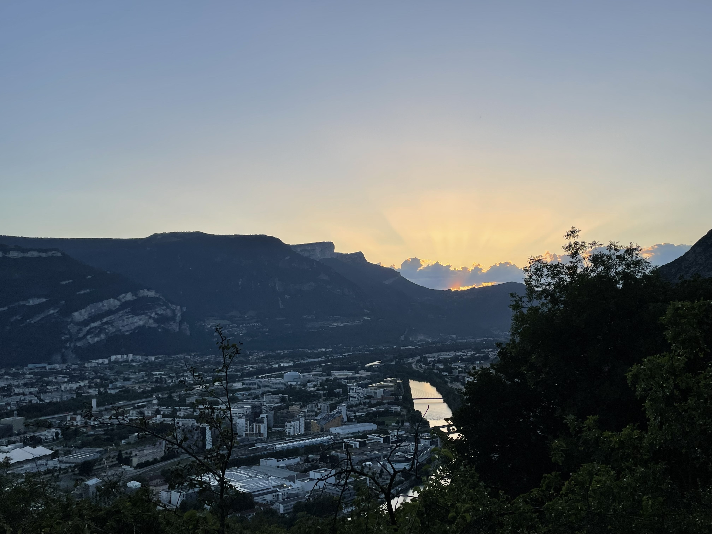

# 🥾💚hike: La Bastille, the classic!

💡 Click “Read more”/“Lire la suite” for full page ✅ Joining = Accepting rules (see below)

##  ⭐ Updates ⭐ 

* 📅 No car needed!

##  🗨️ EN/FR 🗨️ 
🦅/🐓 Our events are in English/French. Don’t worry if you are not fluent. Nos évènements sont en Anglais/Français. Ne vous inquiétez pas si vous n’êtes pas bilingue.

## 📍 Meeting Point 📍
Meet directly at porte saint Laurent

##  🧗‍♂️🟢Via ferrata: La Bastille 

After some months in Paris, i am coming back for a day to Grenoble to catch up with you across a classic hike.

* 🗺️ Topo & GPX track:
* 📏 Distance: 3km
* ⏱️ Time: \~1h
* 📈 D+: 290m

##  📜 Rules 📜 

* 🚶‍♀️🚶‍♂️ GAC is about hiking 🥾 and making friends 🤗, NOT flirting ⛔
* 🚮 Don't litter in nature, even fruit peel. Decomposition: 🍊 6 months, 🍌 2 years, 🥚 3 years
* 🚗 Join waiting list for car availability
* ⏰ Don’t be late, we won’t wait
* 💺 Seats in car(s) are limited, only subscribe if sure to join
* ❌ Unsubscribe or 💬 message if can’t join
* 🚗 Drivers: message me ASAP if you can’t join
* 💟 You are responsible for your own health and security

##  🎒 What to bring 🎒 

* 🥾 Hiking shoes
* 🧃 Water (1-2L) + 🍫 Snacks
* ❄️🌧️ Cold and rain ready clothes (or not?)
* 🌞 Sunscreen, 😎 Sunglasses
* 😁 Smile, 😊 Happiness
* 💵 Car share money (exact change in cash)

***

Got questions? Just ask!
Albin from GAC

PS: Join our Telegram for more activities (🧗‍♀️, 🏓, 🎳, 🎲, 🎥, 🎵, 🍽️). Message me on Meetup for the link.

## Stats

- Start time: 2023-07-13 19:00
- End time: 2023-07-13 22:00
- Duration: 3:00:00
- Time to event: 19:20:49
- Attendees: 7
- KM: 3.1
- D+: 259
- Top: 473
- Type: Hike
- Comment: 

## Links

- [Trail short link](https://s.42l.fr/w8oZa_mI)
- [Trail full link]()
- [Album](https://binnette.github.io/GacImg2023/)
- [Meetup event](https://www.meetup.com/grenoble-adventure-club-english-french/events/294769523/)
