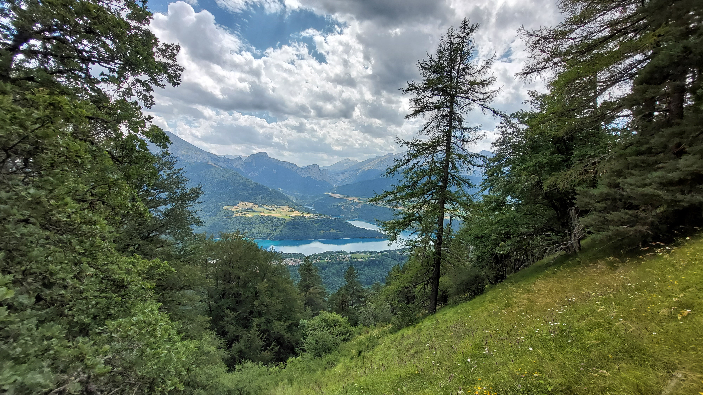

# 🥾🔵 Hike: Up to Peyrague 🏔 and back to starting lake to swim 🌊🏊‍♀️

💡 Click “Read more”/“Lire la suite” for full page ✅ Joining = Accepting rules (see below)

##  ⭐ Updates ⭐ 

* 📅 More cars = more seats. Seats: Albin (5), Chunchun (5), Hamid (5)

##  🗨️ EN/FR 🗨️ 
🦅/🐓 Our events are in English/French. Don’t worry if you are not fluent. Nos évènements sont en Anglais/Français. Ne vous inquiétez pas si vous n’êtes pas bilingue.

## 📍 Meeting Point 📍
Meet at parking "Esplanade du Souvenir Français" near Parc Paul Mistral at **event start time 🔺SHARP🔺**:

* ⏰ [https://osm.org/go/0CASJNbuF?m=](https://osm.org/go/0CASJNbuF?m=)
* ⏰ [https://goo.gl/maps/iNPSZcFVyTcM9VX2A](https://goo.gl/maps/iNPSZcFVyTcM9VX2A)

##  🚗 Transportation 🚗 
We ride our cars for \~1h20 and park at "Lac du Sautet" after "Corps"

* 🅿️ [https://osm.org/go/xXVP0QnEc?m=](https://osm.org/go/xXVP0QnEc?m=)
* 🅿️ [https://goo.gl/maps/TWufqXVQM9vMuDAX6](https://goo.gl/maps/TWufqXVQM9vMuDAX6)

##  🚗 Car share 🚗 
Car share is 6€ per person (fuel + "compensation" to get more drivers).

##  🥾🔵 Hike: Up to Peyrague 🏔 and back to starting lake to swim 🌊🏊‍♀️ 

* 🔴 Hard for beginners
* 🔵 Medium for good hikers

We start our hike by parking our 🚗 at the lake, where we can leave our games and swimsuits for later 👣 We follow the trail that leads us to the village of Corps, where we can admire the old houses and the church. 🌲 We continue our hike through the forest, enjoying the shade and the fresh air. 🌳 We reach the neighborhood of St-Julien, where we can see the impressive rock formations and the views of the valley. 🏔 We climb up to the peak of Peyrague, where we can enjoy the panoramic view of the lake and the mountains. 😍 We start our descent, and make a loop back to Corps and then to the lake. 💦💧🏊‍♂️ We put on our swimsuits and jump into the lake... if you are not disturbed by the fact of swimming while it is raining 🌧 Also you can have some drinks at a nearby cafe ☕

* 🗺️ Topo & GPX track: [https://s.42l.fr/vSA8Qiwq](https://s.42l.fr/vSA8Qiwq) (click Export > GPX)
* 📲 Download GPX on your phone (Tuto: [https://binnette.github.io/GAC](https://binnette.github.io/GAC/))
* 📏 Distance: 16.6km
* ⏱️ Time: \~5/6h of hike + lake
* 📈 D+: 898m

##  📜 Rules 📜 

* 🚶‍♀️🚶‍♂️ GAC is about hiking 🥾 and making friends 🤗, NOT flirting ⛔
* 🚮 No littering in nature. Decomposition: 🍊 6m, 🍌 2y, 🥚 3y
* 🚗 Join waiting list for car availability
* ⏰ Don’t be late, we won’t wait
* 💺 Seats in car(s) are limited, only subscribe if sure to join
* ❌ Unsubscribe or 💬 message if can’t join
* 🚗 Drivers: message me ASAP if you can’t join
* 💟 You are responsible for your own health and security

##  🎒 What to bring 🎒 

* 🥾 Hiking shoes
* 🥢 Hiking poles (optional)
* 🧃 Water (1-2L) + 🍫 Snacks + 🥗 Lunch
* ❄️🌧️ Cold & rain gear (It will probably rain during the day)
* 🩳 Swimsuit 🩱, towel 🏖️💦
* 🃏⚽🥏🎲 Games for the lake (in the 🚗 for after 🥾)
* 🌞 Sunscreen, 😎 Sunglasses
* 😁 Smile, 😊 Happiness
* 💵 Car share money (exact change in cash)

***

❓ Need help 🤔 Visit [https://binnette.github.io/GAC](https://binnette.github.io/GAC) or ask!
Albin from GAC

PS: Join our Telegram for more activities (🧗‍♀️, 🏓, 🎳, 🎲, 🎥, 🎵, 🍽️). Message me on Meetup for the link.

## Stats

- Start time: 2023-07-29 08:30
- End time: 2023-07-29 20:00
- Duration: 11:30:00
- Time to event: 2 days, 20:29:16
- Attendees: 11
- KM: 16.6
- D+: 898
- Top: 1494
- Type: Hike
- Comment: 

## Links

- [Trail short link](https://s.42l.fr/vSA8Qiwq)
- [Trail full link]()
- [Album](https://binnette.github.io/GacImg2023/2023-07-29-🥾🔵-Hike-Up-to-Peyrague-🏔-and-back-to-starting-lake-to-swim-🌊🏊‍♀️.html)
- [Meetup event](https://www.meetup.com/grenoble-adventure-club-english-french/events/295044668/)
