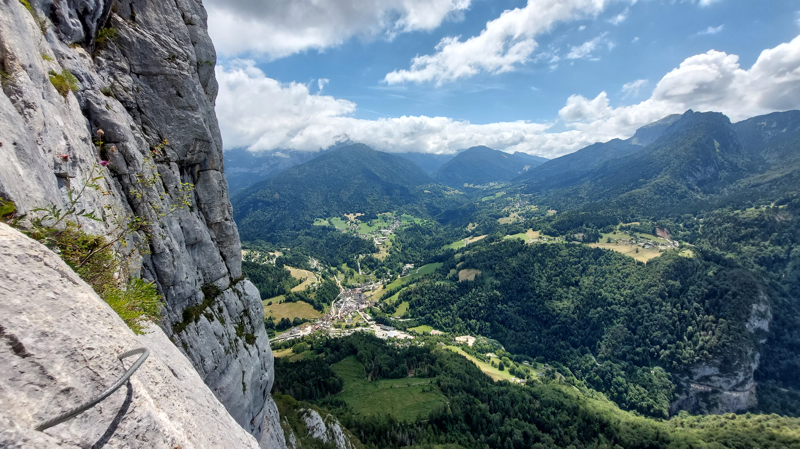

# 🧗🔴 Via ferrata: 'Roche Veyrand' 😲 + 🏊‍♀️ in refreshing 🧊 river 💧

💡 Click “Read more”/“Lire la suite” for full page ✅ Joining = Accepting rules (see below).

##  ⭐ Updates ⭐ 

* 📅 More cars = more seats. Seats: Albin (5), Paul (5)

##  🗨️ EN/FR 🗨️ 
🦅/🐓 Our events are in English/French. Don’t worry if you are not fluent. Nos évènements sont en Anglais/Français. Ne vous inquiétez pas si vous n’êtes pas bilingue.

## 📍 Meeting Point 📍
Meet at parking "Esplanade du Souvenir Français" near Parc Paul Mistral at **event start time 🔺SHARP🔺**:

* ⏰ [https://osm.org/go/0CASJNbuF?m=](https://osm.org/go/0CASJNbuF?m=)
* ⏰ [https://goo.gl/maps/iNPSZcFVyTcM9VX2A](https://goo.gl/maps/iNPSZcFVyTcM9VX2A)

##  🚗 Transportation 🚗 
We ride our cars for 1h10. Then park our car(s) in "St-Pierre-d'Entremont":

* 🚗 [https://osm.org/go/0CBJwqOui?m=](https://osm.org/go/0CBJwqOui?m=)
* 🚗 [https://goo.gl/maps/5hNcyU3xTW9DvPoB7](https://goo.gl/maps/5hNcyU3xTW9DvPoB7)

##  🚗 Car share 🚗 
Car share is 6€ per person (fuel + "compensation" to get more drivers).

##  ⚠️ Rent your via Ferrata set on Friday afternoon ⚠️ 
Rent your Via Ferrata equipment (helmet 🪖, harness, and Via Ferrata set) in Grenoble on Friday afternoon. You can do this at the “Adrenaline Sport” shop 🏬 near Parc Paul Mistral.
Their website is [http://www.adrenaline-ski-shop.com/magasins](http://www.adrenaline-ski-shop.com/magasins) and their opening hours are 10-12:30pm and 2:30-7pm. The cost for a one-day rental is around 16€ 💰.
After the event, you can return the equipment to “Domino’s Pizza” 🍕 at the corner. You can find their location here: [https://osm.org/go/0CASD82h9?m=](https://osm.org/go/0CASD82h9?m=)

##  🧗🔴 Via ferrata: 'Roche Veyrand' 😲 + 🏊‍♀️ in refreshing 🧊 river 💧 

* 🔵 medium for climbers
* 🔴 hard for noobs 🙃 + a lot of vertigo

Join me for this via ferrata in St-Pierre-d’Entremont, a beautiful village in the heart of the Chartreuse mountains 🏔. We will start with a 45-minute hike to approach the start of the via ferrata 🧗‍♂️. Enjoy this hard and breathtaking via ferrata that has a lot of vertigo 😱. After the via, we can reach the top of the mountain “Roche Veyrand”, where we can have a picnic 🥪. Then we will climb down the steep path to reach back to St-Pierre-d’Entremont. From here we can reach the nice bathing place in the village center, where we can cool off and have some fun in the water 💧. Note: the via ferrata is not mandatory, you can join just for the hike and wait for us at the top of the mountain.

About the via:

* [https://www.viaferrata-fr.net/via-ferrata-108-La-via-ferrata-de-Roche-Veyrand-St-Pierre-d%27Entremont-Savoie.html](https://www.viaferrata-fr.net/via-ferrata-108-La-via-ferrata-de-Roche-Veyrand-St-Pierre-d%27Entremont-Savoie.html)

* 🗺️ Topo & GPX track: [https://s.42l.fr/t9FcHuw4](https://s.42l.fr/t9FcHuw4) (click Export > GPX)
* 📲 Download GPX on your phone (Tuto: [https://binnette.github.io/GAC](https://binnette.github.io/GAC/))
* 📏 Distance: 5.2km
* ⏱️ Time: \~4/5h of hike
* 📈 D+: 834m

##  📜 Rules 📜 

* 🚶‍♀️🚶‍♂️ GAC is about hiking 🥾 and making friends 🤗, NOT flirting ⛔
* 🚮 No littering in nature. Decomposition: 🍊 6m, 🍌 2y, 🥚 3y
* 🚗 Join waiting list for car availability
* ⏰ Don’t be late, we won’t wait
* 💺 Seats in car(s) are limited, only subscribe if sure to join
* ❌ Unsubscribe or 💬 message if can’t join
* 🚗 Drivers: message me ASAP if you can’t join
* 💟 You are responsible for your own health and security

##  🎒 What to bring 🎒 

* 🧗‍♂️ Via ferrata set (rented in Grenoble)
* 🥾 Hiking shoes
* 🥢 Hiking poles (optional)
* 🧃 Water (1-2L) + 🍫 Snacks + 🥗 Lunch
* ❄️🌧️ Cold & rain gear (around 10°C on top)
* 🩳 Swimsuit 🩱, towel 🏖️💦
* 😁 Smile, 😊 Happiness
* 💵 Car share money (exact change in cash)

\*\*\*
❓ Need help 🤔 Visit [https://binnette.github.io/GAC](https://binnette.github.io/GAC) or ask!
Albin from GAC
PS: Join our Telegram for more activities (🧗‍♀️, 🏓, 🎳, 🎲, 🎥, 🎵, 🍽️). Message me on Meetup for the link.

## Stats

- Start time: 2023-08-05 08:30
- End time: 2023-08-05 20:00
- Duration: 11:30:00
- Time to event: 1 day, 20:58:27
- Attendees: 8
- KM: 5.2
- D+: 834
- Top: 1397
- Type: Via
- Comment: 

## Links

- [Trail short link](https://s.42l.fr/t9FcHuw4)
- [Trail full link]()
- [Album](https://binnette.github.io/GacImg2023/2023-08-05-🧗🔴-Via-ferrata-Roche-Veyrand-😲-🏊‍♀️-in-refreshing-🧊-river-💧.html)
- [Meetup event](https://www.meetup.com/grenoble-adventure-club-english-french/events/295213425/)
