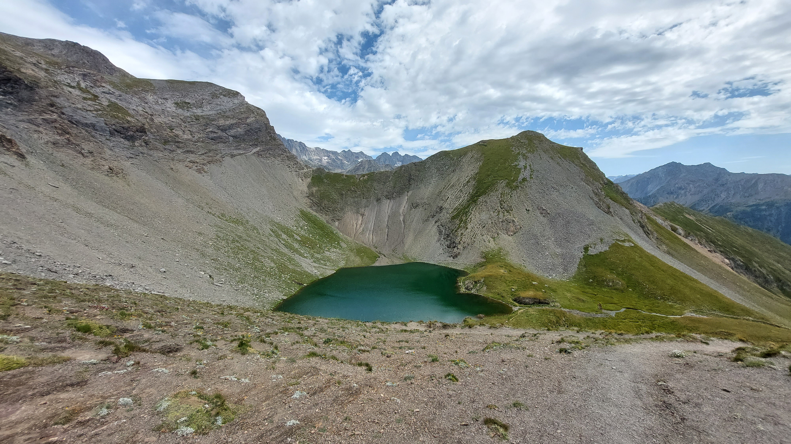

# 🥾⛺🔴 Hike Camp: after-work car ride + 🌠 night in tent + lake hike #Valsenestre

💡 Read full page by clicking on "Read more"/"Lire la suite"...💜
Joining the event = Accepting the rules

##  ⭐⭐ Updates ⭐⭐ 

* 📅 More cars = more seats. Seats: Albin (5), Chunchun (4), Manu (2)

##  🗨️ EN/FR 🗨️ 
🦅/🐓 Our events are in English/French. Don’t worry if you are not fluent. Nos évènements sont en Anglais/Français. Ne vous inquiétez pas si vous n’êtes pas bilingue.

## 📍 Meeting Point 📍
Meet at parking "Esplanade du Souvenir Français" near Parc Paul Mistral at **event start time 🔺SHARP🔺**:

* ⏰ [https://osm.org/go/0CASJNbuF?m=](https://osm.org/go/0CASJNbuF?m=)
* ⏰ [https://goo.gl/maps/iNPSZcFVyTcM9VX2A](https://goo.gl/maps/iNPSZcFVyTcM9VX2A)

##  🚗 Car share 🚗 
Car share is 8€ per person.

##  🥾⛺🔴 Hike Camp: after-work car ride + 🌠 night in tent + lake hike #Valsenestre 
We take cars after-work and ride to Valsenestre. We hike with headlamp for \~20mn with our tents and reach the bivouac place. There we eat/cook food, enjoy some shooting stars and sleep in our tents. The second day, we get back to the cars, drop our tents and start our day hike with our picnic and water. When we are done, we go back to Grenoble (before traffic jam?).

##  Day 1 
We ride our cars for \~1h30 and park at "Valsenestre":

* 🅿️ [https://osm.org/go/xXVx\~Bm2n?m=](https://osm.org/go/xXVx~Bm2n?m=)
* 🅿️ [https://goo.gl/maps/KsZQ1Ra6wKRsm7BTA](https://goo.gl/maps/KsZQ1Ra6wKRsm7BTA)

We do a 20mn hike with our tents, water and food (night and breakfast). We spend the night with the shooting stars.

* 🗺️ Topo & GPX track: [https://s.42l.fr/9IBV9CmM](https://s.42l.fr/9IBV9CmM) (click Export > GPX)
* 📲 Download GPX on your phone (Tuto: [https://binnette.github.io/GAC](https://binnette.github.io/GAC/))
* 📏 Distance: 1km
* ⏱️ Time: \~10mn of hike
* 📈 D+: 61m 🤣

##  Day 2 
Breakfast near the tents. We go back to the cars and drop our tents. We take a small backpack with our food and water and start our hike! We will hike up to the Lac Labarre, swim 🥶, eat and chill. Then we go back to the cars and go back to Grenoble (hopefully before the August 15th traffic jam).

🗺️ Topo: [https://s.42l.fr/J0wLL_Xs](https://s.42l.fr/J0wLL_Xs)
* 📏 Distance: 12km
* ⏱️ Time: \~5/6h of hike
* 📈 D+: 1150m 🥵

##  🎒 What to bring 🎒 
Big backpack is not mandatory. We will only hike with our picnic during the day. For the night, you will carry your tent+food for 20mn up to the bivouac place.

##  For hikes 

* 🎒 Regular bag for picnic+water
* 🥾 Hiking shoes + poles
* 🩳🩱 swimsuit + towel
* 🧃 Water 1 or 2L mini.
* 🍫 Snack and 🥕 food for 3 meals:
* Monday dinner: food to cook if you have cooking stove/gas (we can share) + Tuesday breakfast
* Tuesday lunch: picnic/sandwich (bought in Grenoble)
* 🍵 Ecocup/mug, fork, knife,...
* ❄️ 10°C cold gears
* 🌞 Sunscreen, 😎 Sunglasses

##  For the night 

* 💡 Headlamp ❗️**MANDATORY**
* 💤 Sleeping bag ❗️**MANDATORY** 0°c bag is a must
* Tent + pad + pillow
* 🔥 Cooking stove + gas if you want to cook food
* 👡 Flip-flop to walk around tent
* 🥶 Warm clothes 10°c during the night
* 🧻 Toilet paper, soap, toothbrush...
* 💰 Cash to buy drinks at the Valsenestre Gîte 🍺

##  ❔ Want to bring more ❔ 

* ♣️ Card games
* 🥨 Food, 🫖 Tea bags or other stuffs to share

##  📜 Rules 📜 

* 🚶‍♀️🚶‍♂️ GAC is about hiking 🥾 and making friends 🤗, NOT flirting ⛔
* 🚮 No littering in nature. Decomposition: 🍊 6m, 🍌 2y, 🥚 3y
* 🚗 Join waiting list for car availability
* ⏰ Don’t be late, we won’t wait
* 💺 Seats in car(s) are limited, only subscribe if sure to join
* ❌ Unsubscribe or 💬 message if can’t join
* 🚗 Drivers: message me ASAP if you can’t join
* 💟 You are responsible for your own health and security

\*\*\*
❓ Need help 🤔 Visit [https://binnette.github.io/GAC](https://binnette.github.io/GAC) or ask!
Albin from GAC

PS: Join our Telegram for more activities (🧗‍♀️, 🏓, 🎳, 🎲, 🎥, 🎵, 🍽️). PM me on Meetup for the link.

## Stats

- Start time: 2023-08-14 18:30
- End time: 2023-08-15 18:30
- Duration: 1 day, 0:00:00
- Time to event: 3 days, 8:22:20
- Attendees: 12
- KM: 14
- D+: 1329
- Top: 2644
- Type: Hike
- Comment: 

## Links

- [Trail short link](https://s.42l.fr/kbLPOI0m)
- [Trail full link](https://s.42l.fr/9IBV9CmM7)
- [Album](https://binnette.github.io/GacImg2023/2023-08-14-🥾⛺🔴-Hike-Camp-after-work-car-ride-🌠-night-in-tent-lake-hike-#Valsenestre.html)
- [Meetup event](https://www.meetup.com/grenoble-adventure-club-english-french/events/295381068/)
