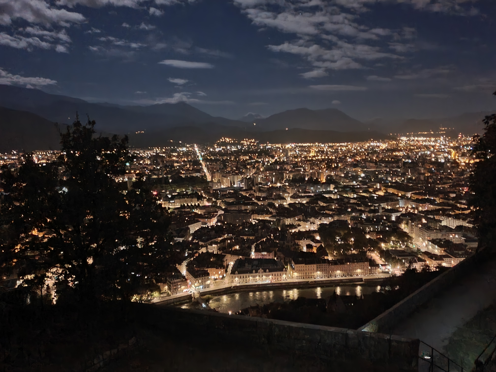

# 🥾🌚Harvest Moon ("lune de moisson") - Night Hike to Mt. Jala (Bastille)🌚🥾

##  Summary 

Pack a thermos of hot tea and your headlight/torch!

An urban night hike above the city to catch a sight the Harvest Moon in all of its celestial magnificence from a spot high above the city.

Sunset for 29th September 2023 is forecast [ 19:30 ]

##  Route 

There are 3 well known paths from Grenoble to the Bastille. There is one less well known, and that's the one for us! You may look at the route here:

* https://www.alltrails.com/explore/map/map-da0b566--45
* https://www.mapmyrun.com/routes/view/3413049679

##  Headlight / Lamp / Torch 

If you do not already own a head-light, may we recommend :

* https://www.amazon.fr/Petzl-Tikka-Lampe-Frontale-Adulte/dp/B01KYTQKBE
* https://www.amazon.fr/Petzl-Lampe-frontale-Reactik-Orange/dp/B01FIDI4UQ
* https://www.amazon.fr/Petzl-E099GA01-Lampe-Frontale-Unique/dp/B07T5RLZTX

(Pro Tip: Do not waste your money on a non-Petzl brand headlight!)

##  General Plan / Schedule 

( To be revised based on the Almanac time of sunset for 2023)

* 19:45-20:05 Meet at the Fountain (Water, Beer, Cafe, Toilet available at the local pub "The Old Bridge")
* 20:05 Walk towards Port de France
* 20:15 Hike up the mountain to the memorial (1.5 hours max)
* 21:15-21:45 Arrive at top. Warm Drinks and small snacks and enjoy the moon, as well as any other astronomical elements that can be observed (Telechargez an app on your phone?).
* 22:00-22:30 Begin Hike back to Grenoble city center

(1 primary exit option, 3 possible exit options)

NOTE: The gate will be locked behind us at 21h after we pass through it; we'll take an alternative route back (there are 3 choices).

##  Suggested Supplies to Bring 

* 1.5-to-2 Liters of Water absolute minimum (\*) plus a small emergency bottle (200-300ml)
* Good Hiking 🥾shoes and socks
* (MANDATORY) Head Lamp Flashlight
* Rain jacket and/or Layers of clothes as Temperatures will change and/or Precipitation may be intermittent
* Food and or small snacks "À partager". We will have a picnic up top!
* Any medicines or allergy treatments you may have pre-existing (EPI PEN)
* 😁 Your smile / 😊 Happiness (Hard to see in the dark?)

Recommended:

* Whistle ( Sifflet )
* Gloves ( Gants )
* USB PowerBank battery for mobile phone (ensure charged!)

##  💡 Rules of The Day 💡 

* 🚶‍♀️🚶‍♂️ The GAC group is about hiking 🥾 , fitness, nature, active lifestyle --- and sure, also socializing and making friends and language/cultural exchange. **BUT NOT about flirting or speed dating!** We want everyone to feel comfortable during our events. ⛔
* 😍 Hiking is about enjoying and respecting mother nature!
* Don't throw/dump any garbage 🚮 in nature, not even fruit pelt: 🍌(2 years for decomposition), 🍊 (6 months); egg shell 🥚 (3 years)
* Don't be (too) late 😇 We have a large 30 minute queue window. If you arrive after we depart, call my mobile and we'll find a way for you to connect with us down the road.
* If you finally can't join us, please unsubscribe from the event or at least write a message here to announce your cancellation. 💜 That way, we won't wait for you 💜
* 💟 You are responsible of your own health and security
* If you have any medical conditions that we should be aware of in an emergency, please feel free to contact me privately!
* 😷 COVID-19 rules at the moment: [https://www.gouvernement.fr/en/coronavirus-covid-19](https://www.gouvernement.fr/en/coronavirus-covid-19)

If you have any questions, please ask! Feel free to send me a Private Message or on WhatsApp (+1-412-378-3823)

## Stats

- Start time: 2023-09-29 20:45
- End time: 2023-09-29 23:45
- Duration: 3:00:00
- Time to event: 339 days, 9:37:04
- Attendees: 74
- KM: 7.6
- D+: 442
- Top: 635
- Type: Hike
- Comment: 

## Links

- [Trail short link](https://s.42l.fr/iF8IWgUy)
- [Trail full link]()
- [Album](https://binnette.github.io/GacImg2023/2023-09-29-🥾🌚Harvest-Moon-lune-de-moisson-Night-Hike-to-Mt-Jala-Bastille🌚🥾.html)
- [Meetup event](https://www.meetup.com/grenoble-adventure-club-english-french/events/289327751/)
