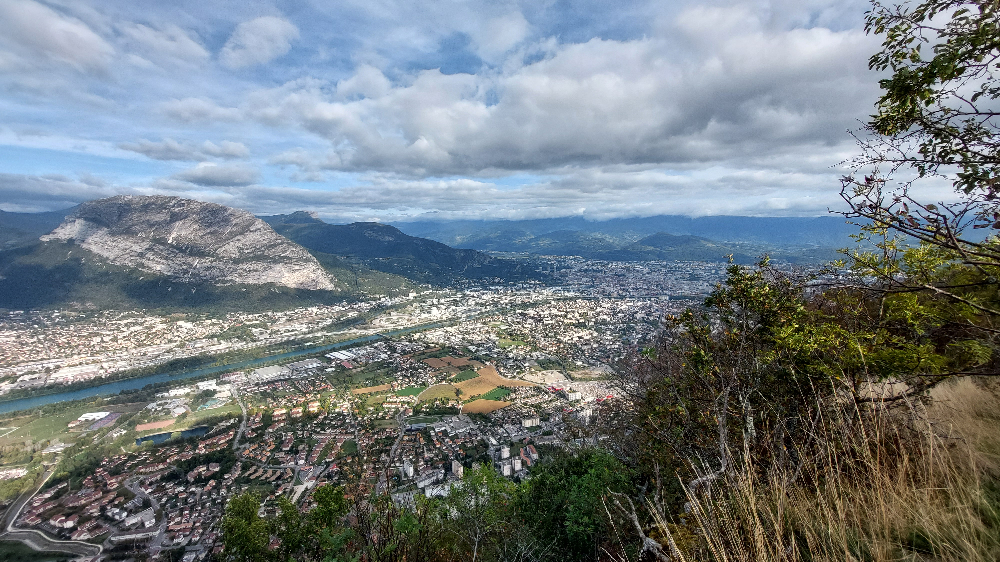

# 🥾🔵 Hike: La Ferme Durand 🚜

💡 Click “Read more”/“Lire la suite” for full page ✅ Joining = Accepting rules (see below)

##  🗨️ EN/FR 🗨️ 
🦅/🐓 : Our events are in English/French. Don’t worry if you are not fluent. Nos évènements sont en Anglais/Français. Ne vous inquiétez pas si vous n’êtes pas bilingue.

##  🥾🔵 Hike: La Ferme Durand 🚜 

* 🟢 Easy for good hikers
* 🔵/🔴 Medium/hard for beginners

Meet at 1:30pm at tram A terminus station "Fontaine La Poya":

* [https://www.osm.org/node/792681747](https://www.osm.org/node/792681747)
* [https://goo.gl/maps/Rj3MT2LeSLKtfnTq7](https://goo.gl/maps/Rj3MT2LeSLKtfnTq7)

Schedule of the 🚋 tram A : [https://www.tag.fr/8-horaires.htm?code=SEM%3AA](https://www.tag.fr/8-horaires.htm?code=SEM%3AA)

We will hike in Sassenage village to warm up. Then hike in the forest to reach the "Ferme Durand". Hike down the mountain, seeing the "Coup de Sabre" (latest photo in [the last year event](https://www.meetup.com/fr-FR/grenoble-adventure-club-english-french/events/284202086/)) and go back to the tram station 😎

🗺️ TopoTopo & GPX track: [https://s.42l.fr/j_PX-bWb](https://s.42l.fr/j_PX-bWb)
* 📲 Download GPX on your phone (Tuto: [https://binnette.github.io/GAC](https://binnette.github.io/GAC/))
* 📏 Distance: 10km
* ⏱️ Time: \~4/5h of hike
* 📈 D+: 691m

##  📜 Rules 📜 

* 🚶‍♀️🚶‍♂️ GAC is about hiking 🥾 and making friends 🤗, NOT flirting ⛔
* 🚮 No littering in nature. Decomposition: 🍊 6m, 🍌 2y, 🥚 3y
* ⏰ Don’t be late, we won’t wait
* ❌ Unsubscribe or 💬 message if you can’t join
* 💟 You are responsible for your own health and security

##  ❔ What do you need ❔ 

* 🥾 Hiking shoes (or any good/non slippery shoes)
* 🥢 Hiking pole (optionnal)
* 🧃 Water + 🍫 Some snack
* 😁 Smile / 😊 Happiness
* ❄️ 10-15°C clothing

***

❓ Need help 🤔 Visit [https://binnette.github.io/GAC](https://binnette.github.io/GAC) or ask!
Nicolas from GAC
PS: Join our Telegram for more activities (🧗‍♀️, 🏓, 🎳, 🎲, 🎥, 🎵, 🍽️). Message me on Meetup for the link.

## Stats

- Start time: 2023-10-15 13:30
- End time: 2023-10-15 18:00
- Duration: 4:30:00
- Time to event: 2 days, 17:08:34
- Attendees: 7
- KM: 10.8
- D+: 691
- Top: 865
- Type: Hike
- Comment: 

## Links

- [Trail short link](https://s.42l.fr/j_PX-bWb)
- [Trail full link]()
- [Album](https://binnette.github.io/GacImg2023/2023-10-15-🥾🔵-Hike-La-Ferme-Durand-🚜.html)
- [Meetup event](https://www.meetup.com/grenoble-adventure-club-english-french/events/296703101/)
