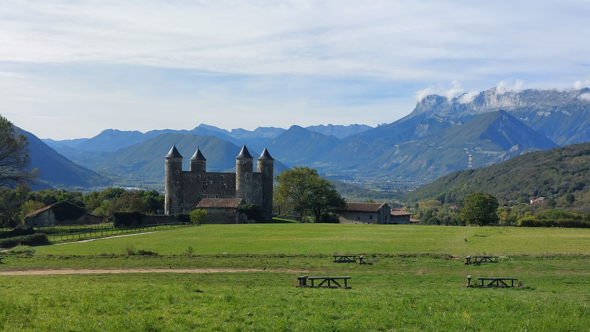

# 🥾🔵 Hike: Castle of Bon Repos 🏰 #Chestnut 🌰 #Tram 🚊

💡 Click “Read more”/“Lire la suite” for full page ✅ Joining = Accepting rules (see below)

##  ⭐ Updates ⭐ 

* 📅 No car needed, take the tram or ride your bike!

##  🗨️ EN/FR 🗨️ 
🦅/🐓 Our events are in English/French. Don’t worry if you are not fluent. Nos évènements sont en Anglais/Français. Ne vous inquiétez pas si vous n’êtes pas bilingue.

## 📍 Meeting Point 📍
Meet at tramway (A) stop "Échirolles - Denis Papin" at **event start time 🔺SHARP🔺**:

* ⏰ [https://osm.org/go/0CAHBBYJU-?m=](https://osm.org/go/0CAHBBYJU-?m=)
* ⏰ [https://maps.app.goo.gl/p6kjDmXAGwsXKpjk7](https://maps.app.goo.gl/p6kjDmXAGwsXKpjk7)

##  🥾🔵 Hike: Castle of Bon Repos 🏰 #Chestnut 🌰 #Tram 🚊 

* 🔵 No difficulty but can be a long hike for noobs.

We’ll meet at the Echirolles tramway station Denis Papin and walk on a flat path to leave the city behind. It will be a nice warm-up for us 😊. Then we’ll follow a trail and enter the forest 🌲. We’ll go up and reach the town of Jarrie. There we’ll see the castle “Château de bon repos” 🏰. We can take a break there and have our lunch 🍽️.

After that, we’ll continue our hike and climb a little more. We’ll try to find some chestnuts 🌰 along the way. I hope there are some left, and that they are not too small or eaten by worms 😬. We’ll enjoy a "beautiful" view over Champ-sur-Drac 🌄.

Then we’ll cross the village of Champagnier. We’ll go through another forest and look for more chestnuts 🌰. Finally, we’ll get back to the tram stop and say goodbye 👋. That will be the end of our adventure 😍.

* 🗺️ Topo & GPX track: [https://s.42l.fr/KHE4Mq7C](https://s.42l.fr/KHE4Mq7C) (click Export > GPX)
* 📲 Download GPX on your phone (Tuto: [https://binnette.github.io/GAC](https://binnette.github.io/GAC/))
* 📏 Distance: 15km
* ⏱️ Time: \~3/4h of hike
* 📈 D+: 320m

##  📜 Rules 📜 

* 🚶‍♀️🚶‍♂️ GAC is about hiking 🥾 and making friends 🤗, NOT flirting ⛔
* 🚮 No littering in nature. Decomposition: 🍊 6m, 🍌 2y, 🥚 3y
* 🚗 Join waiting list for car availability
* ⏰ Don’t be late, we won’t wait
* 💺 Seats in car(s) are limited, only subscribe if sure to join
* ❌ Unsubscribe or 💬 message if can’t join
* 🚗 Drivers: message me ASAP if you can’t join
* 💟 You are responsible for your own health and security

##  🎒 What to bring 🎒 

* 🥾 Hiking shoes
* 🥢 Hiking poles (optional)
* 🌰 A bag to collect nuts (if we find some)
* 🧃 Water (1-2L) + 🍫 Snacks + 🥗 Lunch
* ❄️🌧️ Cold & rain gear (around 15°C on top)
* 🩳 Swimsuit 🩱, towel 🏖️💦
* 😁 Smile, 😊 Happiness

\*\*\*

❓ Need help 🤔 Visit [https://binnette.github.io/GAC](https://binnette.github.io/GAC) or ask!

Albin from GAC

PS: Join our Telegram for more activities (🧗‍♀️, 🏓, 🎳, 🎲, 🎥, 🎵, 🍽️). Message me on Meetup for the link.

## Stats

- Start time: 2023-10-22 10:00
- End time: 2023-10-22 19:00
- Duration: 9:00:00
- Time to event: 16:37:48
- Attendees: 8
- KM: 14.9
- D+: 313
- Top: 437
- Type: Hike
- Comment: 

## Links

- [Trail short link](https://s.42l.fr/KHE4Mq7C)
- [Trail full link]()
- [Album](https://binnette.github.io/GacImg2023/2023-10-22-🥾🔵-Hike-Castle-of-Bon-Repos-🏰-#Chestnut-🌰-#Tram-🚊.html)
- [Meetup event](https://www.meetup.com/grenoble-adventure-club-english-french/events/296875526/)
