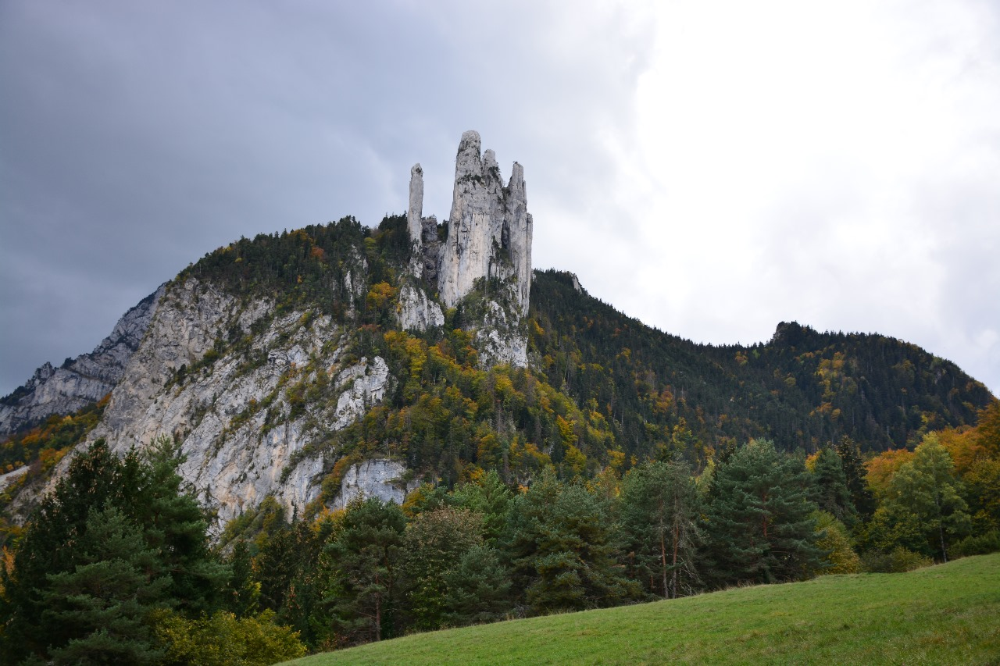

# 🥾🔵 Hike: Vercors via the Old Tramway Railroad 🚊🚊🚊 #Tram 🚊

💡 Click “Read more”/“Lire la suite” for full page ✅ Joining = Accepting rules (see below)

##  ⭐ Updates ⭐ 

* 📅 No car needed, take the tram or ride your bike!

##  🗨️ EN/FR 🗨️ 
🦅/🐓 Our events are in English/French. Don’t worry if you are not fluent. Nos évènements sont en Anglais/Français. Ne vous inquiétez pas si vous n’êtes pas bilingue.

## 📍 Meeting Point 📍
Meet at tramway (C) stop "Seyssins - Le Prisme" at **event start time 🔺SHARP🔺**:

* ⏰ [https://osm.org/go/0CAF2rx8U--?m=](https://osm.org/go/0CAF2rx8U--?m=)
* ⏰ [https://maps.app.goo.gl/L5WHTaAvnWVdhARp8](https://maps.app.goo.gl/L5WHTaAvnWVdhARp8)

##  🥾🔵 Hike: Vercors via the Old Tramway Railroad 🚊🚊🚊 #Tram 🚊 

* 🔵/🔴 Long hike for beginners. But elevation gain is gradual.
* 🟢 Easy for good hikers.

🚶‍♂️🚶‍♀️ We will start our hike from the tram stop Seyssins Le Prisme. We will walk through the city 🏙️ until we reach the path of the old tramway 🚊. From there, we will follow this path all the way to the top 🏔️. Before reaching St-Nizier-du-Moucherotte (because otherwise the hike will be very long), we will start to hike down by another way 🚶‍♂️🚶‍♀️. We will make a halt at “La Tour Sans Venin” 🐍. Finally, we will continue our loop down back to the tramway stop 🚶‍♂️🚶‍♀️.

* 🗺️ Topo & GPX track: [https://s.42l.fr/c8khw3VX](https://s.42l.fr/c8khw3VX) (click Export > GPX)
* 📲 Download GPX on your phone (Tuto: [https://binnette.github.io/GAC](https://binnette.github.io/GAC/))
* 📏 Distance: 19km
* ⏱️ Time: \~5/6h of hike
* 📈 D+: 814m

##  📜 Rules 📜 

* 🚶‍♀️🚶‍♂️ GAC is about hiking 🥾 and making friends 🤗, NOT flirting ⛔
* 🚮 No littering in nature. Decomposition: 🍊 6m, 🍌 2y, 🥚 3y
* 🚗 Join waiting list for car availability
* ⏰ Don’t be late, we won’t wait
* 💺 Seats in car(s) are limited, only subscribe if sure to join
* ❌ Unsubscribe or 💬 message if can’t join
* 🚗 Drivers: message me ASAP if you can’t join
* 💟 You are responsible for your own health and security

##  🎒 What to bring 🎒 

* 🥾 Hiking shoes
* 🥢 Hiking poles (optional)
* 🌰/🧤 Bag & garden gloves to collect nuts (if we find some)
* 🧃 Water (1-2L) + 🍫 Snacks + 🥗 Lunch
* ❄️🌧️ Cold & rain gear (around 12°C on top)
* 😁 Smile, 😊 Happiness

\*\*\*

❓ Need help 🤔 Visit [https://binnette.github.io/GAC](https://binnette.github.io/GAC) or ask!

Albin from GAC

PS: Join our Telegram for more activities (🧗‍♀️, 🏓, 🎳, 🎲, 🎥, 🎵, 🍽️). Message me on Meetup for the link.

## Stats

- Start time: 2023-10-29 10:00
- End time: 2023-10-29 19:00
- Duration: 9:00:00
- Time to event: 21:37:43
- Attendees: 12
- KM: 19
- D+: 814
- Top: 1020
- Type: Hike
- Comment: 

## Links

- [Trail short link](https://s.42l.fr/c8khw3VX)
- [Trail full link]()
- [Album](https://binnette.github.io/GacImg2023/2023-10-29-🥾🔵-Hike-Vercors-via-the-Old-Tramway-Railroad-🚊🚊🚊-#Tram-🚊.html)
- [Meetup event](https://www.meetup.com/grenoble-adventure-club-english-french/events/297008770/)
