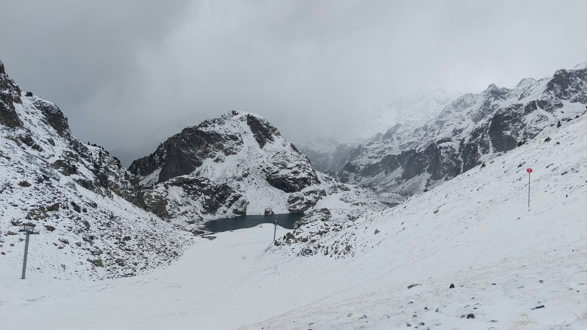

# 🥾🔴 Hike: ⛄❄ snow walk (and bath?😱🥶) in Chamrousse!? 🧊

💡 Click “Read more”/“Lire la suite” for full page ✅ Joining = Accepting rules (see below)

##  ⭐ Updates ⭐ 

* 📅 More cars = more seats. Seats: Albin (5), Rémi (5), Thomas (5)

##  🗨️ EN/FR 🗨️ 
🦅/🐓 Our events are in English/French. Don’t worry if you are not fluent. Nos évènements sont en Anglais/Français. Ne vous inquiétez pas si vous n’êtes pas bilingue.

## 📍 Meeting Point 📍
Meet at parking "Esplanade du Souvenir Français" near Parc Paul Mistral at **event start time 🔺SHARP🔺**:

* ⏰ [https://osm.org/go/0CASJNbuF?m=](https://osm.org/go/0CASJNbuF?m=)
* ⏰ [https://goo.gl/maps/iNPSZcFVyTcM9VX2A](https://goo.gl/maps/iNPSZcFVyTcM9VX2A)

##  🚗 Transportation 🚗 
We ride our cars for \~45mn and park at "Roche Béranger 1750":

* 🅿️ [https://osm.org/go/0CAM6Fj3s--?m=](https://osm.org/go/0CAM6Fj3s--?m=)
* 🅿️ [https://maps.app.goo.gl/5Vqnog6hmrrY1TPw8](https://maps.app.goo.gl/5Vqnog6hmrrY1TPw8)

##  🚗 Car share 🚗 
Car share is 4€ per person (fuel + "compensation" to get more drivers).

##  🥾🔴 Hike: ⛄❄ snow walk (and bath?😱🥶) in Chamrousse!? 🧊 

* 🔴 Not for noobs/beginners
* 🔺 Hiking shoes & winter/rain gears mandatory. Otherwise your feet will be wet and frozen (-10°C felt temperature on top)

How about a snowy walk in Chamrousse? 🏔️ You'll need hiking shoes with good crampons or you'll end up with wet and frozen feet 😱. And you might slide without them ⛸️. Hiking poles are also a good idea to avoid slipping on the snow ❄️. It will feel like -10°C 🧊 on top, with lots of clouds ☁️ and maybe some snowflakes 🌨. Don't forget to bring a thick plastic bag 🛍 to slide down the slopes 🛷. We probably won't need snowshoes as there is not much snow 🥾. For the bravest ones, you can even pack your swimsuit 🩳👙. We can try a cold/frozen dip in "Lacs Robert". 🏊‍♂️

Chamrousse live webcams: [https://www.chamrousse.com/webcams.html](https://www.chamrousse.com/webcams.html)

* 🗺️ Topo & GPX track: [https://s.42l.fr/CuN6Eyfo](https://s.42l.fr/CuN6Eyfo) (click Export > GPX)
* 📲 Download GPX on your phone (Tuto: [https://binnette.github.io/GAC](https://binnette.github.io/GAC/))
* 📏 Distance: 12km
* ⏱️ Time: \~5/6h of hike
* 📈 D+: 700m

##  📜 Rules 📜 

* 🚶‍♀️🚶‍♂️ GAC is about hiking 🥾 and making friends 🤗, NOT flirting ⛔
* 🚮 No littering in nature. Decomposition: 🍊 6m, 🍌 2y, 🥚 3y
* 🚗 Join waiting list for car availability
* ⏰ Don’t be late, we won’t wait
* 💺 Seats in car(s) are limited, only subscribe if sure to join
* ❌ Unsubscribe or 💬 message if can’t join
* 🚗 Drivers: message me ASAP if you can’t join
* 💟 You are responsible for your own health and security

##  🎒 What to bring 🎒 

* 🥾 Hiking shoes (walk in snow) ❗Mandatory
* 🥢 Hiking poles 💯Recommended
* 🧤 Winter gloves, 🧥 jacket, [🧣](https://wprock.fr/t/emoji/cold-face/) scarf, 🧢 beanie,... ❗Mandatory
* 🛍 A thick plastic bag to use as sledge
* 🛍 Small plastic bags to use as socks (protect feet from water)
* 🧃 Water (1-2L) + 🍫 Snacks + 🥗 Lunch
* 🩳🩱 swimsuit + towel 🥶
* 🏂 If you own snowshoes, bring them (but probably useless)
* ❄️🌧️ Cold & rain gear (around -10°C felt on top)
* 💡 Headlamp (for the fog?)
* 🌞 Sunscreen, 😎 Sunglasses, 🤐🧊 **Lip balm**
* 😁 Smile, 😊 Happiness

\*\*\*

❓ Need help 🤔 Visit [https://binnette.github.io/GAC](https://binnette.github.io/GAC) or ask!

Albin from GAC

PS: Join our Telegram for more activities (🧗‍♀️, 🏓, 🎳, 🎲, 🎥, 🎵, 🍽️). Message me on Meetup for the link.

## Stats

- Start time: 2023-11-01 09:00
- End time: 2023-11-01 18:30
- Duration: 9:30:00
- Time to event: 21:08:53
- Attendees: 6
- KM: 11.7
- D+: 694
- Top: 2253
- Type: Hike
- Comment: 

## Links

- [Trail short link](https://s.42l.fr/CuN6Eyfo)
- [Trail full link]()
- [Album](https://binnette.github.io/GacImg2023/2023-11-01-🥾🔴-Hike-⛄❄-snow-walk-and-bath?😱🥶-in-Chamrousse?-🧊.html)
- [Meetup event](https://www.meetup.com/grenoble-adventure-club-english-french/events/297066459/)
