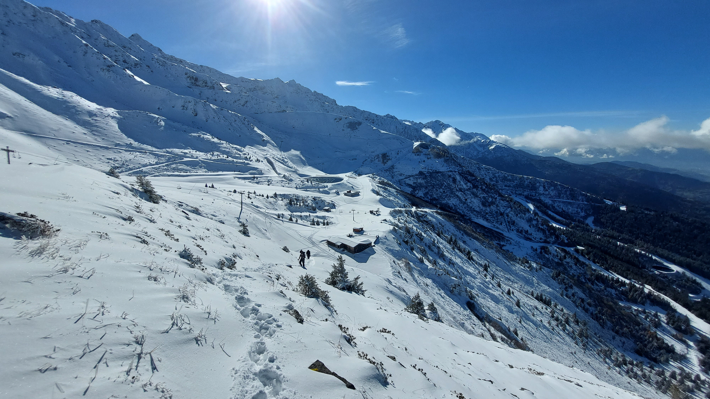

# 🥾🔴 Hike: ⛄ snow walk "Les 7 Laux" ⛷️

💡 Click “Read more”/“Lire la suite” for full page ✅ Joining = Accepting rules (see below)

##  ⭐ Updates ⭐ 

* 📅 More cars = more seats. Seats: Albin (5), Rémi (5), Paul (5)

##  🗨️ EN/FR 🗨️ 
🦅/🐓 Our events are in English/French. Don’t worry if you are not fluent. Nos évènements sont en Anglais/Français. Ne vous inquiétez pas si vous n’êtes pas bilingue.

## 📍 Meeting Point 📍
Meet at parking "Esplanade du Souvenir Français" near Parc Paul Mistral at **event start time 🔺SHARP🔺**:

* ⏰ [https://osm.org/go/0CASJNbuF?m=](https://osm.org/go/0CASJNbuF?m=)
* ⏰ [https://goo.gl/maps/iNPSZcFVyTcM9VX2A](https://goo.gl/maps/iNPSZcFVyTcM9VX2A)

##  🚗 Transportation 🚗 
We ride our cars for about 50m and park at the ski station :

* 🅿️ [https://osm.org/go/0CAxW2jB0?m=](https://osm.org/go/0CAxW2jB0?m=)
* 🅿️ [https://maps.app.goo.gl/smrwWyHJuUytjfGCA](https://maps.app.goo.gl/smrwWyHJuUytjfGCA)

##  🚗 Car share 🚗 
Car share is 4€ per person (fuel + "compensation" to get more drivers).

##  🥾🔴 Hike: ⛄ snow walk "Les 7 Laux" ⛷️ 

* 🔴 Hard for noobs/beginners around 900m elevation
* 🔺 Hiking shoes & winter/rain gears mandatory. Otherwise your feet will be wet and frozen (-10°C felt temperature on top)

🎿❄️ Come with me for a thrilling snow hike in les 7 laux ski station, where we will have a two schuss adventure! We will park at Prapoutel and start with an easy trail that will soon become a steep climb up to the top of the ski station. There, we will hope for a clear sky and a stunning view, unless the clouds crash our party. 🌥️ We will probably have our lunch break on the windy and cold summit, and then turn into ice cubes. 🥶 After that, we will start our loop down. Don’t forget your sledge or thick plastic bag to slide down the station and reach back the car. 🛷 You can also leave a second pair of dry shoes in the trunk of the cars. 👟

* 🗺️ Topo & GPX track: [https://s.42l.fr/U_BL8Njq](https://s.42l.fr/U_BL8Njq) (click Export > GPX)
* 📲 Download GPX on your phone (Tuto: [https://binnette.github.io/GAC](https://binnette.github.io/GAC/))
* 📏 Distance: 13.5km
* ⏱️ Time: \~6/7h of hike
* 📈 D+: 900m

Option 2 : [https://s.42l.fr/GNUbfXeY](https://s.42l.fr/GNUbfXeY) (15km 1000m)

##  For drivers 🚗 
Drivers needs (mandatory):

* ⛄Either 4 winter or 4 four seasons tires
* 🔗Either 2 car snow chains (\~25€ at Carrefour)
* 🧦Either 2 car snow socks

[https://www.service-public.fr/particuliers/actualites/A14389?lang=en](https://www.service-public.fr/particuliers/actualites/A14389?lang=en)

##  📜 Rules 📜 

* 🚶‍♀️🚶‍♂️ GAC is about hiking 🥾 and making friends 🤗, NOT flirting ⛔
* 🚮 No littering in nature. Decomposition: 🍊 6m, 🍌 2y, 🥚 3y
* 🚗 Join waiting list for car availability
* ⏰ Don’t be late, we won’t wait
* 💺 Seats in car(s) are limited, only subscribe if sure to join
* ❌ Unsubscribe or 💬 message if can’t join
* 🚗 Drivers: message me ASAP if you can’t join
* 💟 You are responsible for your own health and security

##  🎒 What to bring 🎒 

* 🥾 Hiking shoes (walk in snow) ❗Mandatory
* 🥢 Hiking poles 💯Recommended
* 🧤 Winter gloves, 🧥 jacket, [🧣](https://wprock.fr/t/emoji/cold-face/) scarf, 🧢 beanie,... ❗Mandatory
* 🛷 A lightweight sledge if you have one or...
* 🛍 A thick plastic bag to use as sledge
* 🛍 Small plastic bags to use as socks (protect feet from water)
* 🧃 Water (1-2L) + 🍫 Snacks + 🥗 Lunch
* 🍵 Thermos with hot tea/coffee
* 🏂 If you own snowshoes, bring them
* ❄️🌧️ Cold & rain gear (around -10°C felt on top)
* 💡 Headlamp (for the fog?)
* 🌞 Sunscreen, 😎 Sunglasses, 🤐🧊 Lip balm
* 😁 Smile, 😊 Happiness

\*\*\*

❓ Need help 🤔 Visit [https://binnette.github.io/GAC](https://binnette.github.io/GAC) or ask!

Albin from GAC

PS: Join our Telegram for more activities (🧗‍♀️, 🏓, 🎳, 🎲, 🎥, 🎵, 🍽️). Message me on Meetup for the link.

## Stats

- Start time: 2023-11-11 08:30
- End time: 2023-11-11 18:30
- Duration: 10:00:00
- Time to event: 21:05:42
- Attendees: 13
- KM: 13.5
- D+: 890
- Top: 2124
- Type: Hike
- Comment: 

## Links

- [Trail short link](https://s.42l.fr/U_BL8Njq)
- [Trail full link]()
- [Album](https://binnette.github.io/GacImg2023/2023-11-11-🥾🔴-Hike-⛄-snow-walk-Les-7-Laux-⛷️.html)
- [Meetup event](https://www.meetup.com/grenoble-adventure-club-english-french/events/297276396/)
