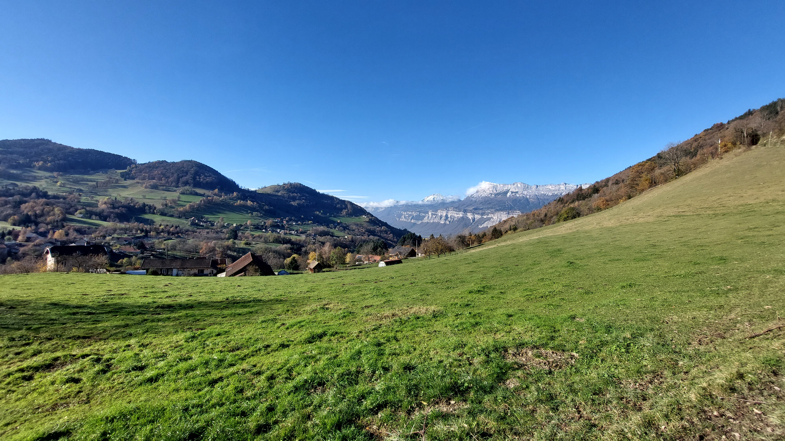

# 🥾🟢 Hike: Easy loop around Theys 🍂🏡🍁

💡 Click “Read more”/“Lire la suite” for full page ✅ Joining = Accepting rules (see below)

##  ⭐ Updates ⭐ 

* 📅 More cars = more seats. Seats: Albin (5), Rémi (5), Thomas (5), Khaled+1 (5)

##  🗨️ EN/FR 🗨️ 
🦅/🐓 Our events are in English/French. Don’t worry if you are not fluent. Nos évènements sont en Anglais/Français. Ne vous inquiétez pas si vous n’êtes pas bilingue.

## 📍 Meeting Point 📍
Meet at parking "Esplanade du Souvenir Français" near Parc Paul Mistral at **event start time 🔺SHARP🔺**:

* ⏰ [https://osm.org/go/0CASJNbuF?m=](https://osm.org/go/0CASJNbuF?m=)
* ⏰ [https://goo.gl/maps/iNPSZcFVyTcM9VX2A](https://goo.gl/maps/iNPSZcFVyTcM9VX2A)

##  🚗 Transportation 🚗 
We ride our cars for about 30m and park in Theys :

* 🅿️ [https://osm.org/go/0CA0W2XnV?m=](https://osm.org/go/0CA0W2XnV?m=)
* 🅿️ [https://maps.app.goo.gl/5eWLARvZcpCpHYWP8](https://maps.app.goo.gl/5eWLARvZcpCpHYWP8)

##  🚗 Car share 🚗 
Car share is 3€ per person (fuel + "compensation" to get more drivers).

##  🥾🟢 Hike: Easy loop around Theys 🍂🏡🍁 

* 🟢/🔵 Beginners welcome, no difficulty.
* 😎 Too easy for good hikers.

We’re off for a chill hike 🥾. We even have time to sleep in 😴 on this beautiful Sunday ☀️, a perfect opportunity to picnic 🧺 in the sun 🌞 while looking at the snowy mountains 🏔️. After a short half hour drive 🚗, we’ll park in the center of Theys Village 🏘️. From there, we’ll start our little loop 🔄 by gaining some altitude 📈, which should give us a nice view 🌄 of the village and the surroundings. We’ll continue our climb 🧗‍♂️ until a large meadow 🌳 where I hope we’ll have a pleasant view 🌼 for our snack break 🍞. After that, we’ll tackle the last ascent 🚵‍♀️ of the day to be able to join the way back to Theys 🛣️. We’ll go through different hamlets and woods 🌲 on our way.

* 🗺️ Topo & GPX track: [https://s.42l.fr/kKgo0xaH](https://s.42l.fr/kKgo0xaH) (click Export > GPX)
* 📲 Download GPX on your phone (Tuto: [https://binnette.github.io/GAC](https://binnette.github.io/GAC/))
* 📏 Distance: 13km
* ⏱️ Time: \~4/5h of hike
* 📈 D+: 600m

##  📜 Rules 📜 

* 🚶‍♀️🚶‍♂️ GAC is about hiking 🥾 and making friends 🤗, NOT flirting ⛔
* 🚮 No littering in nature. Decomposition: 🍊 6m, 🍌 2y, 🥚 3y
* 🚗 Join waiting list for car availability
* ⏰ Don’t be late, we won’t wait
* 💺 Seats in car(s) are limited, only subscribe if sure to join
* ❌ Unsubscribe or 💬 message if can’t join
* 🚗 Drivers: message me ASAP if you can’t join
* 💟 You are responsible for your own health and security

##  🎒 What to bring 🎒 

* 🥾 Hiking shoes
* 🥢 Hiking poles (optional)
* 🧤 Winter gloves, 🧥 jacket, [🧣](https://wprock.fr/t/emoji/cold-face/) scarf, 🧢 beanie,...
* 🧃 Water (1-2L) + 🍫 Snacks + 🥗 Lunch
* 🍵 Thermos with hot tea/coffee
* ❄️🌧️ Cold & rain gear (around 12°C on top)
* 💡 Headlamp (for the fog?)
* 🌞 Sunscreen, 😎 Sunglasses, 🤐🧊 Lip balm
* 😁 Smile, 😊 Happiness

\*\*\*

❓ Need help 🤔 Visit [https://binnette.github.io/GAC](https://binnette.github.io/GAC) or ask!

Albin from GAC

PS: Join our Telegram for more activities (🧗‍♀️, 🏓, 🎳, 🎲, 🎥, 🎵, 🍽️). Message me on Meetup for the link.

## Stats

- Start time: 2023-11-26 09:30
- End time: 2023-11-26 18:00
- Duration: 8:30:00
- Time to event: 1 day, 21:01:51
- Attendees: 13
- KM: 13.1
- D+: 602
- Top: 1193
- Type: Hike
- Comment: 

## Links

- [Trail short link](https://s.42l.fr/kKgo0xaH)
- [Trail full link](https://brouter.de/brouter-web/#map=14/45.3173/6.0028/1069&lonlats=5.994716,45.301435;5.996296,45.301939;6.000423,45.310021;6.01583,45.321916;6.01797,45.321119;6.0229,45.326086;6.026988,45.331156;6.033297,45.325329;6.025078,45.320666;6.010165,45.307674;5.999866,45.300867;5.994791,45.301394&profile=hiking-mountain)
- [Album](https://binnette.github.io/GacImg2023/2023-11-26-🥾🟢-Hike-Easy-loop-around-Theys-🍂🏡🍁.html)
- [Meetup event](https://www.meetup.com/grenoble-adventure-club-english-french/events/297556849/)
