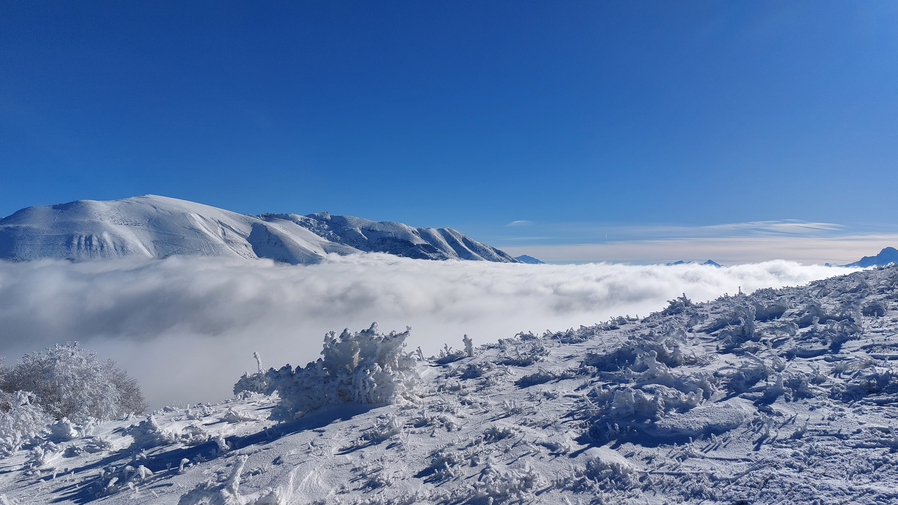

# 🥾🔵 Hike: Snow Walk Peyrouse from St-Jean-de-Vaulx ⛄❄

💡 Click “Read more”/“Lire la suite” for full page ✅ Joining = Accepting rules (see below)

##  ⭐ Updates ⭐ 

* 📅 More cars = more seats. Seats: Albin (5), Paul (5), Thomas (5), Joao+3 (5)

##  🗨️ EN/FR 🗨️ 
🦅/🐓 Our events are in English/French. Don’t worry if you are not fluent. Nos évènements sont en Anglais/Français. Ne vous inquiétez pas si vous n’êtes pas bilingue.

## 📍 Meeting Point 📍
Meet at parking "Esplanade du Souvenir Français" near Parc Paul Mistral at **event start time 🔺SHARP🔺**:

* ⏰ [https://osm.org/go/0CASJNbuF?m=](https://osm.org/go/0CASJNbuF?m=)
* ⏰ [https://goo.gl/maps/iNPSZcFVyTcM9VX2A](https://goo.gl/maps/iNPSZcFVyTcM9VX2A)

##  🚗 Transportation 🚗 
We ride our cars for about 40m and park at Saint-Jean-de-Vaulx :

* 🅿️ [https://osm.org/go/0CACkEiyT?m=](https://osm.org/go/0CACkEiyT?m=)
* 🅿️ [https://maps.app.goo.gl/Yywi5HRk3zRKJGPVA](https://maps.app.goo.gl/Yywi5HRk3zRKJGPVA)

##  For drivers 🚗 
Drivers needs (mandatory):

* ⛄Either 4 winter or 4 four seasons tires
* 🔗Either 2 car snow chains (\~25€ at Carrefour)
* 🧦Either 2 car snow socks

[https://www.service-public.fr/particuliers/actualites/A14389?lang=en](https://www.service-public.fr/particuliers/actualites/A14389?lang=en)
##  🚗 Car share 🚗 
Car share is 4€ per person (fuel + "compensation" to get more drivers).

##  🥾🔵 Hike: Snow Walk Peyrouse from St-Jean-de-Vaulx ⛄❄ 

* 🔵/🔴 A bit steep for beginners. Don't forget snow ready shoes
* 🟢 Easy for good hikers.

🌧️🌨️ After a wet and cold Saturday, let’s enjoy a nice snow walk hike on Sunday. I have chosen a lower mountain to avoid any danger of avalanches and snow on the road. We will drive our cars for 40 minutes and park at the village of Saint-Jean-de-Vaulx. 🚗🚙 From there, we will begin our climb and pass by a small hamlet called les Arnauds. 🏘️ We will keep hiking until we reach the mountain named Beauregard (which means good looking eyes in English). 👀 We will go down and up again until la Peyrouse, which is the highest point of our journey (1710m). 🏔️ We will have our lunch break there and admire the view. 🍽️👌 Then we will start sliding down and walking down until another small hamlet named le Villaret. 🛷🚶‍♂️ From there, we will follow a path along the road to get back to our cars. 🛣️ I hope to see you for this adventure! 🙌

* 🗺️ Topo & GPX track: [https://s.42l.fr/j1OmXr_W](https://s.42l.fr/j1OmXr_W) (click Export > GPX)
* 📲 Download GPX on your phone (Tuto: [https://binnette.github.io/GAC](https://binnette.github.io/GAC/))
* 📏 Distance: 15km
* ⏱️ Time: \~4/5h of hike
* 📈 D+: 763m

##  📜 Rules 📜 

* 🚶‍♀️🚶‍♂️ GAC is about hiking 🥾 and making friends 🤗, NOT flirting ⛔
* 🚮 No littering in nature. Decomposition: 🍊 6m, 🍌 2y, 🥚 3y
* 🚗 Join waiting list for car availability
* ⏰ Don’t be late, we won’t wait
* 💺 Seats in car(s) are limited, only subscribe if sure to join
* ❌ Unsubscribe or 💬 message if can’t join
* 🚗 Drivers: message me ASAP if you can’t join
* 💟 You are responsible for your own health and security

##  🎒 What to bring 🎒 

* 🥾 Hiking snow ready shoes
* (Put plastic bags in your shoes to keep your feet dry)
* 🥢 Hiking poles (optional)
* 🧤 Winter gloves, 🧥 jacket, [🧣](https://wprock.fr/t/emoji/cold-face/) scarf, 🧢 beanie,...
* 🛷 A plastic bag or sledge to have fun in snow
* 🧃 Water (1-2L) + 🍫 Snacks + 🥗 Lunch
* 🍵 Thermos with hot tea/coffee
* ❄️🌧️ Cold & rain gear (around 12°C on top)
* 💡 Headlamp (night fall quickly now)
* 🌞 Sunscreen, 😎 Sunglasses, 🤐🧊 Lip balm
* 😁 Smile, 😊 Happiness

\*\*\*

❓ Need help 🤔 Visit [https://binnette.github.io/GAC](https://binnette.github.io/GAC) or ask!

Albin from GAC

PS: Join our Telegram for more activities (🧗‍♀️, 🏓, 🎳, 🎲, 🎥, 🎵, 🍽️). Message me on Meetup for the link.

## Stats

- Start time: 2023-12-03 08:30
- End time: 2023-12-03 18:30
- Duration: 10:00:00
- Time to event: 1 day, 16:22:27
- Attendees: 16
- KM: 15
- D+: 763
- Top: 1711
- Type: Hike
- Comment: 

## Links

- [Trail short link](https://s.42l.fr/j1OmXr_W)
- [Trail full link](https://brouter.de/brouter-web/#map=14/45.0138/5.7404/1069&lonlats=5.757877,45.01237;5.75469,45.028906;5.751858,45.036049;5.745034,45.028861;5.726967,44.997424;5.724564,44.991914;5.752716,45.00509;5.757732,45.01234&profile=hiking-mountain)
- [Album](https://binnette.github.io/GacImg2023/2023-12-03-🥾🔵-Hike-Snow-Walk-Peyrouse-from-St-Jean-de-Vaulx-⛄❄.html)
- [Meetup event](https://www.meetup.com/grenoble-adventure-club-english-french/events/297699455/)
