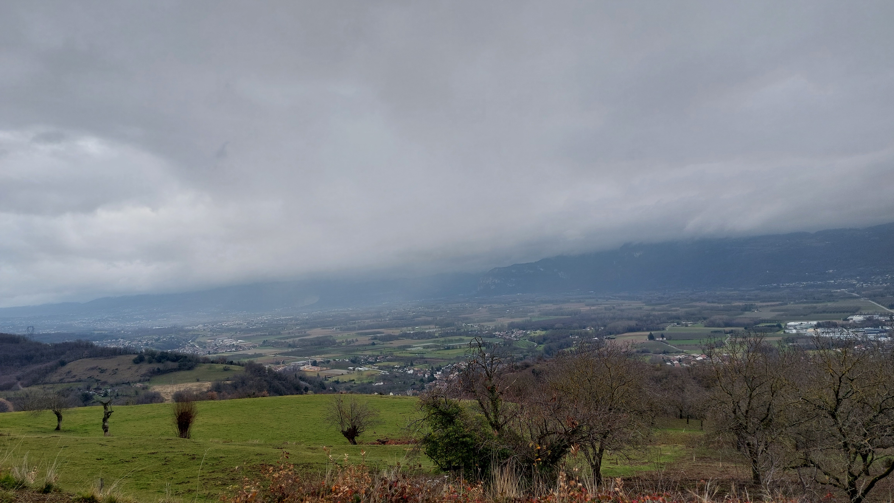

# 🥾🔵 Hike: From Tullins 🏙️ to Chartreuse Notre-Dame de Parmenie ⛪️

💡 Click “Read more”/“Lire la suite” for full page ✅ Joining = Accepting rules (see below)

##  ⭐ Updates ⭐ 

* 📅 More cars = more seats. Seats: Albin (5), Paul (5), Thomas (5), Hamid (5)

##  🗨️ EN/FR 🗨️ 
🦅/🐓 Our events are in English/French. Don’t worry if you are not fluent. Nos évènements sont en Anglais/Français. Ne vous inquiétez pas si vous n’êtes pas bilingue.

## 📍 Meeting Point 📍
Meet at parking "Esplanade du Souvenir Français" near Parc Paul Mistral at **event start time 🔺SHARP🔺**:

* ⏰ [https://osm.org/go/0CASJNbuF?m=](https://osm.org/go/0CASJNbuF?m=)
* ⏰ [https://goo.gl/maps/iNPSZcFVyTcM9VX2A](https://goo.gl/maps/iNPSZcFVyTcM9VX2A)

##  🚗 Transportation 🚗 
We ride our cars for about 30m and park at Tullins :

* 🅿️ [https://osm.org/go/0Aq8fIf5A?m=](https://osm.org/go/0Aq8fIf5A?m=)
* 🅿️ [https://maps.app.goo.gl/y9Sc1o6DDaGYPDeq5](https://maps.app.goo.gl/y9Sc1o6DDaGYPDeq5)

##  🚗 Car share 🚗 
Car share is 4€ per person (fuel + toll + "compensation" to get more drivers).

##  For drivers 🚗 
Drivers needs (mandatory):

* ⛄Either 4 winter or 4 four seasons tires
* 🔗Either 2 car snow chains (\~25€ at Carrefour)
* 🧦Either 2 car snow socks

[https://www.service-public.fr/particuliers/actualites/A14389?lang=en](https://www.service-public.fr/particuliers/actualites/A14389?lang=en)

##  🥾🔵 Hike: From Tullins 🏙️ to Chartreuse Notre-Dame de Parmenie ⛪️ 

* 🔵 Ok for regular hikers with mud ready shoes
* 🔴 Some path can be too steps for noobs with slippery mud

How about we avoid the rain and visit a beautiful church of the chartreuse order? 🌧️ We can park in Tullins near the town hall. 🚗 Our hike will begin by crossing several small bridges. 🌉 Then we will climb up and enjoy a scenic view. 🏞️ Next, we will take a side trip to see the church Chartreuse Notre-Dame de Parmenie. 🙏 After that, we will face a steep ascent to reach the highest point of our hike Marsonnat. 🗻 Then we will descend to a village called L’Eslinard. 🏘️ Finally, we will go back to Tullins and check out another church there before getting in our cars again. 🚙

* 🗺️ Topo & GPX track: [https://s.42l.fr/pgdVqpJV](https://s.42l.fr/pgdVqpJV) (click Export > GPX)
* 📲 Download GPX on your phone (Tuto: [https://binnette.github.io/GAC](https://binnette.github.io/GAC/))
* 📏 Distance: 14.1km
* ⏱️ Time: \~4/5h of hike
* 📈 D+: 727m

##  📜 Rules 📜 

* 🚶‍♀️🚶‍♂️ GAC is about hiking 🥾 and making friends 🤗, NOT flirting ⛔
* 🚮 No littering in nature. Decomposition: 🍊 6m, 🍌 2y, 🥚 3y
* 🚗 Join waiting list for car availability
* ⏰ Don’t be late, we won’t wait
* 💺 Seats in car(s) are limited, only subscribe if sure to join
* ❌ Unsubscribe or 💬 message if can’t join
* 🚗 Drivers: message me ASAP if you can’t join
* 💟 You are responsible for your own health and security

##  🎒 What to bring 🎒 

* 🥾 Hiking snow ready shoes (or keep you feet dry with plastic bags)
* 🥢 Hiking poles (optional)
* 🧤 Winter gloves, 🧥 jacket, [🧣](https://wprock.fr/t/emoji/cold-face/) scarf, 🧢 beanie,...
* 🧃 Water (1-2L) + 🍫 Snacks + 🥗 Lunch
* 🍵 Thermos with hot tea/coffee
* ❄️🌧️ Cold & rain gear
* 💡 Headlamp (night fall quickly now)
* 🌞 Sunscreen, 😎 Sunglasses, 🤐🧊 Lip balm
* 😁 Smile, 😊 Happiness

\*\*\*

❓ Need help 🤔 Visit [https://binnette.github.io/GAC](https://binnette.github.io/GAC) or ask!

Albin from GAC

PS: Join our Telegram for more activities (🧗‍♀️, 🏓, 🎳, 🎲, 🎥, 🎵, 🍽️). Message me on Meetup for the link.

## Stats

- Start time: 2024-01-06 09:00
- End time: 2024-01-06 18:30
- Duration: 9:30:00
- Time to event: 1 day, 11:32:37
- Attendees: 12
- KM: 14.1
- D+: 727
- Top: 758
- Type: Hike
- Comment: 

## Links

- [Trail short link](https://s.42l.fr/pgdVqpJV)
- [Trail full link](https://brouter.de/brouter-web/#map=14/45.3086/5.4802/1069&lonlats=5.485466,45.302803;5.485611,45.303204;5.484924,45.303501;5.48427,45.303312;5.481928,45.303765;5.48353,45.304081;5.485225,45.305833;5.481319,45.308993;5.479324,45.3111;5.473595,45.315536;5.470934,45.318358;5.474668,45.321812;5.467731,45.323778;5.465215,45.323565;5.468574,45.318311;5.456536,45.305433;5.464668,45.303383;5.453703,45.299777;5.467329,45.297059;5.48074,45.298097;5.481416,45.297873;5.484152,45.300521;5.484812,45.302277;5.485337,45.302699)
- [Album](https://binnette.github.io/GacImg2024/2024-01-06-🥾🔵-Hike-From-Tullins-🏙️-to-Chartreuse-Notre-Dame-de-Parmenie-⛪️.html)
- [Meetup event](https://www.meetup.com/grenoble-adventure-club-english-french/events/298335698/)
