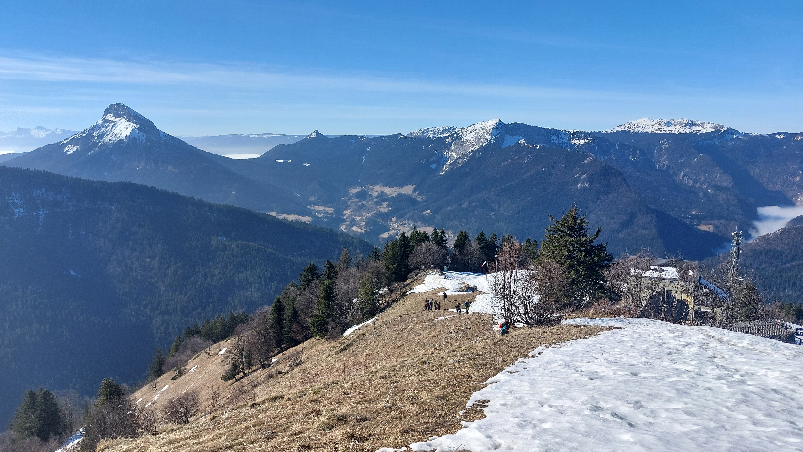

# 🥾🔴 Hike: La Scia from St-Pierre-de-Chartreuse ⛄❄🛷

💡 Click “Read more”/“Lire la suite” for full page ✅ Joining = Accepting rules (see below)

##  ⭐ Updates ⭐ 

* 📅 More cars = more seats. Seats: Albin (5), Paul (5), Rémi (5), Walid (5), Thomas (5), Catie (5), Chunchun (4)

##  🗨️ EN/FR 🗨️ 
🦅/🐓 Our events are in English/French. Don’t worry if you are not fluent. Nos évènements sont en Anglais/Français. Ne vous inquiétez pas si vous n’êtes pas bilingue.

## 📍 Meeting Point 📍
Meet at parking "Esplanade du Souvenir Français" near Parc Paul Mistral at **event start time 🔺SHARP🔺**:

* ⏰ [https://osm.org/go/0CASJNbuF?m=](https://osm.org/go/0CASJNbuF?m=)
* ⏰ [https://goo.gl/maps/iNPSZcFVyTcM9VX2A](https://goo.gl/maps/iNPSZcFVyTcM9VX2A)

##  🚗 Transportation 🚗 
We ride our cars for about 1h and park at St-Pierre-de-Chartreuse:

* 🅿️ [https://osm.org/go/0CAdWNRs4?m=](https://osm.org/go/0CAdWNRs4?m=)
* 🅿️ [https://maps.app.goo.gl/sjcbJhjwnXf7q4ng6](https://maps.app.goo.gl/sjcbJhjwnXf7q4ng6)

##  🚗 Car share 🚗 
Car share is 5€ per person (fuel + "compensation" to get more drivers).

##  For drivers 🚗 
Drivers needs (mandatory):

* ⛄Either 4 winter or 4 four seasons tires
* 🔗Either 2 car snow chains (\~25€ at Carrefour)
* 🧦Either 2 car snow socks

[https://www.service-public.fr/particuliers/actualites/A14389?lang=en](https://www.service-public.fr/particuliers/actualites/A14389?lang=en)

##  🥾🔴 Hike: La Scia from St-Pierre-de-Chartreuse ⛄❄🛷 

* 🔴 Hard for noobs. Very steep path with snow on top
* 🔵 OK for good hikers

We are going to drive for about 50 minutes and get to the town of Saint-Pierre-de-Chartreuse. There is a ski resort there but it is shut down because of money problems. That’s why we can hike in the ski resort and get to the top. 🏔️ We will begin our walk from the village by following the river Guiers Mort. 🚶‍♂️ Then we will start our hard climb to the top and do our 950 meters of elevation in one go, but we will probably take some breaks on the way up. 😅 On the top, we should enjoy a 360 view over Chartreuse. 😍 Then the way down should be quicker as we can maybe slide down on the snow until the half of the ski resort. 🛷 Then we will have to keep hiking down in the forest and then back to our starting point. 🌲

* 🗺️ Topo & GPX track: [https://s.42l.fr/B-WDpxYh](https://s.42l.fr/B-WDpxYh) (click Export > GPX)
* 📲 Download GPX on your phone (Tuto: [https://binnette.github.io/GAC](https://binnette.github.io/GAC/))
* 📏 Distance: 9.7km
* ⏱️ Time: \~4/5h of hike
* 📈 D+: 948m 🐱‍👓

##  📜 Rules 📜 

* 🚶‍♀️🚶‍♂️ GAC is about hiking 🥾 and making friends 🤗, NOT flirting ⛔
* 🚮 No littering in nature. Decomposition: 🍊 6m, 🍌 2y, 🥚 3y
* 🚗 Join waiting list for car availability
* ⏰ Don’t be late, we won’t wait
* 💺 Seats in car(s) are limited, only subscribe if sure to join
* ❌ Unsubscribe or 💬 message if can’t join
* 🚗 Drivers: message me ASAP if you can’t join
* 💟 You are responsible for your own health and security

##  🎒 What to bring 🎒 

* 🥾 Hiking snow ready shoes (or keep you feet dry with plastic bags)
* 🥢 Hiking poles (optional)
* 🛷 Luge/sledge or thick plastic bag to slide down!
* 🧤 Winter gloves, 🧥 jacket, [🧣](https://wprock.fr/t/emoji/cold-face/) scarf, 🧢 beanie,...
* 🧃 Water (1-2L) + 🍫 Snacks + 🥗 Lunch
* 🍵 Thermos with hot tea/coffee
* ❄️🌧️ Cold & rain gear
* 💡 Headlamp (night fall quickly now)
* 🌞 Sunscreen, 😎 Sunglasses, 🤐🧊 Lip balm
* 😁 Smile, 😊 Happiness

\*\*\*

❓ Need help 🤔 Visit [https://binnette.github.io/GAC](https://binnette.github.io/GAC) or ask!

Albin from GAC

PS: Join our Telegram for more activities (🧗‍♀️, 🏓, 🎳, 🎲, 🎥, 🎵, 🍽️). Message me on Meetup for the link.

## Stats

- Start time: 2024-02-04 09:00
- End time: 2024-02-04 18:00
- Duration: 9:00:00
- Time to event: 1 day, 19:15:20
- Attendees: 20
- KM: 9.7
- D+: 948
- Top: 1791
- Type: Hike
- Comment: 

## Links

- [Trail short link](https://s.42l.fr/B-WDpxYh)
- [Trail full link](https://brouter.de/brouter-web/#map=15/45.3446/5.8344/OpenTopoMap&lonlats=5.814729,45.343138;5.820415,45.340261;5.838547,45.340956;5.850493,45.342247;5.850863,45.349318;5.846486,45.344892;5.823398,45.344922;5.814857,45.343334&profile=hiking-mountain)
- [Album](https://binnette.github.io/GacImg2024/2024-02-04-🥾🔴-Hike-La-Scia-from-St-Pierre-de-Chartreuse-⛄❄🛷.html)
- [Meetup event](https://www.meetup.com/grenoble-adventure-club-english-french/events/298950788/)
