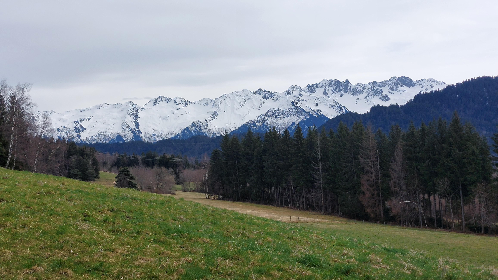

# 🥾🟢 Hike: Easy loop around "La Table" 🪑🏡🌞

💡 Click “Read more”/“Lire la suite” for full page ✅ Joining = Accepting rules (see below)

##  ⭐ Updates ⭐ 

* 📅 More cars = more seats. Seats: Albin (5), Thomas (5), Paulo. (5)

##  🗨️ EN/FR 🗨️ 
🦅/🐓 Our events are in English/French. Don’t worry if you are not fluent. Nos évènements sont en Anglais/Français. Ne vous inquiétez pas si vous n’êtes pas bilingue.

## 📍 Meeting Point 📍
Meet at parking "Esplanade du Souvenir Français" near Parc Paul Mistral at **event start time 🔺SHARP🔺**:

* ⏰ [https://osm.org/go/0CASJNbuF?m=](https://osm.org/go/0CASJNbuF?m=)
* ⏰ [https://goo.gl/maps/iNPSZcFVyTcM9VX2A](https://goo.gl/maps/iNPSZcFVyTcM9VX2A)

##  🚗 Transportation 🚗 
We ride our cars for about 1h and park in "La Table":

* 🅿️ [https://osm.org/go/0CBsXms1w?m=](https://osm.org/go/0CBsXms1w?m=)
* 🅿️ [https://maps.app.goo.gl/qqk3mN5Euts5TW3H8](https://maps.app.goo.gl/qqk3mN5Euts5TW3H8)

##  🚗 Car share 🚗 
Car share is 7€ per person (fuel + toll + "compensation" to get more drivers).

##  For drivers 🚗 
Drivers needs (mandatory):

* ⛄Either 4 winter or 4 four seasons tires
* 🔗Either 2 car snow chains (\~25€ at Carrefour)
* 🧦Either 2 car snow socks

[https://www.service-public.fr/particuliers/actualites/A14389?lang=en](https://www.service-public.fr/particuliers/actualites/A14389?lang=en)

##  🥾🟢 Hike: Easy loop around "La Table" 🪑🏡🌞 

* 🟢 Easy hike. Maybe some mud in the forest.

🌿 **Winter Transition**: let’s embark on a “Spring” hike before Sunday’s anticipated rain. Our journey will take us to Savoie, where we’ll drive for an hour and arrive at the quaint village of “La Table.” From there, we’ll begin our loop hike, tracing the contours of the nearby hill. Along the way, we’ll appreciate the serene landscapes and viewpoints. Our path will wind through forests and open lands, eventually leading us back to our starting point. 🚶‍♀️🌲🗺️

* 🗺️ Topo & GPX track: [https://s.42l.fr/tYOE_fwF](https://s.42l.fr/tYOE_fwF) (click Export > GPX)
* 📲 Download GPX on your phone (Tuto: [https://binnette.github.io/GAC](https://binnette.github.io/GAC/))
* 📏 Distance: 12.4km
* ⏱️ Time: \~4/5h of hike
* 📈 D+: 373m 😎

##  📜 Rules 📜 

* 🚶‍♀️🚶‍♂️ GAC is about hiking 🥾 and making friends 🤗, NOT flirting ⛔
* 🚮 No littering in nature. Decomposition: 🍊 6m, 🍌 2y, 🥚 3y
* 🚗 Join waiting list for car availability
* ⏰ Don’t be late, we won’t wait
* 💺 Seats in car(s) are limited, only subscribe if sure to join
* ❌ Unsubscribe or 💬 message if can’t join
* 🚗 Drivers: message me ASAP if you can’t join
* 💟 You are responsible for your own health and security

##  🎒 What to bring 🎒 

* 🥾 Hiking shoes
* 🥢 Hiking poles (optional)
* 🧤 Winter gloves, 🧥 jacket, [🧣](https://wprock.fr/t/emoji/cold-face/) scarf, 🧢 beanie,...
* 🧃 Water (1-2L) + 🍫 Snacks + 🥗 Lunch
* 🍵 Thermos with hot tea/coffee
* ❄️🌧️ Cold & rain gear
* 💡 Headlamp (night fall quickly now)
* 🌞 Sunscreen, 😎 Sunglasses, 🤐🧊 Lip balm
* 😁 Smile, 😊 Happiness

\*\*\*

❓ Need help 🤔 Visit [https://binnette.github.io/GAC](https://binnette.github.io/GAC) or ask!

Albin from GAC

PS: Join our Telegram for more activities (🧗‍♀️, 🏓, 🎳, 🎲, 🎥, 🎵, 🍽️). Message me on Meetup for the link.

## Stats

- Start time: 2024-03-02 09:00
- End time: 2024-03-02 18:00
- Duration: 9:00:00
- Time to event: 1 day, 9:32:46
- Attendees: 14
- KM: 12.5
- D+: 374
- Top: 1136
- Type: Hike
- Comment: 

## Links

- [Trail short link](https://s.42l.fr/tYOE_fwF)
- [Trail full link](https://brouter.de/brouter-web/#map=14/45.4936/6.1871/OpenTopoMap&lonlats=6.171457,45.479599;6.171591,45.482447;6.182792,45.492751;6.200709,45.503009;6.198611,45.499848;6.218986,45.504214;6.207191,45.493684;6.19895,45.493895;6.17318,45.477134;6.171565,45.479593&profile=hiking-mountain)
- [Album](https://binnette.github.io/GacImg2024/2024-03-02-🥾🟢-Hike-Easy-loop-around-La-Table-🪑🏡🌞.html)
- [Meetup event](https://www.meetup.com/grenoble-adventure-club-english-french/events/299514997/)
