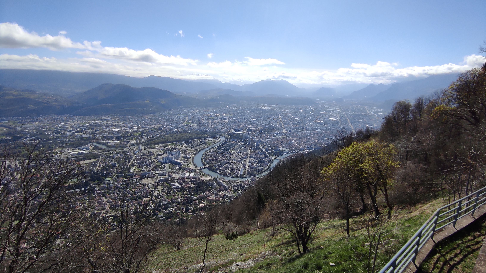

# Hike: back to the basics (Bastille, Mont Jalla, Mont Rachais) + games + fun

💡 Click “Read more”/“Lire la suite” for full page ✅ Joining = Accepting rules (see below)

##  🗨️ EN/FR 🗨️ 
🦅/🐓 Our events are in English/French. Don’t worry if you are not fluent. Nos évènements sont en Anglais/Français. Ne vous inquiétez pas si vous n’êtes pas bilingue.
## 📍 Meeting Point 📍
Meet at the entrance of Jardin des Dauphins:

* [https://maps.app.goo.gl/7X595U6dNvfZ3ypeA](https://maps.app.goo.gl/7X595U6dNvfZ3ypeA)

##  🥾🔴 Hike: Bastille + Mont Jalla + Mont Rachais

* 🔵 easy even for noobs

We go for the most typical hike in Grenoble: we start from Jardin des Dauphins, enjoy the views up to La Bastille, pass by a small cave, go up to Mont Jalla and then Mont Rachais, then return to Parking du glacis, spend a few hours eating lunch, playing games, having a nap/sunbath, etc. We can stay to enjoy the sunset, but you are indeed free to join/return anytime that suits you better.
Note: You can skip the hike to Mont Rachais and wait for us in Parking du glacis if you want!

* 🗺️ Topo & GPX track: [ https://shorturl.at/mopsw](https://shorturl.at/mopsw) (click Export > GPX)
LAZY track: [https://shorturl.at/dhijR](https://shorturl.at/dhijR)

* 📲 Download GPX on your phone (Tuto: [https://binnette.github.io/GAC](https://binnette.github.io/GAC/))
* 📏 Distance: 6.5 km
* ⏱️ Time: \~2/3h of hike + a few hours of playing games!
* 📈 D+: 680m 🐱‍👓
##  📜 Rules 📜 

* 🚶‍♀️🚶‍♂️ GAC is about hiking 🥾 and making friends 🤗, NOT flirting ⛔
* 🚮 No littering in nature. Decomposition: 🍊 6m, 🍌 2y, 🥚 3y
* ❌ Unsubscribe or 💬 message if can’t join
* 💟 You are responsible for your own health and security

##  🎒 What to bring 🎒 

* 🎲🃏 🏐 Any game(s) you have/can play. For example, ball games, cards, Molkky, Petanque, Frisbee, ....
* 🥢 Hiking poles (optional)
* 🧤 Junt in case:🧥 jacket, [🧣](https://wprock.fr/t/emoji/cold-face/) scarf, 🧢 beanie, rain gear
* 🧃 Water (1-2L) + 🍫 Snacks + 🥗 Lunch
* 🍵 Thermos with hot tea/coffee
* 💡 Headlamp (night fall quickly now)
* 🌞 Sunscreen, 😎 Sunglasses, 🤐🧊 Lip balm
* 😁 Smile, 😊 Happiness

\*\*\*
❓ Need help 🤔 Visit [https://binnette.github.io/GAC](https://binnette.github.io/GAC) or ask!

Hassan

PS: Join our Telegram for more activities (🧗‍♀️, 🏓, 🎳, 🎲, 🎥, 🎵, 🍽️). Message me on Meetup for the link.

## Stats

- Start time: 2024-03-23 10:00
- End time: 2024-03-23 19:00
- Duration: 9:00:00
- Time to event: 20:56:08
- Attendees: 5
- KM: 6.5
- D+: 680
- Top: 710
- Type: Hike
- Comment: 

## Links

- [Trail short link](https://shorturl.at/mopsw)
- [Trail full link](https://graphhopper.com/maps/?point=45.193552,5.720191&point=45.198726,5.724526&point=45.200741,5.724916&point=45.201272,5.724536&point=45.203855,5.724226&point=45.208292,5.727072&point=45.20571,5.7281&point=45.199957,5.725168&point=45.197917,5.727329&point=45.197923,5.728089&point=45.197421,5.728368&point=45.196905,5.728486&point=45.197497,5.730549&point=45.197875,5.731272&profile=hike&layer=Omniscale)
- [Album](https://binnette.github.io/GacImg2024/2024-03-23-Hike-back-to-the-basics-Bastille,-Mont-Jalla,-Mont-Rachais-games-fun.html)
- [Meetup event](https://www.meetup.com/grenoble-adventure-club-english-french/events/299950014/)
