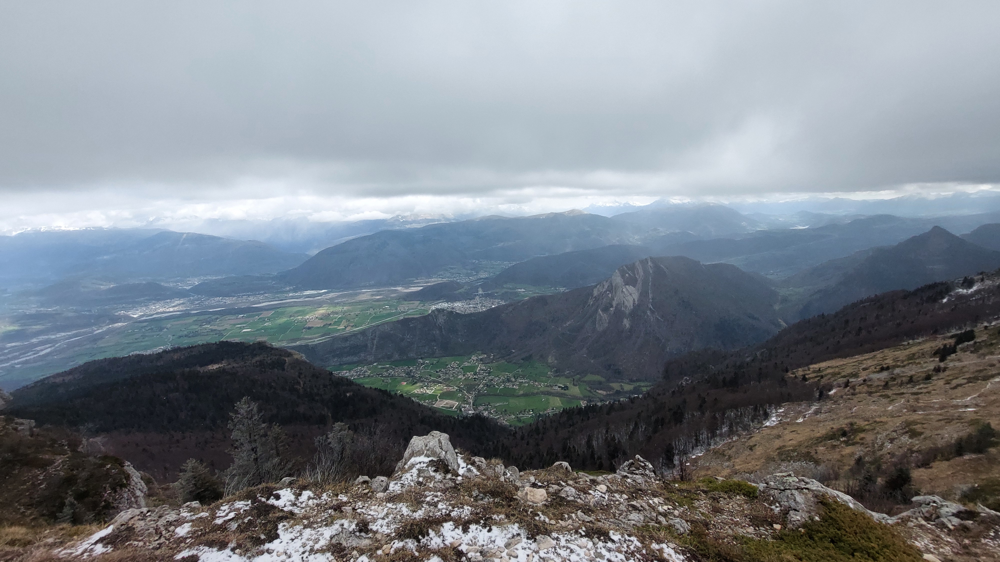

# 🥾🔵 Hike: Pic St-Michel 🌄 from Pré du Four 🌳🚙

💡 Click “Read more”/“Lire la suite” for full page ✅ Joining = Accepting rules (see below)

##  ⭐ Updates ⭐ 

* 📅 More cars = more seats. Seats: Albin (5), Federico (5), Ana (5), Thomas (5)

##  🗨️ EN/FR 🗨️ 
🦅/🐓 Our events are in English/French. Don’t worry if you are not fluent. Nos évènements sont en Anglais/Français. Ne vous inquiétez pas si vous n’êtes pas bilingue.

## 📍 Meeting Point 📍
Meet at parking "Esplanade du Souvenir Français" near Parc Paul Mistral at **event start time 🔺SHARP🔺**:

* ⏰ [https://osm.org/go/0CASJNbuF?m=](https://osm.org/go/0CASJNbuF?m=)
* ⏰ [https://goo.gl/maps/iNPSZcFVyTcM9VX2A](https://goo.gl/maps/iNPSZcFVyTcM9VX2A)

##  🚗 Transportation 🚗 
We ride our cars for about 45m and park near Nantes-en-Rattier:

* 🅿️ [https://osm.org/go/0CAECjSnP?m=](https://osm.org/go/0CAECjSnP?m=)
* 🅿️ [https://maps.app.goo.gl/ZgJ4Hsoq82pp3C1R6](https://maps.app.goo.gl/ZgJ4Hsoq82pp3C1R6)

##  🚗 Car share 🚗 
Car share is 5€ per person (fuel + "compensation" to get more drivers).

##  For drivers 🚗 
Drivers needs (mandatory):

* ⛄Either 4 winter or 4 four seasons tires
* 🔗Either 2 car snow chains (\~25€ at Carrefour)
* 🧦Either 2 car snow socks

[https://www.service-public.fr/particuliers/actualites/A14389?lang=en](https://www.service-public.fr/particuliers/actualites/A14389?lang=en)

##  🥾🔵 Hike: Pic St-Michel 🌄 from Pré du Four 🌳🚙 

* 🔵 Medium for noobs. Steep path with slippery moist rocks
* 🟢 OK for good hikers

Is Sunday a day of rest, or a sunny day to quest? 🤔 Let's find out. We'll park at "Pré du Four" 🚗 and embark on an 11km journey with 812m elevation to reach the top of Pic St-Michel 🗻. Together, let's explore a new path upwards 🧭. Starting from the parking lot, we'll trek through the forest 🌲, gradually ascending towards Col de l'Arc 🛤️. As we climb, we'll leave the forest canopy behind 🌳➡️🌄. We'll take a small detour to drink at a water fountain 💧. From Col de l'Arc, it's a climb to the summit of Pic St-Michel, where we'll savor the view and enjoy our lunch 🥪🍏. We might encounter a sprinkle of rain 🌦️ or a few snowflakes ❄️ at the peak. Descending, we'll return to Col de l'Arc and then veer off onto a forest trail 🌲 that loops back to the parking lot. Near the end, we could detour past some communication antennas for an alternate view of Grenoble 📡🏙️. Time permitting, we might drive to "Tourbières du Peuil" for a brief 2 km hike amidst flora 🌼🌷. Hopefully, we'll spot some daffodils and other blooms 🌸. Then, it's back to Grenoble by car 🚗.

Parking for the second 2km hike :

* 🅿️ [https://osm.org/go/0CAEWrIuh-?m=](https://osm.org/go/0CAEWrIuh-?m=)
* 🅿️ [https://maps.app.goo.gl/x4rABY16dcPTycJq6](https://maps.app.goo.gl/x4rABY16dcPTycJq6)

* 🗺️ Topo & GPX track: [https://s.42l.fr/jxQybEbw](https://s.42l.fr/jxQybEbw) (click Export > GPX)
* 📲 Download GPX on your phone (Tuto: [https://binnette.github.io/GAC](https://binnette.github.io/GAC/))
* 📏 Distance: 11km
* ⏱️ Time: \~5/6h of hike
* 📈 D+: 812m 🦝

##  📜 Rules 📜 

* 🚶‍♀️🚶‍♂️ GAC is about hiking 🥾 and making friends 🤗, NOT flirting ⛔
* 🚮 No littering in nature. Decomposition: 🍊 6m, 🍌 2y, 🥚 3y
* 🚗 Join waiting list for car availability
* ⏰ Don’t be late, we won’t wait
* 💺 Seats in car(s) are limited, only subscribe if sure to join
* ❌ Unsubscribe or 💬 message if can’t join
* 🚗 Drivers: message me ASAP if you can’t join
* 💟 You are responsible for your own health and security

##  🎒 What to bring 🎒 

* 🥾 Hiking snow ready shoes
* 🥢 Hiking poles (optional)
* 🧤 Winter gloves, 🧥 jacket, [🧣](https://wprock.fr/t/emoji/cold-face/) scarf, 🧢 beanie,...
* 🧃 Water (1-2L) + 🍫 Snacks + 🥗 Lunch
* 🍵 Thermos with hot tea/coffee
* ❄️🌧️ Cold & rain gear
* 💡 Headlamp (night fall quickly now)
* 🌞 Sunscreen, 😎 Sunglasses, 🤐🧊 Lip balm
* 😁 Smile, 😊 Happiness

\*\*\*

❓ Need help 🤔 Visit [https://binnette.github.io/GAC](https://binnette.github.io/GAC) or ask!

Albin from GAC

PS: Join our Telegram for more activities (🧗‍♀️, 🏓, 🎳, 🎲, 🎥, 🎵, 🍽️). Message me on Meetup for the link.

## Stats

- Start time: 2024-03-24 09:00
- End time: 2024-03-24 18:00
- Duration: 9:00:00
- Time to event: 1 day, 17:18:50
- Attendees: 11
- KM: 10.6
- D+: 812
- Top: 1966
- Type: Hike
- Comment: 

## Links

- [Trail short link](https://s.42l.fr/jxQybEbw)
- [Trail full link](https://brouter.de/brouter-web/#map=15/45.0856/5.6270/OpenTopoMap&lonlats=5.642381,45.088703;5.630879,45.087918;5.614657,45.078974;5.619419,45.090492;5.63015,45.082609;5.645943,45.087793;5.643153,45.088664&profile=hiking-mountain)
- [Album](https://binnette.github.io/GacImg2024/2024-03-24-🥾🔵-Hike-Pic-St-Michel-🌄-from-Pre-du-Four-🌳🚙.html)
- [Meetup event](https://www.meetup.com/grenoble-adventure-club-english-french/events/299951751/)
