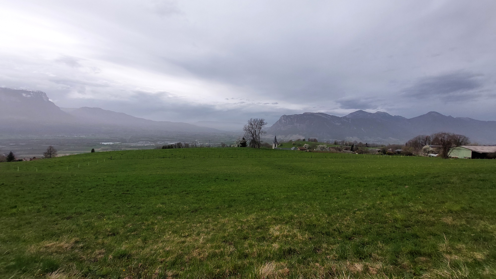

# 🥾🟢 Hike: Montmayeur towers rainy rendez-vous 🏰🌧️

💡 Click “Read more”/“Lire la suite” for full page ✅ Joining = Accepting rules (see below)

##  ⭐ Updates ⭐ 

* 📅 More cars = more seats. Seats: Albin (5), Ana(5), Thomas (5)

##  🗨️ EN/FR 🗨️ 
🦅/🐓 Our events are in English/French. Don’t worry if you are not fluent. Nos évènements sont en Anglais/Français. Ne vous inquiétez pas si vous n’êtes pas bilingue.

## 📍 Meeting Point 📍
Meet at parking "Esplanade du Souvenir Français" near Parc Paul Mistral at **event start time 🔺SHARP🔺**:

* ⏰ [https://osm.org/go/0CASJNbuF?m=](https://osm.org/go/0CASJNbuF?m=)
* ⏰ [https://goo.gl/maps/iNPSZcFVyTcM9VX2A](https://goo.gl/maps/iNPSZcFVyTcM9VX2A)

##  🚗 Transportation 🚗 
We ride our cars for about 45m and park at Villaroux:

* 🅿️ [https://osm.org/go/0CBmFvqmb?m=](https://osm.org/go/0CBmFvqmb?m=)
* 🅿️ [https://maps.app.goo.gl/79pga3uSc6QU8x1y5](https://maps.app.goo.gl/79pga3uSc6QU8x1y5)

##  🚗 Car share 🚗 
Car share is 5€ per person (fuel + toll + "compensation" to get more drivers).

##  For drivers 🚗 
Drivers needs (mandatory):

* ⛄Either 4 winter or 4 four seasons tires
* 🔗Either 2 car snow chains (\~25€ at Carrefour)
* 🧦Either 2 car snow socks

[https://www.service-public.fr/particuliers/actualites/A14389?lang=en](https://www.service-public.fr/particuliers/actualites/A14389?lang=en)

##  🥾🟢 Hike: Montmayeur towers rainy rendez-vous 🏰🌧️ 

* 🟢 Should be OK for everyone. Maybe some mud because of the rain.

Who says the Grenoble Adventure Club (GAC) shies away from a little rain? 🌧️ Let's demonstrate our resilience and gracefully navigate through the raindrops. 💧 Our journey begins with a 45-minute drive 🚗, arriving at the quaint village of Villaroux in Savoie. 🏡 In the morning, we'll traverse the open fields adjacent to the forest 🌾🌲 and even drop by the charming village of Soucy. 🏘️ As we venture into the woods, we'll ascend to the twin towers of Montmayeur, remnants of an ancient castle. 🏰 Here, we might take shelter near or within the towers for our lunch break 🍞🧀, safeguarding us from the wind and rain. 🌬️🌧️ Our afternoon will be spent meandering through the forest and over the hills 🌳🌲, with the hope of catching a panoramic view of the valleys below. 👀🏞️ Completing our loop, we'll return to the parking lot where, if you've planned ahead, dry clothes, socks, and shoes await. 👕🧦👟 Finally, we'll head back to Grenoble by car. 🚗💨

* 🗺️ Topo & GPX track: [https://s.42l.fr/qJorejLn](https://s.42l.fr/qJorejLn) (click Export > GPX)
* 📲 Download GPX on your phone (Tuto: [https://binnette.github.io/GAC](https://binnette.github.io/GAC/))
* 📏 Distance: 15.2km
* ⏱️ Time: \~5/6h of hike
* 📈 D+: 550m 🐭

##  📜 Rules 📜 

* 🚶‍♀️🚶‍♂️ GAC is about hiking 🥾 and making friends 🤗, NOT flirting ⛔
* 🚮 No littering in nature. Decomposition: 🍊 6m, 🍌 2y, 🥚 3y
* 🚗 Join waiting list for car availability
* ⏰ Don’t be late, we won’t wait
* 💺 Seats in car(s) are limited, only subscribe if sure to join
* ❌ Unsubscribe or 💬 message if can’t join
* 🚗 Drivers: message me ASAP if you can’t join
* 💟 You are responsible for your own health and security

##  🎒 What to bring 🎒 

* 🥾 Hiking snow ready shoes
* 🥢 Hiking poles (optional)
* 🧤 Gloves, 🧥 jacket, [🧣](https://wprock.fr/t/emoji/cold-face/) scarf, 🧢 beanie,...
* ❄️🌧️ Cold & rain gear
* 🧦 Dry socks/shoes/pant that wait for you in the car
* 🧃 Water (1-2L) + 🍫 Snacks + 🥗 Lunch
* 🍵 Thermos with hot tea/coffee
* 💡 Headlamp (night fall quickly now)
* 🌞 Sunscreen, 😎 Sunglasses, 🤐🧊 Lip balm
* 😁 Smile, 😊 Happiness

\*\*\*

❓ Need help 🤔 Visit [https://binnette.github.io/GAC](https://binnette.github.io/GAC) or ask!

Albin from GAC

PS: Join our Telegram for more activities (🧗‍♀️, 🏓, 🎳, 🎲, 🎥, 🎵, 🍽️). Message me on Meetup for the link.

## Stats

- Start time: 2024-03-30 09:00
- End time: 2024-03-30 18:00
- Duration: 9:00:00
- Time to event: 1 day, 10:32:12
- Attendees: 6
- KM: 15.2
- D+: 550
- Top: 811
- Type: Hike
- Comment: 

## Links

- [Trail short link](https://s.42l.fr/qJorejLn)
- [Trail full link](https://brouter.de/brouter-web/#map=13/45.4730/6.1007/OpenTopoMap&lonlats=6.075447,45.458052;6.096567,45.478918;6.096707,45.479445;6.131723,45.498763;6.123106,45.489357;6.073203,45.4524;6.075245,45.457965&profile=hiking-mountain)
- [Album](https://binnette.github.io/GacImg2024/2024-03-30-🥾🟢-Hike-Montmayeur-towers-rainy-rendez-vous-🏰🌧️.html)
- [Meetup event](https://www.meetup.com/grenoble-adventure-club-english-french/events/300079128/)
