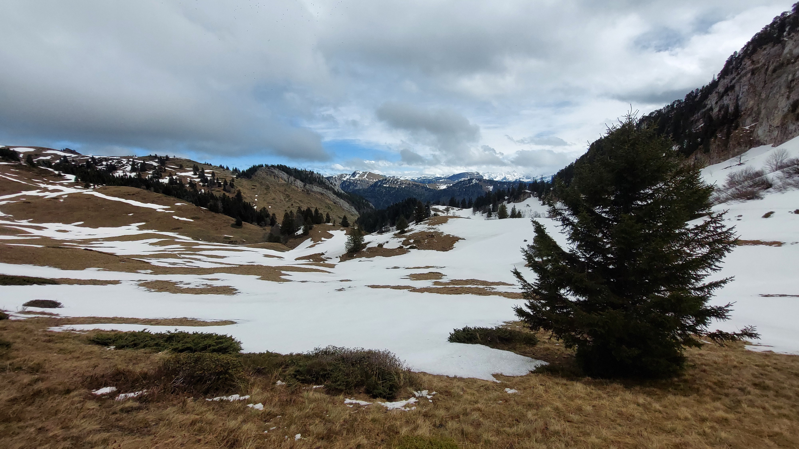

# 🥾🔴 Hike: Rochers 'de Lorzier 1838m' ⛰️ and 'de Chalves' 1845m 🌄

💡 Click “Read more”/“Lire la suite” for full page ✅ Joining = Accepting rules (see below)

##  ⭐ Updates ⭐ 

* 📅 More cars = more seats. Seats: Albin (5), Thomas (5), Guillaume (1), Emmanuel (5)

##  🗨️ EN/FR 🗨️ 
🦅/🐓 Our events are in English/French. Don’t worry if you are not fluent. Nos évènements sont en Anglais/Français. Ne vous inquiétez pas si vous n’êtes pas bilingue.

## 📍 Meeting Point 📍
Meet at parking "Esplanade du Souvenir Français" near Parc Paul Mistral at **event start time 🔺SHARP🔺**:

* ⏰ [https://osm.org/go/0CASJNbuF?m=](https://osm.org/go/0CASJNbuF?m=)
* ⏰ [https://goo.gl/maps/iNPSZcFVyTcM9VX2A](https://goo.gl/maps/iNPSZcFVyTcM9VX2A)

##  🚗 Transportation 🚗 
We ride our cars for about 40mn and park near Mont-Saint-Martin:

* 🅿️ [https://osm.org/go/0CAUh_I_8?m=](https://osm.org/go/0CAUh_I_8?m=)
* 🅿️ [https://maps.app.goo.gl/mSLuPuiN8nkjWP499](https://maps.app.goo.gl/mSLuPuiN8nkjWP499)

##  🚗 Car share 🚗 
Car share is 4€ per person (fuel + "compensation" to get more drivers).

##  For drivers 🚗 
Drivers needs (mandatory):

* ⛄Either 4 winter or 4 four seasons tires
* 🔗Either 2 car snow chains (\~25€ at Carrefour)
* 🧦Either 2 car snow socks

[https://www.service-public.fr/particuliers/actualites/A14389?lang=en](https://www.service-public.fr/particuliers/actualites/A14389?lang=en)

##  🥾🔴 Hike: Rochers 'de Lorzier 1838m' ⛰️ and 'de Chalves' 1845m 🌄 

* 🔴 Hard for noobs. Very steep/slippery path. Maybe rain/snow
* 🔵 OK for good hikers

Prepare for a challenging hike with wind and rain as your guides 🌧️💨. From Grenoble, a 40-minute car ride takes us to Mont-Saint-Martin, where the journey begins. No warm-up, just a steep 900m climb through the forest 🌲🌿. Upon reaching the high plain, a loop trail leads to the Chalet des Bannettes 🏠 and the Rocher de Lorzier (1838m) 🏔️. For those with energy to spare, a detour to Rocher de Chalves (1844m) awaits 🗻. The descent follows the same path, with dry socks, shoes, and pants waiting in the car 🧦🥾👖. Finally, a drive back to Grenoble concludes this weather-beaten adventure 🏞️💪."

* 🗺️ Topo & GPX track: [https://s.42l.fr/F1inOPMf](https://s.42l.fr/F1inOPMf) (click Export > GPX)
* 📲 Download GPX on your phone (Tuto: [https://binnette.github.io/GAC](https://binnette.github.io/GAC/))
* 📏 Distance: 15km
* ⏱️ Time: \~5/6h of hike
* 📈 D+: 1215m 🐱‍👓

##  📜 Rules 📜 

* 🚶‍♀️🚶‍♂️ GAC is about hiking 🥾 and making friends 🤗, NOT flirting ⛔
* 🚮 No littering in nature. Decomposition: 🍊 6m, 🍌 2y, 🥚 3y
* 🚗 Join waiting list for car availability
* ⏰ Don’t be late, we won’t wait
* 💺 Seats in car(s) are limited, only subscribe if sure to join
* ❌ Unsubscribe or 💬 message if can’t join
* 🚗 Drivers: message me ASAP if you can’t join
* 💟 You are responsible for your own health and security

##  🎒 What to bring 🎒 

* 🥾 Hiking snow ready shoes
* 🥢 Hiking poles (optional)
* 🛷 Luge/sledge or thick plastic bag to slide down (if snow)!
* 🧤 Winter gloves, 🧥 jacket, [🧣](https://wprock.fr/t/emoji/cold-face/) scarf, 🧢 beanie,...
* 🧃 Water (1-2L) + 🍫 Snacks + 🥗 Lunch
* 🍵 Thermos with hot tea/coffee
* ❄️🌧️ Cold & rain gear
* 💡 Headlamp (night fall quickly now)
* 🌞 Sunscreen, 😎 Sunglasses, 🤐🧊 Lip balm
* 😁 Smile, 😊 Happiness

\*\*\*

❓ Need help 🤔 Visit [https://binnette.github.io/GAC](https://binnette.github.io/GAC) or ask!

Albin from GAC

PS: Join our Telegram for more activities (🧗‍♀️, 🏓, 🎳, 🎲, 🎥, 🎵, 🍽️). Message me on Meetup for the link.

## Stats

- Start time: 2024-03-31 09:00
- End time: 2024-03-31 18:00
- Duration: 9:00:00
- Time to event: 1 day, 8:33:55
- Attendees: 13
- KM: 15.1
- D+: 1215
- Top: 1845
- Type: Hike
- Comment: 

## Links

- [Trail short link](https://s.42l.fr/F1inOPMf)
- [Trail full link](https://brouter.de/brouter-web/#map=13/45.2962/5.6947/OpenTopoMap&lonlats=5.679134,45.273395;5.685176,45.283858;5.681365,45.286135;5.694524,45.299639;5.701737,45.315225;5.696146,45.313348;5.698068,45.298217;5.684704,45.282886;5.67905,45.27339&profile=hiking-mountain)
- [Album](https://binnette.github.io/GacImg2024/2024-03-31-🥾🔴-Hike-Rochers-'de-Lorzier-1838m'-⛰️-and-'de-Chalves'-1845m-🌄.html)
- [Meetup event](https://www.meetup.com/grenoble-adventure-club-english-french/events/300101111/)
