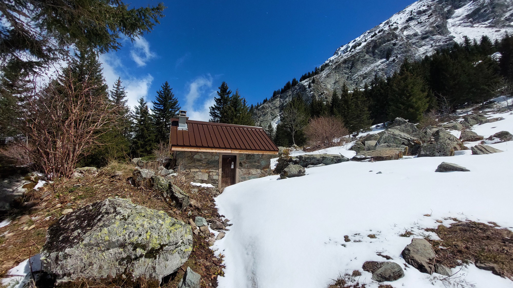

# 🥾🔵 Hike: Still some ⛄️ snow at 🛖 Cabane de Combe Oursière? 🤔

💡 Click “Read more”/“Lire la suite” for full page ✅ Joining = Accepting rules (see below)

##  ⭐ Updates ⭐ 

* 📅 More cars = more seats. Seats: Albin (5), Paul (5), Federico (5), Thomas (5)

##  🗨️ EN/FR 🗨️ 
🦅/🐓 Our events are in English/French. Don’t worry if you are not fluent. Nos évènements sont en Anglais/Français. Ne vous inquiétez pas si vous n’êtes pas bilingue.

## 📍 Meeting Point 📍
Meet at parking "Esplanade du Souvenir Français" near Parc Paul Mistral at **event start time 🔺SHARP🔺**:

* ⏰ [https://osm.org/go/0CASJNbuF?m=](https://osm.org/go/0CASJNbuF?m=)
* ⏰ [https://goo.gl/maps/iNPSZcFVyTcM9VX2A](https://goo.gl/maps/iNPSZcFVyTcM9VX2A)

##  🚗 Transportation 🚗 
We ride our cars for about 1h and park at Moulin Vieux:

* 🅿️ [https://osm.org/go/0CAIrdAlV--?m=](https://osm.org/go/0CAIrdAlV--?m=)
* 🅿️ [https://maps.app.goo.gl/9duuQ9fL2bmx9RoD8](https://maps.app.goo.gl/9duuQ9fL2bmx9RoD8)

##  🚗 Car share 🚗 
Car share is 6€ per person (fuel + toll + "compensation" to get more drivers).

##  🥾🔵 Hike: Still some ⛄️ snow at 🛖 Cabane de Combe Oursière? 🤔 

* 🔵 Steepness go crescendo until the top, maybe some snow there.

Embark on a journey to uncover a quaint little cabin nestled in the mountains at the trail’s conclusion 🏔️. Curious if the winter’s blanket of snow still lingers ❄️? We’ll venture by car for an hour to “Moulin Vieux,” just beyond “La Morte.” Upon arrival, a brief visit to the village church is in order ⛪, followed by the commencement of our trek across the village’s welcoming flat fields 🌄. We might opt for a shortcut, but either way, our path leads us into the embrace of the forest 🌲, ascending 766m until we emerge to greet the alpine refuge: Cabane de Combe Oursière 🏠. Here, we’ll explore the cozy hut and likely pause for a lunch break 🍞. After a leisurely time near the hut, we’ll descend, diverging from our morning route to complete a circuit back to our starting point. Our return will be graced by the gentle company of a small stream, Ruisseau de Vaunoire, whispering alongside us 🚶‍♂️💦. And at last, we’ll find ourselves back at the parking lot, marking the end of our sojourn 🚗.

* 🗺️ Topo & GPX track: [https://s.42l.fr/41lWD3aY](https://s.42l.fr/41lWD3aY) (click Export > GPX)
* 📲 Download GPX on your phone (Tuto: [https://binnette.github.io/GAC](https://binnette.github.io/GAC/))
* 📏 Distance: 12km
* ⏱️ Time: \~5/6h of hike
* 📈 D+: 766m

##  📜 Rules 📜 

* 🚶‍♀️🚶‍♂️ GAC is about hiking 🥾 and making friends 🤗, NOT flirting ⛔
* 🚮 No littering in nature. Decomposition: 🍊 6m, 🍌 2y, 🥚 3y
* 🚗 Join waiting list for car availability
* ⏰ Don’t be late, we won’t wait
* 💺 Seats in car(s) are limited, only subscribe if sure to join
* ❌ Unsubscribe or 💬 message if can’t join
* 🚗 Drivers: message me ASAP if you can’t join
* 💟 You are responsible for your own health and security

##  🎒 What to bring 🎒

* 🥾 Hiking snow ready shoes
* 🥢 Hiking poles (optional)
* 🧤 Gloves, 🧥 jacket, [🧣](https://wprock.fr/t/emoji/cold-face/) scarf, 🧢 beanie,...
* ❄️🌧️ Cold & rain gear (around 2°C on top)
* 🧦 Dry socks/shoes/pant that wait for you in the car
* 🧃 Water (1-2L) + 🍫 Snacks + 🥗 Lunch
* 🍵 Thermos with hot tea/coffee
* 💡 Headlamp (optional)
* 🌞 Sunscreen, 😎 Sunglasses, 🤐🧊 Lip balm
* 😁 Smile, 😊 Happiness

\*\*\*

❓ Need help 🤔 Visit [https://binnette.github.io/GAC](https://binnette.github.io/GAC) or ask!

Albin from GAC

PS: Join our Telegram for more activities (🧗‍♀️, 🏓, 🎳, 🎲, 🎥, 🎵, 🍽️). Message me on Meetup for the link.

## Stats

- Start time: 2024-04-20 09:00
- End time: 2024-04-20 18:00
- Duration: 9:00:00
- Time to event: 1 day, 8:43:59
- Attendees: 12
- KM: 12
- D+: 766
- Top: 1740
- Type: Hike
- Comment: 

## Links

- [Trail short link](https://s.42l.fr/41lWD3aY)
- [Trail full link](https://brouter.de/brouter-web/#map=15/45.0070/5.8994/OpenTopoMap&lonlats=5.880416,45.010476;5.888221,45.007277;5.888337,45.00705;5.888369,45.00729;5.897256,45.00403;5.916309,45.000133;5.907576,45.010069;5.880609,45.01048&profile=hiking-mountain)
- [Album](https://binnette.github.io/GacImg2024/2024-04-20-🥾🔵-Hike-Still-some-⛄️-snow-at-🛖-Cabane-de-Combe-Oursiere?-🤔.html)
- [Meetup event](https://www.meetup.com/grenoble-adventure-club-english-french/events/300501073/)
