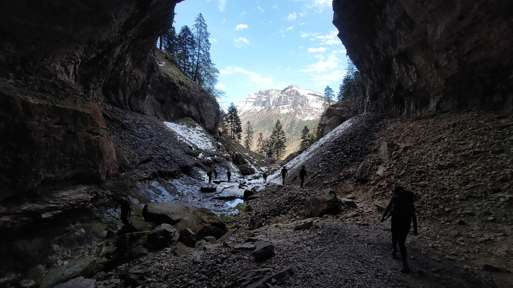

# 🥾🔴 Hike: to Cirque de Saint Même (Saint-Pierre-d'Entremont)

💡 Click “Read more”/“Lire la suite” for full page ✅ Joining = Accepting rules (see below)

##  ⭐ Updates ⭐ 

* After a cold and wet week, we have a sunny Saturday predicted. Lets go the Cirque de St-Même waterfalls at the Isère-Savoie border.
* 📅 More cars = more seats. Seats: Thomas (5), Albin (5), Walid(5), David (5)

##  🗨️ EN/FR 🗨️ 
🦅/🐓 Our events are in English/French. Don’t worry if you are not fluent. Nos évènements sont en Anglais/Français. Ne vous inquiétez pas si vous n’êtes pas bilingue.

## 📍 Meeting Point 📍
Meet at parking "Esplanade du Souvenir Français" near Parc Paul Mistral at **event start time 🔺SHARP🔺**:

* ⏰ [https://osm.org/go/0CASJNbuF?m=](https://osm.org/go/0CASJNbuF?m=)
* ⏰ [https://goo.gl/maps/iNPSZcFVyTcM9VX2A](https://goo.gl/maps/iNPSZcFVyTcM9VX2A)

##  🚗 Transportation 🚗 
We ride our cars for about 1h & park at Parking du Cirque de Saint-Même :

* 🅿️ [https://osm.org/go/0CBLBCPjJ--?layers=N&m=](https://osm.org/go/0CBLBCPjJ--?layers=N&m=)
* 🅿️ [https://maps.app.goo.gl/CqzxqvgXRxNBEx4m6](https://maps.app.goo.gl/CqzxqvgXRxNBEx4m6)

##  🚗 Car share 🚗 
Car share is 7€ per person (fuel + toll + parking + "compensation" to get more drivers).
##  🥾🔴 Hike: to Cirque de Saint Même (Saint-Pierre-d'Entremont) 

* ⚫ Not for beginners 🚫, aerial walk on the edge of a cliff 😲, guaranteed vertigo 😬, use of cables for climbing ⛓️, wet and slippery passages 💦👣, steep slope ⛰️📈.

🥾 We start from the 🚗 parking (alt \~850 m), past some views 🌄 and water crossings 🌊, through the forest 🌳 to reach the waterfall (1.5km, \~1000m) 🏞️. We then climb up to the top by the side of the waterfall, this is the hard part & can be wet and slippery 💦🧗‍♂️. There may be some handholds or cables to help 🛠️.

We hike up past the 'pas de La Mort' ❗❗ until the 3km mark (alt\~1500m), then it flattens out and we leave Isère to cross over to Savoie 🔄.

We continue easily to Pré-Pratcel (5km \~ 1500m) 🚶‍♂️ and start to go up some more to get to a shepherd's hut ( \~1700m) 🏡.
This is our destination, it should be a good spot for lunch 🍽️ and a siesta 😴.

To return, we take the same path to Pré-Pratcel, then turn west at the signpost 🪧, and continue to St-Même- d'en- Haut, and then to the parking 🚗.

There are a few waterways along the return path for a dip 🏊‍♂️.
For the more motivated folks, the big waterfalls are not too far 🏞️👣.

* 🗺️ Topo & GPX track: [https://s.42l.fr/5ll4jHmp](https://s.42l.fr/5ll4jHmp) (click Export > GPX)
* 📲 Download GPX on your phone (Tuto: [https://binnette.github.io/GAC](https://binnette.github.io/GAC/))
* 📏 Distance: 11.5km
* ⏱️ Time: \~5/6h of hike
* 📈 D+: 1027m 🤯

##  📜 Rules 📜 

* 🚶‍♀️🚶‍♂️ GAC is about hiking 🥾 and making friends 🤗, NOT flirting ⛔
* 🚮 No littering in nature. Decomposition: 🍊 6m, 🍌 2y, 🥚 3y
* 🚗 Join waiting list for car availability
* ⏰ Don’t be late, we won’t wait
* 💺 Seats in car(s) are limited, only subscribe if sure to join
* ❌ Unsubscribe or 💬 message if can’t join
* 🚗 Drivers: message me ASAP if you can’t join
* 💟 You are responsible for your own health and security

##  🎒 What to bring 🎒 

* 🥾 Hiking ready shoes. There might be some scattered snow after this week.
* 🥢 Hiking poles (optional)
* 🧤 Gloves, 🧥 jacket, [🧣](https://wprock.fr/t/emoji/cold-face/) scarf, 🧢 beanie,...
* ❄️🌧️ Cold & rain gear (Lets hope for the sun, but you never know !)
* 🧦 Dry socks/shoes/pant that wait for you in the car
* 🧃 Water (1-2L) + 🍫 Snacks + 🥗 Lunch
* 🍵 Thermos with hot tea/coffee
* 💡 Headlamp (optional)
* 🌞 Sunscreen, 😎 Sunglasses, 🤐🧊 Lip balm
* 😁 Smile, 😊 Happiness

\*\*\*

❓ Need help 🤔 Visit [https://binnette.github.io/GAC](https://binnette.github.io/GAC) or ask!

Thomas

PS: Join our Telegram for more activities (🧗‍♀️, 🏓, 🎳, 🎲, 🎥, 🎵, 🍽️).

## Stats

- Start time: 2024-04-27 09:00
- End time: 2024-04-27 18:00
- Duration: 9:00:00
- Time to event: 2 days, 7:55:16
- Attendees: 12
- KM: 11.4
- D+: 1027
- Top: 1672
- Type: Hike
- Comment: 

## Links

- [Trail short link](https://s.42l.fr/5ll4jHmp)
- [Trail full link](https://brouter.de/brouter-web/#map=14/45.4057/5.8990/OpenTopoMap&lonlats=5.890646,45.400819;5.890474,45.399158;5.890624,45.392061;5.907125,45.396069;5.914335,45.414662;5.890388,45.406103;5.89056,45.401552)
- [Album](https://binnette.github.io/GacImg2024/2024-04-27-🥾🔴-Hike-to-Cirque-de-Saint-Même-Saint-Pierre-dEntremont.html)
- [Meetup event](https://www.meetup.com/grenoble-adventure-club-english-french/events/300623520/)
