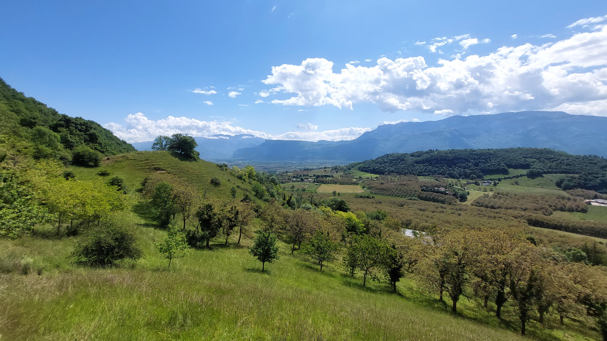

# 🥾🔵 Hike: short loop around Morette 🏡🌲🌳 without rain? 🌤️

💡 Click “Read more”/“Lire la suite” for full page ✅ Joining = Accepting rules (see below)

##  ⭐ Updates ⭐ 

* 📅 More cars = more seats. Seats: Albin (5), Rémi (5), Thomas (5)

##  🗨️ EN/FR 🗨️ 
🦅/🐓 Our events are in English/French. Don’t worry if you are not fluent. Nos évènements sont en Anglais/Français. Ne vous inquiétez pas si vous n’êtes pas bilingue.

## 📍 Meeting Point 📍
Meet at parking "Esplanade du Souvenir Français" near Parc Paul Mistral at **event start time 🔺SHARP🔺**:

* ⏰ [https://osm.org/go/0CASJNbuF?m=](https://osm.org/go/0CASJNbuF?m=)
* ⏰ [https://goo.gl/maps/iNPSZcFVyTcM9VX2A](https://goo.gl/maps/iNPSZcFVyTcM9VX2A)

##  🚗 Transportation 🚗 
We ride our cars for about 35mn and park at Morette:

* 🅿️ [https://osm.org/go/0Aq8FfRuB-?m=](https://osm.org/go/0Aq8FfRuB-?m=)
* 🅿️ [https://maps.app.goo.gl/K9xfKVSpLV6x88LK8](https://maps.app.goo.gl/K9xfKVSpLV6x88LK8)

##  🚗 Car share 🚗 
Car share is 4€ per person (fuel + "compensation" to get more drivers).

##  🥾🔵 Hike: short loop around Morette 🏡🌲🌳 without rain? 🌤️ 

* 🔵 Maybe mud because of rain. Not so long.

Is it going to be a rainy weekend? 🌧️ Nope! 🚫 It looks like we’ve got a chance to dodge Sunday’s showers! 🌤️ Let’s hop in the car 🚗 and head west from Grenoble to the quaint village of Morette, home to about 400 souls. 🏡 We’ll park right in front of the **mairie** and kick off our escapade there. 🗺️ We’ll bid farewell to the village and soon begin our trek through the woods. 🌲🥾 Next, we’ll stroll through the hamlet of “l’Eslinard,” stirring up memories from our not-so-distant past visit. 🍃👣 Continuing our climb amidst the trees, we’ll eventually descend to “Col de Châtain.” 🍂 There’s a picnic spot with a cover, making it the ideal setting for our lunch break with a view. 🥪🌄 Afterward, it’s back into the forest for a little more uphill action before completing our circuit and descending back to the village. 🔄🏞️

* 🗺️ Topo & GPX track: [https://s.42l.fr/Rprq17-S](https://s.42l.fr/Rprq17-S) (click Export > GPX)
* 📲 Download GPX on your phone (Tuto: [https://binnette.github.io/GAC](https://binnette.github.io/GAC/))
* 📏 Distance: 11.8km
* ⏱️ Time: \~2/3h of hike
* 📈 D+: 514m

##  📜 Rules 📜 

* 🚶‍♀️🚶‍♂️ GAC is about hiking 🥾 and making friends 🤗, NOT flirting ⛔
* 🚮 No littering in nature. Decomposition: 🍊 6m, 🍌 2y, 🥚 3y
* 🚗 Join waiting list for car availability
* ⏰ Don’t be late, we won’t wait
* 💺 Seats in car(s) are limited, only subscribe if sure to join
* ❌ Unsubscribe or 💬 message if can’t join
* 🚗 Drivers: message me ASAP if you can’t join
* 💟 You are responsible for your own health and security

##  🎒 What to bring 🎒 

* 🥾 Hiking shoes
* 🥢 Hiking poles (optional)
* 🧤 Gloves, 🧥 jacket, [🧣](https://wprock.fr/t/emoji/cold-face/) scarf, 🧢 beanie,...
* ❄️🌧️ Cold & rain gear
* 🧦 Dry socks/shoes/pant that wait for you in the car
* 🧃 Water (1-2L) + 🍫 Snacks + 🥗 Lunch
* 🍵 Thermos with hot tea/coffee
* 💡 Headlamp (optional)
* 🌞 Sunscreen, 😎 Sunglasses, 🤐🧊 Lip balm
* 😁 Smile, 😊 Happiness

\*\*\*

❓ Need help 🤔 Visit [https://binnette.github.io/GAC](https://binnette.github.io/GAC) or ask!

Albin from GAC

PS: Join our Telegram for more activities (🧗‍♀️, 🏓, 🎳, 🎲, 🎥, 🎵, 🍽️). Message me on Meetup for the link.

## Stats

- Start time: 2024-05-19 10:00
- End time: 2024-05-19 16:00
- Duration: 6:00:00
- Time to event: 1 day, 9:23:09
- Attendees: 7
- KM: 11.8
- D+: 514
- Top: 755
- Type: Hike
- Comment: 

## Links

- [Trail short link](https://s.42l.fr/Rprq17-S)
- [Trail full link](https://brouter.de/brouter-web/#map=15/45.2908/5.4482/OpenTopoMap&lonlats=5.453687,45.285414;5.450082,45.287675;5.458639,45.290574;5.460184,45.289863;5.460548,45.297849;5.444359,45.300973;5.435829,45.299916;5.435057,45.298377;5.44027,45.293275;5.42772,45.284519;5.434222,45.280313;5.441043,45.282216;5.449337,45.28665;5.450206,45.284805;5.453639,45.285336&profile=hiking-mountain)
- [Album](https://binnette.github.io/GacImg2024/2024-05-19-🥾🔵-Hike-short-loop-around-Morette-🏡🌲🌳-without-rain?-🌤️.html)
- [Meetup event](https://www.meetup.com/grenoble-adventure-club-english-french/events/301088984/)
