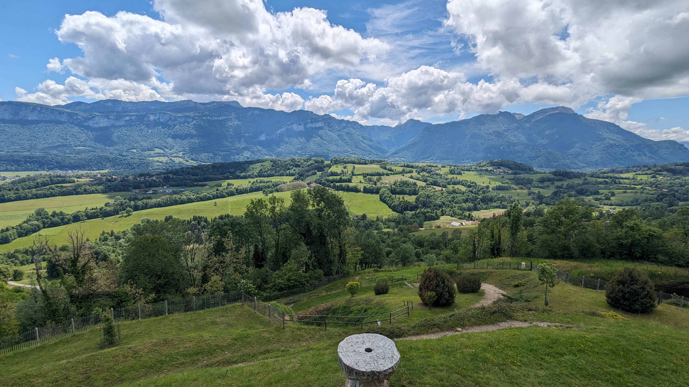

# 🥾🟢 Hike: Miribel-les-Echelles - Forest - Dolmens and Grotte du loup

💡 Click “Read more”/“Lire la suite” for full page ✅ Joining = Accepting rules (see below)

##  ⭐ Updates ⭐ 

* 📅 More cars = more seats. Seats: Thomas (5) Paul (5) François (3)

##  🗨️ EN/FR 🗨️ 
🦅/🐓 Our events are in English/French. Don’t worry if you are not fluent. Nos évènements sont en Anglais/Français. Ne vous inquiétez pas si vous n’êtes pas bilingue.

## 📍 Meeting Point 📍
Meet at parking "Esplanade du Souvenir Français" near Parc Paul Mistral at **event start time 🔺SHARP🔺**:

* ⏰ [https://osm.org/go/0CASJNbuF?m=](https://osm.org/go/0CASJNbuF?m=)
* ⏰ [https://goo.gl/maps/iNPSZcFVyTcM9VX2A](https://goo.gl/maps/iNPSZcFVyTcM9VX2A)

##  🚗 Transportation 🚗 
We ride our cars for about 55min and park at Miribel-les-Echelles:

* 🅿️ [https://osm.org/go/0CBB_9U4B?m=](https://osm.org/go/0CBB_9U4B?m=)
* 🅿️ [https://maps.app.goo.gl/MCZy8EUmuU3p7vjN8](https://maps.app.goo.gl/MCZy8EUmuU3p7vjN8)

##  🚗 Car share 🚗 
Car share is 6€ per person (fuel + toll + "compensation" to get more drivers).

##  🥾🟢 This is an easy hike, through the forest around the old village of Miribel-les-echelles in the heart of the Chartreuse mountains.
There are Dolmens, Druidic stones or sacrificial stones scattered around the forest.
In the forest we will take a short detour to visit a natural cave / tunnel of about 30 meters called the grotte du loup / trou du loup.
So grab your headlamps if you want to explore the cave.

* 🗺️ Topo & GPX track: [https://tinyurl.com/5h3evmt6](https://tinyurl.com/5h3evmt6) (click Export > GPX)
* 📲 Download GPX on your phone (Tuto: [https://binnette.github.io/GAC](https://binnette.github.io/GAC/))
* 📏 Distance: 12.1km
* ⏱️ Time: \~5/6h of hike
* 📈 D+: 465m

##  📜 Rules 📜 

* 🚶‍♀️🚶‍♂️ GAC is about hiking 🥾 and making friends 🤗, NOT flirting ⛔
* 🚮 No littering in nature. Decomposition: 🍊 6m, 🍌 2y, 🥚 3y
* 🚗 Join waiting list for car availability
* ⏰ Don’t be late, we won’t wait
* 💺 Seats in car(s) are limited, only subscribe if sure to join
* ❌ Unsubscribe or 💬 message if can’t join
* 🚗 Drivers: message me ASAP if you can’t join
* 💟 You are responsible for your own health and security

##  🎒 What to bring 🎒 

* Prediction is no rain, but maybe grab your ponchos or rain jackets or an umbrella.
* No snow,
* 🥢 Hiking poles (optional)
* 🧃 Water (1-2L) + 🍫 Snacks + 🥗 Lunch
* 🍵 Thermos with hot tea/coffee
* 🌞 Sunscreen, 😎 Sunglasses, 🤐🧊 Lip balm
* 😁 Smile, 😊 Happiness

\*\*\*

❓ Need help 🤔 Visit [https://binnette.github.io/GAC](https://binnette.github.io/GAC) or ask!

Thomas from GAC

PS: Join our Telegram for more activities (🧗‍♀️, 🏓, 🎳, 🎲, 🎥, 🎵, 🍽️). .

## Stats

- Start time: 2024-05-25 09:30
- End time: 2024-05-25 17:30
- Duration: 8:00:00
- Time to event: 18:54:59
- Attendees: 6
- KM: 12
- D+: 461
- Top: 760
- Type: Hike
- Comment: 

## Links

- [Trail short link](https://s.42l.fr/heDv2OEh)
- [Trail full link](https://brouter.de/brouter-web/#map=15/45.4359/5.7090/standard,Waymarked_Trails-Hiking&lonlats=5.710203,45.43382;5.715348,45.438846;5.71814,45.444673;5.719746,45.437903;5.715208,45.434333;5.707537,45.428661;5.700756,45.427026;5.703954,45.430815;5.696239,45.431147;5.698541,45.432948;5.692366,45.433688;5.693987,45.43524;5.697033,45.434083;5.702387,45.441452;5.704694,45.435124;5.709962,45.433873&profile=hiking-mountain)
- [Album](https://binnette.github.io/GacImg2024/2024-05-25-🥾🟢-Hike-Miribel-les-Echelles---Forest---Dolmens-and-Grotte-du-loup.html)
- [Meetup event](https://www.meetup.com/grenoble-adventure-club-english-french/events/301217125/)
