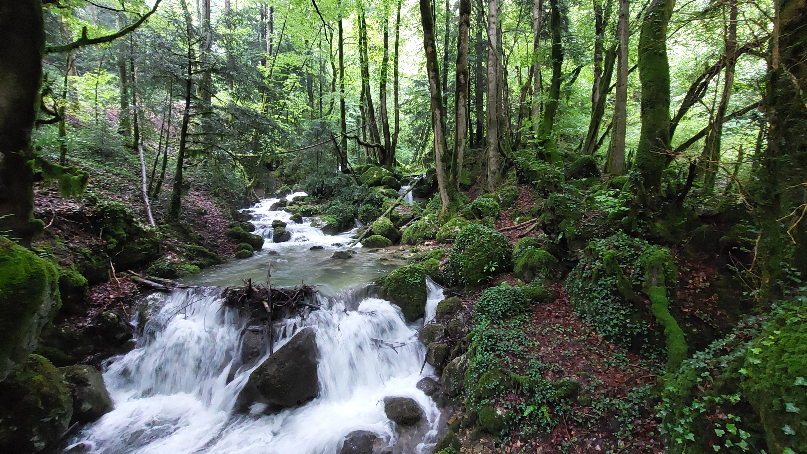

# 🥾🔴 Hike: forest 🌲 hike near "La Rivière" village and hut exploration 🏡

💡 Click “Read more”/“Lire la suite” for full page ✅ Joining = Accepting rules (see below)

##  ⭐ Updates ⭐ 

* 📅 More cars = more seats. Seats: Albin (5), Dimitry (5)

##  🗨️ EN/FR 🗨️ 
🦅/🐓 Our events are in English/French. Don’t worry if you are not fluent. Nos évènements sont en Anglais/Français. Ne vous inquiétez pas si vous n’êtes pas bilingue.

## 📍 Meeting Point 📍
Meet at parking "Esplanade du Souvenir Français" near Parc Paul Mistral at **event start time 🔺SHARP🔺**:

* ⏰ [https://osm.org/go/0CASJNbuF?m=](https://osm.org/go/0CASJNbuF?m=)
* ⏰ [https://goo.gl/maps/iNPSZcFVyTcM9VX2A](https://goo.gl/maps/iNPSZcFVyTcM9VX2A)

##  🚗 Transportation 🚗 
We ride our cars for about 30mn and park at "La Rivière":

* 🅿️ [https://osm.org/go/0Aq5mTnwW?m=](https://osm.org/go/0Aq5mTnwW?m=)
* 🅿️ [https://maps.app.goo.gl/UuQgf6atpaPbYH429](https://maps.app.goo.gl/UuQgf6atpaPbYH429)

##  🚗 Car share 🚗 
Car share is 4€ per person (fuel + "compensation" to get more drivers).

##  🥾🔴 Hike: forest 🌲 hike near "La Rivière" village and hut exploration 🏡 

* 🔴 Ok for good hikers, but steep and maybe wet
* ⚫ Hard for noobs: very steep, quite long and slippery

This weekend, it seems the clouds 🌥️ will be gathering once again. We’re planning to avoid them by heading to the west side of Vercors. We’ll drive 🚗 from Grenoble and park at the town hall in La Rivière, a village with 729 residents. 🏘️
Our hike 🥾 starts in the village, moving through the fields 🌾 and crossing the river “Le Versoud”, known for canyoning 🧗‍♂️💧. We’ll then enter the forest 🌲 and begin our ascent to the hamlet “Les Monts”. A brief detour will offer us a view from a field 🌄 before we return to the forest and continue to “Le Cuchet” hill and the nearby hut 🏡.
Afterward, we’ll head down ⬇️, passing a picnic area 🧺 and a second hut “Cabane de la Fessie”. Our descent concludes back in the village, where we might visit the local church ⛪ before returning to our cars. 🚗 With some luck, we’ll avoid the rain. 🌦️🤞

* 🗺️ Topo & GPX track: [https://s.42l.fr/f4Wtqe1B](https://s.42l.fr/f4Wtqe1B) (click Export > GPX)
* 📲 Download GPX on your phone (Tuto: [https://binnette.github.io/GAC](https://binnette.github.io/GAC/))
* 📏 Distance: 13.7km
* ⏱️ Time: \~5/6h of hike
* 📈 D+: 854m

##  📜 Rules 📜 

* 🚶‍♀️🚶‍♂️ GAC is about hiking 🥾 and making friends 🤗, NOT flirting ⛔
* 🚮 No littering in nature. Decomposition: 🍊 6m, 🍌 2y, 🥚 3y
* 🚗 Join waiting list for car availability
* ⏰ Don’t be late, we won’t wait
* 💺 Seats in car(s) are limited, only subscribe if sure to join
* ❌ Unsubscribe or 💬 message if can’t join
* 🚗 Drivers: message me ASAP if you can’t join
* 💟 You are responsible for your own health and security

##  🎒 What to bring 🎒 

* 🥾 Hiking shoes
* 🥢 Hiking poles (optional)
* 🧤 Gloves, 🧥 jacket, [🧣](https://wprock.fr/t/emoji/cold-face/) scarf, 🧢 beanie,...
* ❄️🌧️ Cold & rain gear
* 🩳 No place to bath, but maybe some rivers?
* 🧦 Dry socks/shoes/pant that wait for you in the car
* 🧃 Water (1-2L) + 🍫 Snacks + 🥗 Lunch
* 🍵 Thermos with hot tea/coffee
* 💡 Headlamp (optional)
* 🌞 Sunscreen, 😎 Sunglasses, 🤐🧊 Lip balm
* 😁 Smile, 😊 Happiness

\*\*\*

❓ Need help 🤔 Visit [https://binnette.github.io/GAC](https://binnette.github.io/GAC) or ask!

Albin from GAC

PS: Join our Telegram for more activities (🧗‍♀️, 🏓, 🎳, 🎲, 🎥, 🎵, 🍽️). Message me on Meetup for the link.

## Stats

- Start time: 2024-06-02 09:00
- End time: 2024-06-02 18:30
- Duration: 9:30:00
- Time to event: 1 day, 23:00:47
- Attendees: 7
- KM: 13.7
- D+: 854
- Top: 912
- Type: Hike
- Comment: 

## Links

- [Trail short link](https://s.42l.fr/f4Wtqe1B)
- [Trail full link](https://brouter.de/brouter-web/#map=14/45.2272/5.5131/OpenTopoMap&lonlats=5.506666,45.234295;5.497321,45.209428;5.516746,45.220044;5.526316,45.234268;5.506701,45.234421&profile=hiking-mountain)
- [Album](https://binnette.github.io/GacImg2024/2024-06-02-🥾🔴-Hike-forest-🌲-hike-near-La-Riviere-village-and-hut-exploration-🏡.html)
- [Meetup event](https://www.meetup.com/grenoble-adventure-club-english-french/events/301358215/)
