# Display a GPX track on your phone through OsmAnd

## Step I: download and install OsmAnd
### 🤖 Android

#### a) 🙂 Freeware version (10 maps download and limited options)
Choose one: [Google Store](https://play.google.com/store/apps/details?id=net.osmand) / [Amazon Store](https://www.amazon.com/OsmAnd-Maps-Navigation/dp/B00D0SA8I8/)

#### b) 😍 Open Source version (more features like elevation/shadow, no limit on map download)
It requires that you enable the "developer options" and the "install of APK from unknown source" on your phone.

Choose one:
- [Download the APK](https://f-droid.org/repo/net.osmand.plus_400.apk) from F-droid
- [Install F-droid](https://f-droid.org/F-Droid.apk), then download OsmAnd from F-droid app

#### c) 😎 Payed version
Choose one: [Google PlayStore](https://play.google.com/store/apps/details?id=net.osmand.plus) / [Amazon Store](http://www.amazon.com/gp/product/B00D0SEGMC/ref=mas_pm_OsmAnd-Maps-Navigation)

#### 🍏 iOS
- [App Store](https://itunes.apple.com/app/apple-store/id934850257?pt=2123532&ct=WebSite&mt=8)

## Step II: download the map in OsmAnd

1. Connect your phone on Wifi (if you don't have a lot of data)
2. Launch OsmAnd on your phone
3. Click on the "menu" button
>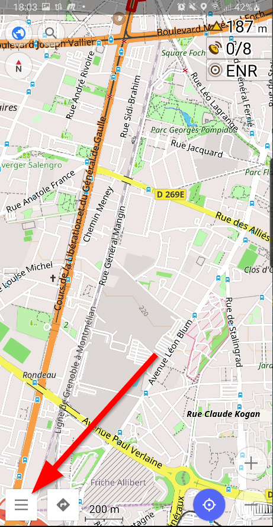
4. Click on the "Download maps" menu
>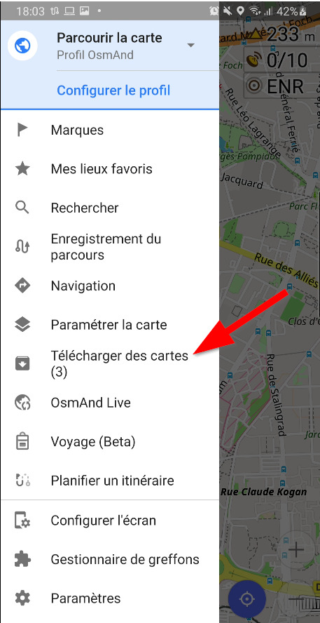
5. Navigate through the item to "Auvergne-Rhône-Alpes"
    1. Europe
    2. France
    3. Auvergne-Rhône-Alpes
    4. Cartes Standards / Standards Maps
>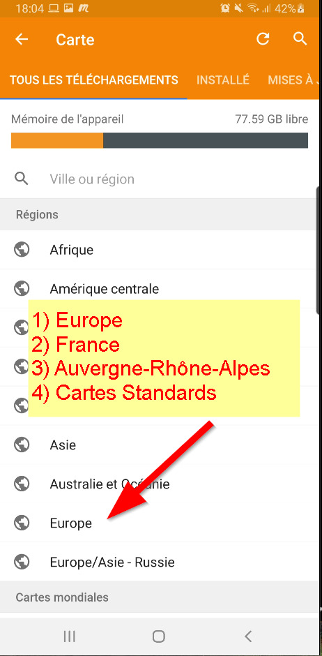
6. Download: Cartes Standards / Standards Maps
>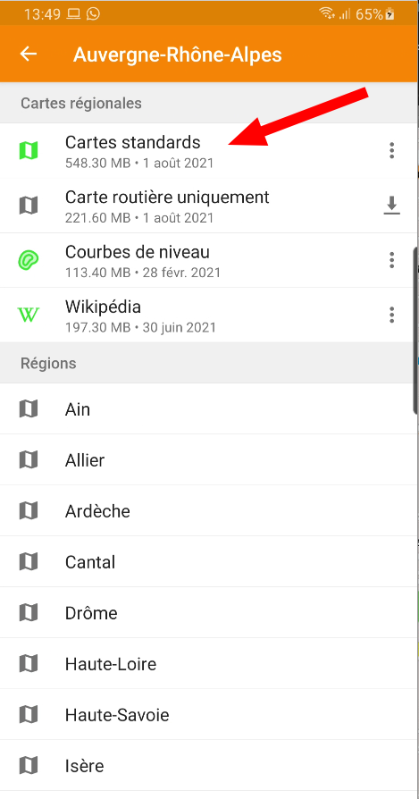
7. Wait until the downloads are done (~550 Mo download)
8. Done!

## Step3 bis: download the GPX track (from BRouter)
1. Open the "topo" link in the meetup event
2. Click on the menu 𝄘
3. Click on "Exporter"
>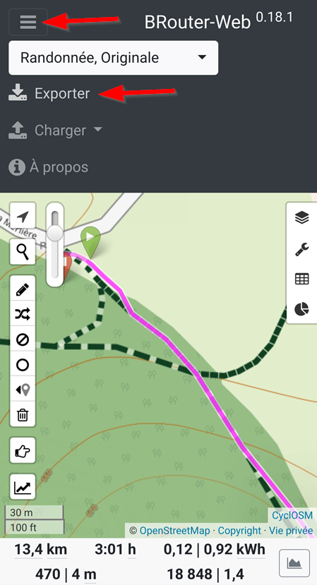
4. In the popup, click on "Exporter l'itinéraire"
>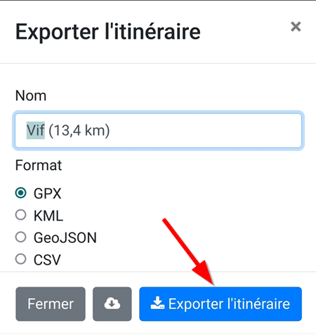
5. It's done! The track is displayed
>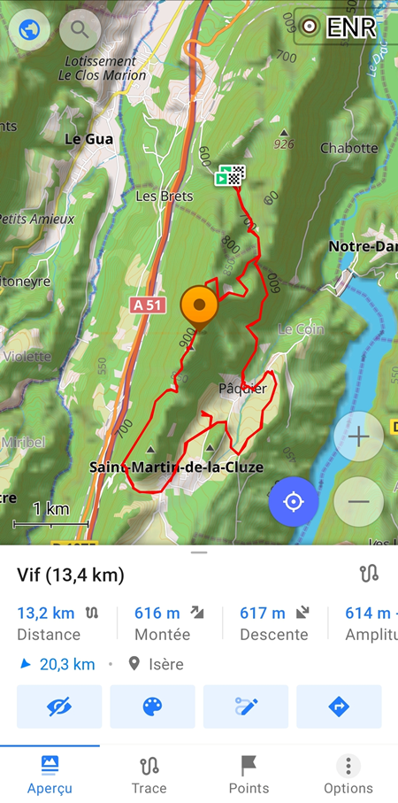
6. Done!

# Appendix

## Hiking rendering and more online maps for OsmAnd

Follow instructions on this website: https://github.com/OsmAnd-Rendering

## Step3 bis: download the GPX track (from GraphHooper)

1. Open the "topo" link in the meetup event
2. Click on the "gpx" icon
>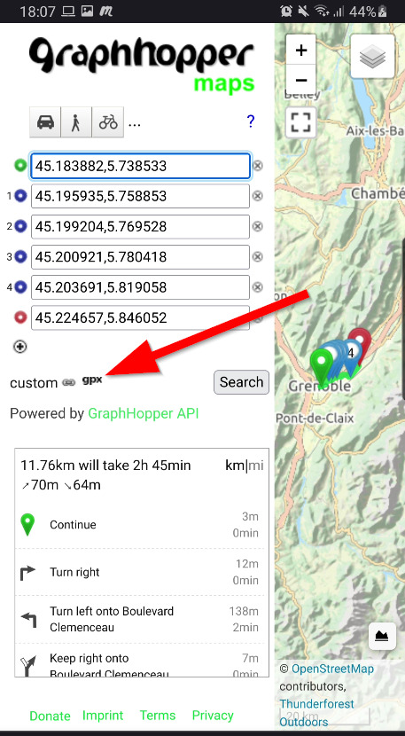
3. In the popup, click on the "Export GPX" button
>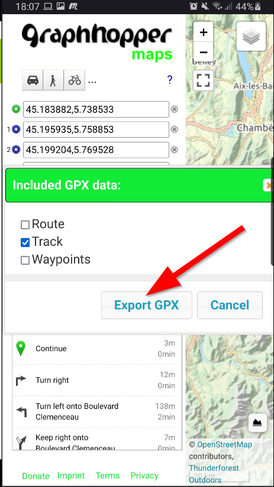
4. Open the download gpx file with OsmAnd
>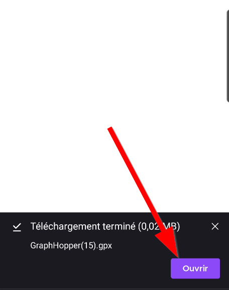
5. It's done! The track is displayed
>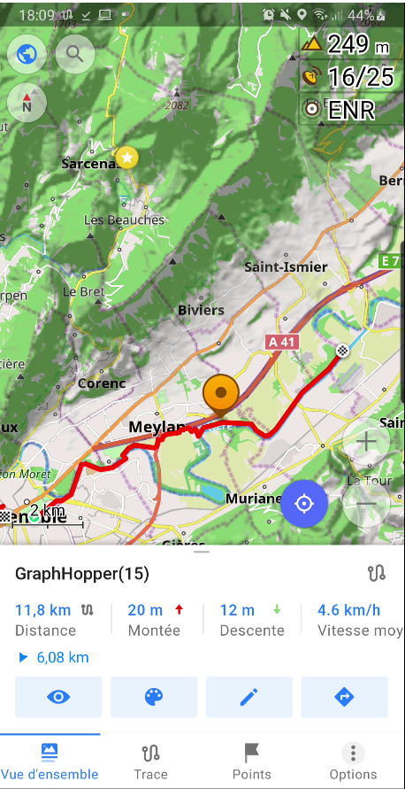
6. Done!
