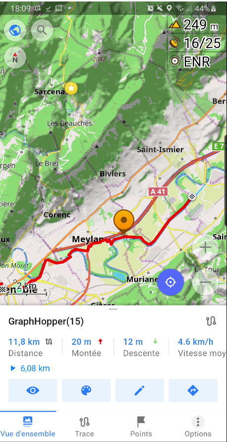
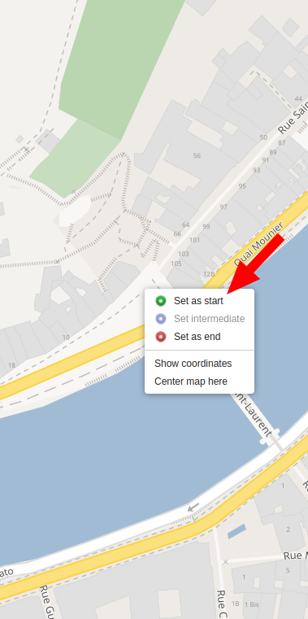
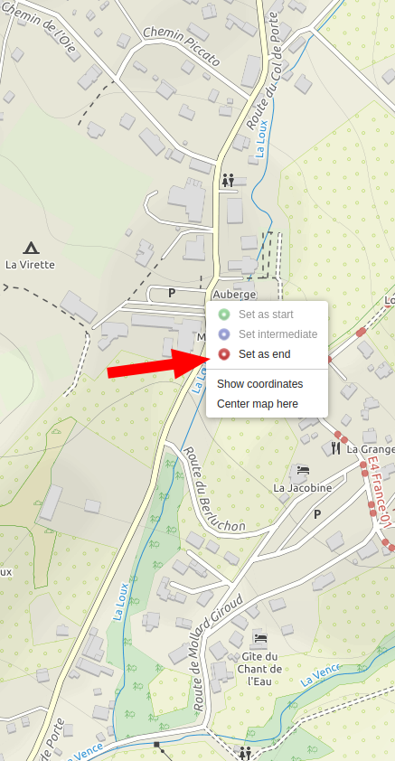
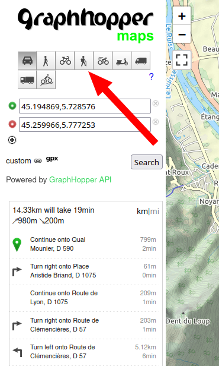
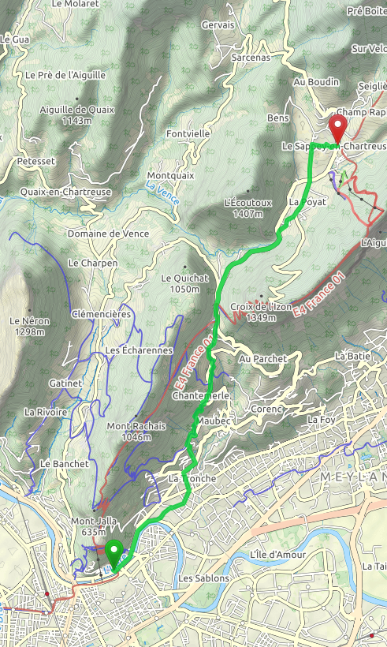
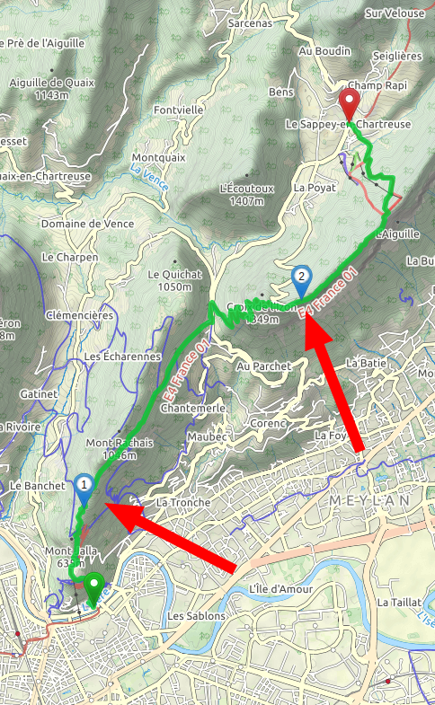
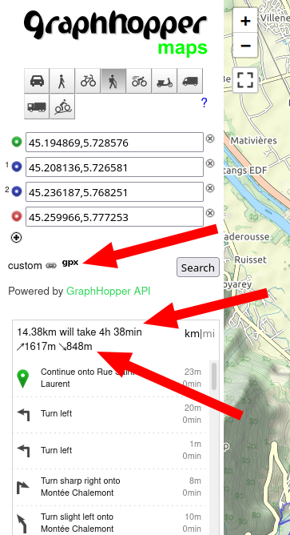

# Display a GPX track on your phone through OsmAnd

## ======= Step I: download and install OsmAnd =======
### ==== Android ====

#### a) Freeware version (10 maps download and limited options)
Choose one:
- Google Store: https://play.google.com/store/apps/details?id=net.osmand
- Amazon Store: https://www.amazon.com/OsmAnd-Maps-Navigation/dp/B00D0SA8I8/

#### b) Open Source version (more features like elevation/shadow, no limit on download)
It requires that you enable the "developer options" and the "install of APK from unknown source" on your phone.

Choose one:
- Download the APK directly from F-droid: https://f-droid.org/repo/net.osmand.plus_400.apk
- Or you can install f-droid and download OsmAnd throuth the f-droid app: https://f-droid.org/F-Droid.apk

#### c) Payed version
Choose one:
- Google PlayStore: https://play.google.com/store/apps/details?id=net.osmand.plus
- Amazon Store: http://www.amazon.com/gp/product/B00D0SEGMC/ref=mas_pm_OsmAnd-Maps-Navigation

#### ==== iOS ====
- App Store: https://itunes.apple.com/app/apple-store/id934850257?pt=2123532&ct=WebSite&mt=8

## ======= Step II: download the map in OsmAnd =======

1. Connect your phone on Wifi (if you don't have a lot of data)
1. Launch OsmAnd on your phone
1. Click on the "menu" button 
1. 
1. Click on the "Download maps" menu
1. 
1. Navigate through the item to "Auvergne-Rhône-Alpes"
    1. Europe
    1. France
    1. Auvergne-Rhône-Alpes
    1. Cartes Standards / Standards Maps
1. 
1. Download: Cartes Standards / Standards Maps
1. 
1. Wait until the downloads are done (~550 Mo download)
1. Done!

## ======= Step III: download the GPX track from Meetup =======

1. Open the "topo" link in the meetup event
1. Click on the "gpx" icon
1. 
1. In the popup, click on the "Export GPX" button
1. 
1. Open the download gpx file with OsmAnd
1. 
1. It's done! The track is displayed
1. 
1. Done!

## Bonus: create your own GPX track on a computer

1. Open https://graphhopper.com/maps/
1. On the top right angle, select the radio "TF Outdoors"
1. 
1. Zoom the map until you see the start position of your new hike
1. Right click on the map and select "Set as start"
1. 
1. Zoom the map until you see the end position of yout hike
1. Right click until you see the end position of your hike
1. 
1. Now click on the "hiker profile" on the left
1. 
1. GraphHopper will make a route for you:
1. 
1. You can customize your route by adding steps
1. To do so, right click on the map and select "Set intermediate"
1. Now you have a "more friendly" hike
1. 
1. You can see your hike detail (elevation, km) on the left
1. And you can download the GPX track as well
1. 
1. Done!
